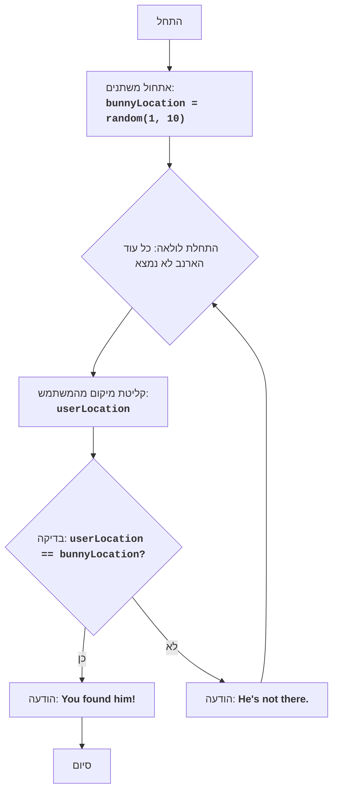

## ניתוח קוד המשחק "ארנב"

### 1. <algorithm>

**תיאור תהליך העבודה:**

1. **אתחול:**
   - המשתנה `bunnyLocation` מקבל ערך אקראי בין 1 ל-10, המייצג את מיקום הארנב.
   - לדוגמה, אם הפונקציה `random.randint(1, 10)` מחזירה 7, אז `bunnyLocation` יהיה 7.

2. **לולאת משחק:**
   - מתחילה לולאה אינסופית (`while True`) שתמשיך עד שהארנב יימצא.

3. **קלט משתמש:**
   - המשתמש מתבקש להזין מספר בין 1 ל-10, שמייצג את מיקום הניחוש שלו.
   - לדוגמה, אם המשתמש מזין 3, אז `userLocation` יהיה 3.
   - טיפול בשגיאות: הקוד מנסה להמיר את הקלט למספר שלם. אם הקלט לא תקין (למשל, מחרוזת או מספר עשרוני), מוצגת הודעת שגיאה והלולאה ממשיכה לסיבוב הבא.

4. **בדיקת מיקום:**
   - נבדק אם `userLocation` שווה ל-`bunnyLocation`.
   - אם שווים, מוצגת הודעת "You found him!", והלולאה נשברת (`break`), מה שמסיים את המשחק.
   - לדוגמה, אם `userLocation` הוא 7 וגם `bunnyLocation` הוא 7, המשחק מסתיים והודעת ניצחון מוצגת.
   - אם לא שווים, מוצגת הודעת "He's not there.", והלולאה ממשיכה לסיבוב הבא.
   - לדוגמה, אם `userLocation` הוא 3 ו-`bunnyLocation` הוא 7, מוצגת הודעת "He's not there." והמשחק ממשיך.

5. **סיום:**
   - המשחק מסתיים כאשר המשתמש מוצא את הארנב.

**זרימת נתונים:**

- פונקציית `random.randint(1, 10)` מייצרת מספר אקראי ונותנת אותו למשתנה `bunnyLocation`.
- פונקציית `input()` קולטת קלט מהמשתמש ונותנת אותו למשתנה `userLocation`.
- הערכים של `userLocation` ו-`bunnyLocation` מושוואים בתנאי `if userLocation == bunnyLocation`.
- הודעות ("You found him!" או "He's not there.") מודפסות בהתאם לתוצאת ההשוואה.

### 2. <mermaid>

**הסבר תלויות:**

-   **random**: מודול המשמש ליצירת מספר אקראי למיקום הארנב.
    -   `random.randint(1, 10)`: פונקציה מהמודול `random` שמחזירה מספר שלם אקראי בין 1 ל-10 (כולל).
-   **input**: פונקציה מובנית ב-Python שמשמשת לקבלת קלט מהמשתמש.
-   **int**: פונקציה מובנית ב-Python המשמשת להמרת קלט המחרוזת למספר שלם.

### 3. <explanation>

**ייבוא:**

-   `import random`: מייבא את המודול `random`, שמספק פונקציות ליצירת מספרים אקראיים. המודול משמש ליצירת מיקום אקראי לארנב במשחק.

**משתנים:**

-   `bunnyLocation`: משתנה מסוג מספר שלם, שמייצג את המיקום האקראי בו הארנב נמצא (בין 1 ל-10). הוא נוצר על ידי `random.randint(1, 10)`.
-   `userLocation`: משתנה מסוג מספר שלם, שמקבל מהמשתמש את המיקום שהוא מנחש בו נמצא הארנב. ערכו מוגדר על ידי פונקציית הקלט `input()`.

**פונקציות:**

-   `random.randint(a, b)`: פונקציה מהמודול `random` שמחזירה מספר שלם אקראי בין `a` ל-`b` (כולל).
    -   דוגמה: `random.randint(1, 10)` תחזיר מספר שלם אקראי בין 1 ל-10.
-   `input(prompt)`: פונקציה מובנית ב-Python שמציגה את הטקסט `prompt` למשתמש ומחזירה את הקלט שלו כטקסט.
    -   דוגמה: `input("היכן הארנב (1-10)? ")` תציג את השאלה למשתמש ותחזיר את הקלט שלו.
-   `int(x)`: פונקציה מובנית ב-Python שממירה את הערך `x` למספר שלם.
    -   דוגמה: `int("5")` תחזיר את המספר השלם 5.

**קשרים עם חלקים אחרים בפרויקט:**

- לקוד זה אין תלות ישירה עם חלקים אחרים בפרויקט `hypotez/src`, אבל ניתן לראות שזה משחק בסיסי שמוגדר בתוך תיקייה של משחקי מחשב (`/ai_games/101_basic_computer_games/ru/GAMES/BUNNY`). הוא משתמש רק במודולים סטנדרטיים של Python.

**בעיות אפשריות או תחומים לשיפור:**

1.  **אימות קלט:** ניתן להוסיף בדיקה נוספת כדי לוודא שהמספר שנקלט מהמשתמש הוא אכן בטווח 1-10, ולא רק מספר שלם.
2.  **ממשק משתמש:** ממשק המשתמש יכול להיות יותר ידידותי על ידי הוספת הודעות ברורות יותר, כגון "נסה שוב" או מספר ניסיונות שנותרו.
3.  **משחקיות:** ניתן להוסיף רמות קושי או מספר ניסיונות מוגבלים כדי להוסיף עניין למשחק.
4.  **רישום משחק:** ניתן להוסיף לוגיקה לשמירת היסטוריית המשחק או ניקוד.
5.  **הפרדה בין לוגיקה לממשק:** מומלץ להפריד בין הלוגיקה של המשחק לבין התצוגה, דבר שיקל על שינויים עתידיים.

לסיכום, הקוד מיישם משחק טקסט פשוט עם לוגיקה ברורה ושימוש נכון במודולים סטנדרטיים של Python. השיפורים המוצעים יכולים לשדרג את המשחק ולהפוך אותו לידידותי יותר למשתמש.