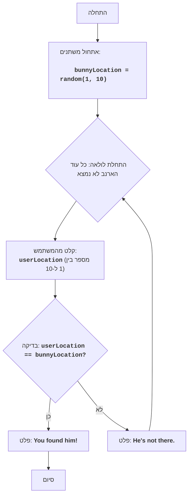

## ניתוח קוד: משחק "ארנב"

### 1. <algorithm>

1.  **התחלה:**
    *   המשחק מתחיל.

2.  **אתחול משתנים:**
    *   `bunnyLocation`: מוגרל מספר אקראי בין 1 ל-10, המייצג את מיקום הארנב. לדוגמה, `bunnyLocation` יכול להיות 7.

3.  **לולאה ראשית (כל עוד הארנב לא נמצא):**
    *   **קלט מהמשתמש:**
        *   המשחק מבקש מהמשתמש להזין מספר בין 1 ל-10, המייצג את מיקום הארנב לפי בחירת המשתמש. לדוגמה, המשתמש מזין 3.
    *   **בדיקת מיקום:**
        *   המשחק בודק האם `userLocation` (3) שווה ל-`bunnyLocation` (7).
            *   **אם כן (userLocation == bunnyLocation):**
                *   המשחק מודיע "You found him!".
                *   המשחק מסתיים.
            *   **אם לא (userLocation != bunnyLocation):**
                *   המשחק מודיע "He's not there.".
                *   הלולאה חוזרת לנקודת הקלט מהמשתמש.

### 2. <mermaid>

**ניתוח תלויות:**

*   **random:** מודול `random` מיובא כדי לייצר מספרים אקראיים. הפונקציה `random.randint(1, 10)` משמשת לייצר מספר אקראי בין 1 ל-10, שמייצג את מיקום הארנב.

### 3. <explanation>

*   **ייבוא (Imports):**
    *   `import random`: מודול `random` מספק פונקציות ליצירת מספרים אקראיים. כאן, הוא משמש ליצירת מיקום אקראי עבור הארנב. אין תלות נוספת בחבילת `src.`.

*   **משתנים (Variables):**
    *   `bunnyLocation`: משתנה מסוג שלם (int) המכיל את מיקום הארנב האקראי שנוצר בתחילת המשחק.
    *   `userLocation`: משתנה מסוג שלם (int) המכיל את קלט המשתמש, מיקום משוער של הארנב.

*   **פונקציות (Functions):**
    *   `random.randint(1, 10)`: פונקציה מובנית מתוך מודול `random` שמקבלת שני פרמטרים (1 ו-10 במקרה הזה) ומחזירה מספר שלם אקראי בטווח שצוין (כולל הגבולות).

*   **מבנה (Structure):**
    *   הקוד מתחיל בייבוא מודול `random`.
    *   לאחר מכן, מוגרל מיקום אקראי לארנב (`bunnyLocation`).
    *   הקוד נכנס ללולאה אינסופית (`while True`) שכוללת:
        *   בקשת קלט מהמשתמש (`input`).
        *   בדיקה האם קלט המשתמש שווה למיקום הארנב האקראי.
        *   אם הקלט שווה למיקום הארנב, מוצגת הודעה למשתמש והלולאה מסתיימת.
        *   אם הקלט אינו שווה, מוצגת הודעה למשתמש והלולאה ממשיכה.
    *   המערכת משתמשת בבלוק `try...except` לטיפול בשגיאות שעלולות להתרחש כאשר המשתמש מזין קלט לא תקין (כלומר, לא מספר שלם).

*   **אינטראקציה עם חלקים אחרים בפרויקט:**
    *   לקוד הנוכחי אין אינטראקציה ישירה עם חלקים אחרים בפרויקט. הוא עומד בפני עצמו ומשמש כמשחק פשוט.

*   **בעיות אפשריות ושיפורים:**
    *   **אימות קלט:** הקוד בודק רק שהקלט הוא מספר שלם, אך לא מוודא שהוא נמצא בטווח 1-10. ניתן להוסיף בדיקה זו כדי למנוע שגיאות או התנהגות לא רצויה.
    *   **ממשק משתמש:** הממשק פשוט ומבוסס טקסט. ניתן לשפר אותו באמצעות ממשק גרפי או שיפורים ויזואליים אחרים.
    *   **מספר ניחושים:** ניתן להוסיף מגבלה על מספר הניחושים כדי להפוך את המשחק למאתגר יותר.
    *   **שמירה על מיקום:** הקוד הנוכחי מייצר מיקום חדש לארנב בכל הרצה. ייתכן שתרצה לאפשר לו להישאר קבוע עד שמשתמש אחר יפעיל את המשחק.

בסך הכל, הקוד מספק משחק פשוט ויעיל, עם אפשרויות שיפור בסיסיות.