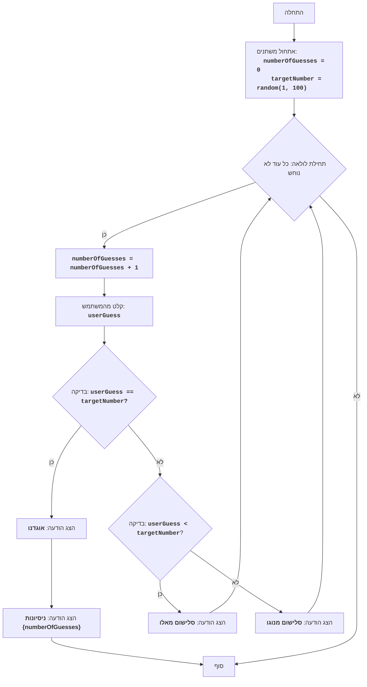

## <algorithm>

הקוד מתאר את המשחק "BUZZWD", בו המחשב בוחר מספר אקראי בין 1 ל-100, והשחקן מנסה לנחש אותו. לאחר כל ניחוש, המחשב נותן רמז אם הניחוש גבוה מדי, נמוך מדי או נכון. המשחק מסתיים כאשר השחקן מנחש את המספר הנכון.

**תרשים זרימה צעד-אחר-צעד:**

1.  **התחל:** המשחק מתחיל.
    *   *דוגמה:* תחילת ריצת התוכנית.
2.  **אתחול משתנים:**
    *   `numberOfGuesses` (מספר הניסיונות) מוגדר כ-0.
        *   *דוגמה:* `numberOfGuesses = 0`
    *   `targetNumber` (המספר הנבחר) נוצר באופן אקראי בין 1 ל-100.
        *   *דוגמה:* `targetNumber = 42`
3.  **לולאה:** כל עוד המספר לא נוחש נכון:
    *   3.1. **הגדלת מספר הניסיונות:** `numberOfGuesses` גדל ב-1.
        *   *דוגמה:* אם `numberOfGuesses` היה 0, עכשיו הוא 1.
    *   3.2. **קבלת קלט מהמשתמש:** המשתמש מתבקש להזין ניחוש.
        *   *דוגמה:* המשתמש מזין 50, `userGuess = 50`.
    *   3.3. **בדיקת ניחוש:**
        *   אם `userGuess` שווה ל- `targetNumber` (הניחוש נכון):
            *   הצג הודעה "אוגדנו".
                *   *דוגמה:* אם `userGuess` שווה 42, תוצג ההודעה "אוגדנו".
            *   עבור לשלב 4.
        *   אחרת:
            *   אם `userGuess` קטן מ-`targetNumber` (הניחוש נמוך מדי):
                *   הצג הודעה "סלישום מאלו".
                    *   *דוגמה:* אם `userGuess` שווה 30 ו- `targetNumber` שווה 42, תוצג ההודעה "סלישום מאלו".
                *   חזור לתחילת הלולאה (3).
            *   אחרת (הניחוש גבוה מדי):
                *   הצג הודעה "סלישום מנוגו".
                    *   *דוגמה:* אם `userGuess` שווה 70 ו- `targetNumber` שווה 42, תוצג ההודעה "סלישום מנוגו".
                *   חזור לתחילת הלולאה (3).
4.  **הצגת מספר הניסיונות:** הצג הודעה "ניסיונות {מספר הניסיונות}".
    *   *דוגמה:* אם `numberOfGuesses` שווה 5, תוצג ההודעה "ניסיונות 5".
5.  **סיום:** המשחק מסתיים.

**זרימת נתונים:**

*   המשתמש מכניס נתונים (ניחושים).
*   התוכנית משווה את הניחוש למספר המטרה ומספקת משוב.
*   התוכנית שומרת את מספר הניסיונות.
*   התוכנית מציגה את מספר הניסיונות הכולל בסיום המשחק.

## <mermaid>

**הסבר התלויות (אין ייבוא):**

אין תלויות יבוא בקוד זה. האלגוריתם משתמש באופן ישיר במשתנים ובפעולות בסיסיות כמו השמה, השוואה, קלט, פלט ופעולות מתמטיות.

## <explanation>

**ייבואים (Imports):**

אין ייבוא כלשהו בקוד זה. הוא משתמש רק בפונקציונליות בסיסית, כמו קלט/פלט ואקראיות.

**מחלקות (Classes):**

אין שימוש במחלקות בקוד הזה. הוא מורכב רק מהגיון פשוט של פונקציות ובקרה.

**פונקציות (Functions):**

הקוד לא משתמש בפונקציות שהוגדרו באופן מפורש, אלא בפעולות לוגיות כמו לולאות והתניות. הפעולה העיקרית היא לולאת while שרצה עד שהמשתמש מנחש את המספר הנכון.

*   **`random(1, 100)`:** פונקציה היפותטית שמייצרת מספר אקראי בין 1 ל-100. היא לא חלק מהקוד הממשי אבל היא חלק מההסבר של מה שהקוד עושה.
*  **`input()`:** פונקציה לקבלת קלט מהמשתמש.
*   **`print()`:** פונקציה להצגת הודעות למשתמש.

**משתנים (Variables):**

*   **`numberOfGuesses` (סוג: מספר שלם):** מונה את מספר הניסיונות של המשתמש לנחש את המספר הנכון. הוא מאותחל ל-0 וגדל ב-1 בכל ניסיון.
*   **`targetNumber` (סוג: מספר שלם):** המספר האקראי שנוצר על ידי המחשב והמשתמש מנסה לנחש אותו.
*   **`userGuess` (סוג: מספר שלם):** המספר שהמשתמש מזין כניחוש שלו.

**בעיות אפשריות או תחומים לשיפור:**

1.  **טיפול בקלט:** אין טיפול שגיאות בקלט המשתמש. לדוגמה, אם המשתמש יזין קלט שאינו מספר, התוכנית עלולה לקרוס. ניתן להוסיף בלוק `try-except` כדי לטפל במקרים כאלה.
2.  **משוב מורכב:** המשוב ניתן רק בצורה של "סלישום מאלו" או "סלישום מנוגו". ניתן להוסיף משוב נוסף, כמו טווח הניחושים האפשריים, כדי לעזור למשתמש לנחש את המספר הנכון מהר יותר.
3.  **ממשק משתמש:** ממשק המשתמש הוא בסיסי מאוד. ניתן לשפר אותו על ידי הוספת גרפיקה או שימוש בספריית ממשק משתמש גרפי.

**שרשרת קשרים עם חלקים אחרים בפרויקט:**

בקוד המקורי אין קשר ישיר עם חלקים אחרים בפרויקט. עם זאת, ניתן לחבר אותו למערכת גדולה יותר שכוללת:

*   **מערכת ניהול משחקים:** ניתן לשלב את המשחק במערכת ניהול משחקים כוללת, בה יהיו לו ממשק משתמש, שמירת ניקוד וכו'.
*   **ספריית משחקים:** ניתן לכלול אותו בספריית משחקים גדולה יותר.
*   **מערכת למידה:** אפשר לפתח גרסה של המשחק שמשתמשת בטכניקות למידה.