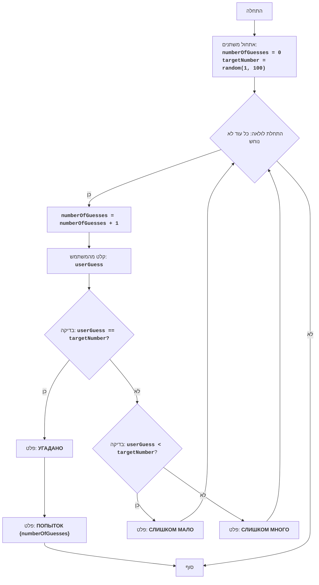

## <algorithm>

הקוד המתואר מייצג משחק ניחוש מספרים פשוט. המשחק פועל על פי השלבים הבאים:

1.  **אתחול:**
    *   מונה הניסיונות (`numberOfGuesses`) מאותחל ל-0.
    *   מספר מטרה (`targetNumber`) מוגרל באופן אקראי בין 1 ל-100.
    *   *דוגמה:* `numberOfGuesses = 0`, `targetNumber = 42`

2.  **לולאה ראשית (כל עוד לא נוחש):**
    *   מונה הניסיונות (`numberOfGuesses`) גדל ב-1.
    *   *דוגמה:* `numberOfGuesses` הופך ל-1.
    *   המשתמש מתבקש להזין ניחוש (`userGuess`).
    *   *דוגמה:* המשתמש מזין 50, ולכן `userGuess = 50`.

3.  **בדיקת ניחוש:**
    *   אם `userGuess` שווה ל-`targetNumber` (ניחוש נכון):
        *   מוצגת הודעה "УГАДАНО" (נכון).
        *   המעבר לשלב 4 (סיום המשחק).
        *   *דוגמה:* אם `targetNumber` הוא 42 ו- `userGuess` הוא 42, תוצג ההודעה.
    *   אחרת:
        *   אם `userGuess` קטן מ-`targetNumber`:
            *   מוצגת הודעה "СЛИШКОМ МАЛО" (קטן מדי).
            *   החזרה לשלב 2 (המשך הלולאה).
            *   *דוגמה:* אם `targetNumber` הוא 42 ו- `userGuess` הוא 30, תוצג ההודעה.
        *   אחרת (אם `userGuess` גדול מ-`targetNumber`):
            *   מוצגת הודעה "СЛИШКОМ МНОГО" (גדול מדי).
            *   החזרה לשלב 2 (המשך הלולאה).
            *   *דוגמה:* אם `targetNumber` הוא 42 ו- `userGuess` הוא 60, תוצג ההודעה.

4.  **סיום המשחק:**
    *   מוצגת הודעה המציינת את מספר הניסיונות שלקח למשתמש לנחש את המספר.
    *   *דוגמה:* אם המשחק הסתיים ב-7 ניסיונות, תוצג ההודעה "ПОПЫТОК 7".

## <mermaid>

**ניתוח תלויות:**

אין תלויות חיצוניות, הקוד מתאר אלגוריתם עצמאי. 

**הסברים לשמות המשתנים בדיאגרמה:**

*   `Start`: מייצג את תחילת ביצוע התוכנית.
*   `InitializeVariables`: פעולה של אתחול המשתנים ההתחלתיים של המשחק.
*   `LoopStart`: מייצג את תחילת לולאת המשחק, שחוזרת על עצמה כל עוד לא נוחש המספר.
*  `IncreaseGuesses`: פעולה של הגדלת מונה הניחושים.
*   `InputGuess`: פעולה לקבלת קלט מהמשתמש (ניחוש המספר).
*   `CheckGuess`: בדיקה האם הניחוש שווה למספר המטרה.
*   `OutputWin`: פלט הודעה שהניחוש נכון.
*   `OutputAttempts`: פלט הודעה על מספר הניסיונות שלקח לנחש את המספר.
*   `End`: מייצג את סוף התוכנית.
*   `CheckLow`: בדיקה האם הניחוש קטן מהמספר המטרה.
*   `OutputLow`: פלט הודעה שהניחוש קטן מדי.
*   `OutputHigh`: פלט הודעה שהניחוש גדול מדי.

## <explanation>

**ייבוא (Imports):**
*   אין ייבוא של מודולים או חבילות. הקוד עצמאי ואינו תלוי בחבילות אחרות.

**מחלקות (Classes):**
*   אין שימוש במחלקות בקוד זה.

**פונקציות (Functions):**
*   אין שימוש בפונקציות מוגדרות בקוד זה. כל הלוגיקה מיושמת ישירות.

**משתנים (Variables):**
*   `numberOfGuesses`: משתנה מסוג שלם (integer) המשמש לספירת מספר הניסיונות של המשתמש. הוא מאותחל ל-0 וגדל ב-1 בכל ניסיון.
*   `targetNumber`: משתנה מסוג שלם (integer) המייצג את המספר האקראי שהמשתמש צריך לנחש. המספר מוגרל בין 1 ל-100.
*   `userGuess`: משתנה מסוג שלם (integer) המאחסן את הניחוש של המשתמש.

**בעיות אפשריות ותחומים לשיפור:**

*   **הגבלת קלט:** אין בדיקה שהקלט מהמשתמש הוא מספר שלם. אם המשתמש יזין קלט שאינו מספר שלם, התוכנית עלולה לקרוס או להתנהג בצורה לא צפויה.
*   **ממשק משתמש:** המשחק פשוט ואינטראקציה עם המשתמש בסיסית. ניתן לשפר את חוויית המשתמש על ידי הוספת עיצוב טקסט, אפשרויות בחירה של טווח מספרים ועוד.
*   **שימוש בפונקציות:** כרגע הקוד הוא סדרה של פעולות בסיסיות. ניתן לחלק את הקוד לפונקציות שונות כדי להגביר את הקריאות והשימוש החוזר בקוד. לדוגמה, ניתן להגדיר פונקציה להגרלת המספר, פונקציה לבדיקת הניחוש, פונקציה לקלט מהמשתמש וכו'.

**שרשרת קשרים עם חלקים אחרים בפרויקט:**

הקוד הוא עצמאי ואין לו תלות ישירה בחלקים אחרים בפרויקט. עם זאת, הוא יכול להיות חלק ממערכת גדולה יותר של משחקים.