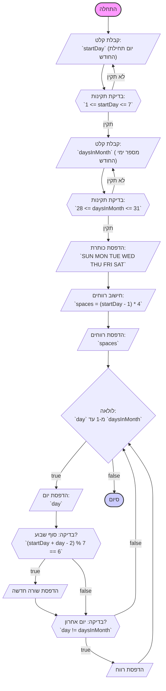

## <algorithm>

1. **קבלת קלט מהמשתמש עבור יום התחלת החודש (startDay) ומספר הימים בחודש (daysInMonth):**
   -  התוכנית נכנסת ללולאה `while True` כדי להבטיח קלט תקין.
   -  היא מבקשת מהמשתמש להזין את יום ההתחלה של החודש (1-7) ומספר הימים בחודש (28-31).
   -  אם הקלט אינו מספר שלם, הודעת שגיאה תוצג, והלולאה תחזור על עצמה.
   -   אם הקלט אינו בטווח הנכון (1-7 עבור `startDay` או 28-31 עבור `daysInMonth`), תוצג הודעת שגיאה מתאימה, והלולאה תחזור על עצמה.
   -  דוגמה: עבור קלט תקין `startDay = 1` ו-`daysInMonth = 31`, התוכנית תמשיך לשלב הבא. אם הקלט היה `startDay = 8`, תוצג הודעת שגיאה ויוזן ערך חדש.

2. **הדפסת שורת הכותרת של ימי השבוע:**
   - התוכנית מדפיסה את שמות ימי השבוע `SUN MON TUE WED THU FRI SAT`.
   - דוגמה: הפלט יציג את הכותרת "SUN MON TUE WED THU FRI SAT".

3. **חישוב מספר הרווחים הנדרשים לפני תחילת החודש:**
   - התוכנית מחשבת את מספר הרווחים באמצעות הנוסחה `spaces = (startDay - 1) * 4`.
   - דוגמה: אם `startDay` הוא 3 (יום שלישי), אז `spaces` יהיה `(3 - 1) * 4 = 8` רווחים.

4. **הדפסת הרווחים הנדרשים:**
   - התוכנית מדפיסה את מספר הרווחים שחושב בשלב הקודם.
   - דוגמה: עבור `spaces = 8`, התוכנית תדפיס שמונה רווחים לפני תחילת הדפסת המספרים של ימי החודש.

5. **לולאה להדפסת ימי החודש:**
   -  לולאה `for` חוזרת על עצמה עבור כל יום בחודש, מ-1 עד `daysInMonth`.
   -  בתוך הלולאה:
     -   היום הנוכחי מודפס עם רוחב של 3 תווים, ולאחר מכן רווח.
         - דוגמה: עבור `day = 1`, התוכנית תדפיס "  1 ".
     -  התוכנית בודקת אם היום הנוכחי הוא סוף שבוע (שבת).
       -  הבדיקה מתבצעת על ידי `(startDay + day - 2) % 7 == 6`. אם התוצאה היא 6, זהו יום שבת.
         - דוגמה: אם `startDay = 1` (יום ראשון) ו-`day = 7`, אז הביטוי יהיה `(1 + 7 - 2) % 7 == 6`, והתוכנית תדפיס שורה חדשה.
     -  אם היום אינו האחרון בחודש, נוסף רווח אחריו.
   -  דוגמה: עבור `startDay = 1` ו-`daysInMonth = 31`, התוכנית תדפיס את החודש המלא, עם מעבר שורה אחרי כל יום שבת, ורווחים בין הימים האחרים.

## <mermaid>

**ניתוח תלויות מיובאות:**

אין תלויות מיובאות בקוד זה. הקוד מסתמך על פונקציות בסיסיות של פייתון, כמו `input`, `print`, `int` ופונקציות עיצוב מחרוזות.

## <explanation>

**ייבוא (Imports):**

- אין ייבוא בקוד זה. הקוד משתמש רק בפונקציות מובנות של פייתון.

**מחלקות (Classes):**

- אין מחלקות בקוד זה.

**פונקציות (Functions):**

- אין פונקציות מוגדרות בקוד זה, מלבד פונקציות מובנות.

**משתנים (Variables):**

- **`startDay`**:
    - **סוג**: מספר שלם (`int`).
    - **שימוש**: מייצג את יום השבוע שבו מתחיל החודש (1=ראשון, 7=שבת).
    - **ערך**: מתקבל כקלט מהמשתמש, נבדק כדי לוודא שהוא בטווח 1-7.
    - **דוגמה**: `startDay = 1` (ראשון), `startDay = 7` (שבת).
- **`daysInMonth`**:
    - **סוג**: מספר שלם (`int`).
    - **שימוש**: מייצג את מספר הימים בחודש.
    - **ערך**: מתקבל כקלט מהמשתמש, נבדק כדי לוודא שהוא בטווח 28-31.
    - **דוגמה**: `daysInMonth = 28` ,`daysInMonth = 31`.
- **`spaces`**:
    - **סוג**: מספר שלם (`int`).
    - **שימוש**: מייצג את מספר הרווחים שצריך להוסיף לפני תחילת הדפסת ימי החודש.
    - **ערך**: מחושב באמצעות הנוסחה `(startDay - 1) * 4`.
    - **דוגמה**: אם `startDay = 3`, אז `spaces = 8`.
- **`day`**:
    - **סוג**: מספר שלם (`int`).
    - **שימוש**: משמש כאינדקס בתוך הלולאה שרצה על כל יום בחודש.
    - **ערך**: מתחיל ב-1 ומסתיים ב-`daysInMonth`.
    - **דוגמה**: כאשר הלולאה נמצאת בימים הראשונים, הערכים יהיו 1, 2, 3...

**בעיות אפשריות או תחומים לשיפור:**

1. **בדיקת תקינות קלט:**
   - הקוד כולל בדיקת תקינות בסיסית לערכי הקלט, אך אפשר להוסיף בדיקות נוספות (כמו בדיקה ש`daysInMonth` תואם לחודש מסוים, לדוגמה, פברואר).

2. **גמישות:**
    - הקוד מוגבל לטווח ימים 28-31. שיפור אפשרי הוא להתיר קלט של כל מספר ימים חוקי בחודש, ואף להתאים את מספר הימים לפי שם החודש.

3. **עיצוב:**
    - העיצוב של הקוד יכול להיות משופר על ידי שימוש בפונקציות לעיצוב הדפסת הקלנדר.

**שרשרת קשרים עם חלקים אחרים בפרויקט:**

- הקוד הוא משחק עצמאי (CALNDR) ואינו מקושר ישירות לחלקים אחרים בפרויקט, מלבד המבנה של הפרויקט.
- הקוד פועל כחלק מתיקיית `ai_games`, כלומר משחקי AI בסיסיים, בתוך פרויקט גדול יותר.
- הקלט והפלט מבוצעים באופן ישיר, ללא שימוש במחלקות או מודולים אחרים.
- הקוד אינו מסתמך על קבצי קונפיגורציה חיצוניים או הגדרות גלובליות.