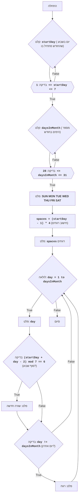

## ניתוח קוד: משחק לוח שנה

### <algorithm>
1.  **התחלה**: תחילת ביצוע התוכנית.
2.  **קלט יום התחלה**:
    *   התוכנית מבקשת מהמשתמש להזין את היום בשבוע שבו מתחיל החודש (1 עבור יום ראשון, 7 עבור יום שבת).
    *   התוכנית מוודאת שהקלט הוא מספר שלם בין 1 ל-7. אם לא, היא מבקשת קלט נוסף.
    *   *דוגמה:* אם המשתמש מזין 3, זה אומר שהחודש מתחיל ביום שלישי.
3.  **קלט מספר ימים בחודש**:
    *   התוכנית מבקשת מהמשתמש להזין את מספר הימים בחודש (28 עד 31).
    *   התוכנית מוודאת שהקלט הוא מספר שלם בין 28 ל-31. אם לא, היא מבקשת קלט נוסף.
    *   *דוגמה:* אם המשתמש מזין 30, זה אומר שבחודש יש 30 ימים.
4.  **פלט כותרת ימי שבוע**: התוכנית מדפיסה כותרת עם ימי השבוע: "SUN MON TUE WED THU FRI SAT".
5.  **חישוב רווחים**:
    *   התוכנית מחשבת את מספר הרווחים שיש להדפיס לפני היום הראשון בחודש.
    *   החישוב הוא `(startDay - 1) * 4`, מכיוון שכל יום תופס 4 תווים (3 ספרות + רווח).
    *   *דוגמה:* אם החודש מתחיל ביום שלישי (startDay = 3), מספר הרווחים יהיה (3-1) * 4 = 8.
6.  **פלט רווחים התחלתיים**: התוכנית מדפיסה את מספר הרווחים המחושב לפני תחילת הדפסת הימים.
7.  **לולאת הדפסת ימים**:
    *   התוכנית מתחילה לולאה שרצה על כל יום בחודש (מ-1 עד מספר הימים בחודש).
    *   בכל איטרציה:
        *   הדפסת היום הנוכחי עם רווח אחריו.
        *   בדיקה האם היום הנוכחי הוא סוף שבוע (שבת).
        *   אם כן, התוכנית מדפיסה שורה חדשה.
        *    אם לא, התוכנית בודקת האם זה היום האחרון בחודש. אם לא אז היא מדפיסה רווח נוסף.
    *   *דוגמה:* אם היום הנוכחי הוא 7 (startDay=3) (כלומר יום שבת) ויום החודש הוא 5: (3+5-2)%7 == 6. הפלט יהיה: 5. לאחר מכן, תודפס שורה חדשה.
8.  **סיום**: סיום התוכנית לאחר הדפסת כל הימים.

### <mermaid>

**תלויות יבוא:**

אין תלויות יבוא בקוד הנוכחי.

### <explanation>
**ייבוא (Imports):**
אין ייבוא בקוד זה. הקוד פועל באופן עצמאי ואינו נסמך על ספריות חיצוניות.

**משתנים (Variables):**
* `startDay`: משתנה מסוג שלם המאחסן את היום בשבוע בו מתחיל החודש, נקלט מהמשתמש.
*   `daysInMonth`: משתנה מסוג שלם המאחסן את מספר הימים בחודש, נקלט מהמשתמש.
*   `spaces`: משתנה מסוג שלם המאחסן את מספר הרווחים שיש להדפיס לפני היום הראשון בחודש.
*   `day`: משתנה מסוג שלם המשמש כאינדקס בלולאה, המייצג את היום הנוכחי בחודש.

**פונקציות (Functions):**
*   אין פונקציות מוגדרות בקוד זה, כל הלוגיקה מובנית בתוך קטע הקוד הראשי.

**הסברים מפורטים:**
1.  **קלט משתמש:**
    *   הקוד משתמש בלולאות `while True` ובבלוק `try-except` כדי להבטיח שהמשתמש יזין נתונים תקינים (מספרים שלמים בטווח הנכון).
    *   `startDay` ו-`daysInMonth` מקבלים קלט מהמשתמש באמצעות הפונקציה `input()`.
    *   הקוד בודק את הקלט: 1 <= startDay <= 7 ו-28 <= daysInMonth <= 31. אם הקלט לא תקין, הוא מבקש קלט חוזר.
2.  **כותרת:**
    *   הקוד מדפיס כותרת עם ימי השבוע באמצעות הפקודה `print`.
3.  **חישוב רווחים:**
    *   הקוד מחשב את מספר הרווחים שיש להדפיס בהתחלה בהתבסס על `startDay`.
4.  **לולאת הדפסה:**
    *   לולאת `for` עוברת על כל יום בחודש.
    *   הקוד מדפיס כל יום מעוצב עם שלושה תווים ורווח, למשל " 1 ".
    *   הקוד בודק אם היום הנוכחי הוא שבת, אם כן הוא מדפיס מעבר שורה.
    *   בנוסף, הקוד מוסיף רווח אחרי כל מספר חוץ מהיום האחרון.

**שרשרת קשרים עם חלקים אחרים בפרויקט:**

אין קשרים עם חלקים אחרים בפרויקט בקוד זה. זהו משחק עצמאי הפועל באופן עצמאי.

**בעיות אפשריות ותחומים לשיפור:**

1.  **טיפול שגיאות:** למרות שיש טיפול בערכי קלט שאינם מספרים שלמים, אפשר להוסיף בדיקות קלט נוספות (כגון בדיקה שהקלט אינו ריק).
2.  **עיצוב:** אפשר לשפר את עיצוב הקלט באמצעות הדפסת הנחיות ברורות יותר למשתמש.
3.  **פונקציונליות:** ניתן להוסיף אפשרות לבחור את השנה כדי להתאים את הימים באופן מדויק יותר, כמו כן אפשר לאפשר הדפסת שמות חודשים.