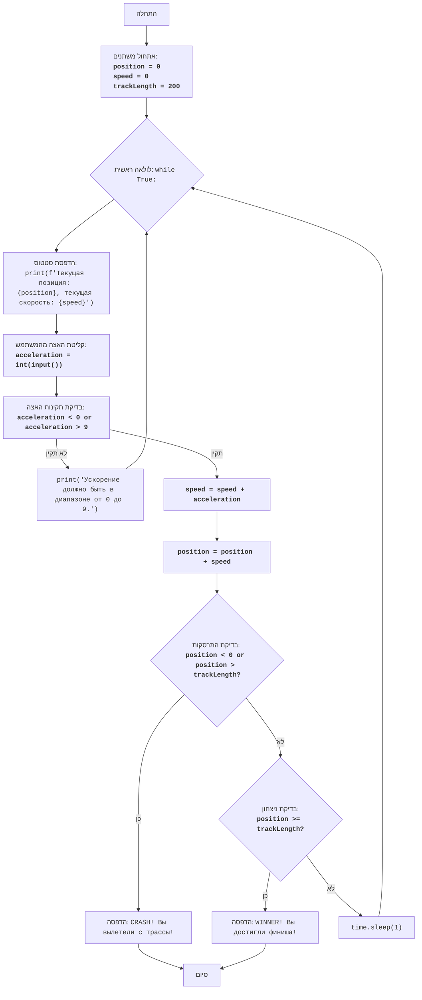

## ניתוח קוד: CAN AM

### 1. <algorithm>

**תיאור תהליך העבודה של הקוד בתרשים זרימה צעד-אחר-צעד:**

1.  **התחלה:**
    *   התוכנית מתחילה את ביצועה.

2.  **אתחול משתנים:**
    *   `position` (מיקום) מוגדר ל-0. לדוגמה, `position = 0`.
    *   `speed` (מהירות) מוגדר ל-0. לדוגמה, `speed = 0`.
    *   `trackLength` (אורך המסלול) מוגדר ל-200. לדוגמה, `trackLength = 200`.

3.  **לולאה ראשית (while True):**
    *   מתחיל לולאה אינסופית.

4.  **הדפסת מידע נוכחי:**
    *   התוכנית מדפיסה את המיקום הנוכחי ואת המהירות הנוכחית של המכונית. לדוגמה, "Текущая позиция: 0, текущая скорость: 0".

5.  **קליטת קלט מהמשתמש (acceleration):**
    *   המשתמש מתבקש להזין את ההאצה (מספר בין 0 ל-9). לדוגמה, `acceleration = int(input("Введите ускорение (0-9): "))`
    *   **טיפול בשגיאה:**
        *   אם המשתמש לא מזין מספר שלם (לדוגמה, מזין טקסט), התוכנית תדפיס הודעת שגיאה ותחזור לתחילת הלולאה (step 3).
        *   אם ההאצה קטנה מ-0 או גדולה מ-9, תדפיס הודעת שגיאה ותמשיך לאיטרציה הבאה.

6.  **עדכון מהירות:**
    *   המהירות הנוכחית מתווספת לערך ההאצה שהתקבל. לדוגמה, אם `speed = 0` ו-`acceleration = 5`, אז `speed` יהפוך ל-`5`.

7.  **עדכון מיקום:**
    *   המיקום הנוכחי מתווסף לערך המהירות הנוכחית. לדוגמה, אם `position = 0` ו-`speed = 5`, אז `position` יהפוך ל-`5`.

8.  **בדיקת התרסקות (CRASH):**
    *   התוכנית בודקת האם המיקום הנוכחי קטן מ-0 או גדול מ-`trackLength` (200). לדוגמה, אם `position = -1`, תנאי ה-CRASH מתקיים.
    *   אם התנאי מתקיים:
        *   התוכנית מדפיסה "CRASH! Вы вылетели с трассы!".
        *   הלולאה מסתיימת (break).

9.  **בדיקת ניצחון (WINNER):**
    *   התוכנית בודקת האם המיקום הנוכחי גדול או שווה ל-`trackLength` (200). לדוגמה, אם `position = 200`, תנאי ה-WINNER מתקיים.
    *   אם התנאי מתקיים:
        *   התוכנית מדפיסה "WINNER! Вы достигли финиша!".
        *   הלולאה מסתיימת (break).

10. **השהיה:**
    *   אם לא היה CRASH ולא היה WINNER, התוכנית עוצרת למשך 1 שנייה.

11. **חזרה ללולאה:**
    *   חוזרים לשלב 3 וממשיכים בלולאה הראשית.

12. **סיום:**
    *   התוכנית מסיימת את ביצועה כאשר הלולאה מסתיימת (במקרה של CRASH או WINNER).

### 2. <mermaid>

**ניתוח התלויות המיובאות:**

*   **`import time`**:
    *   המודול `time` מספק פונקציות הקשורות לזמן, כגון `time.sleep()`, המשמשת להשהיית ביצוע התוכנית למשך זמן מסוים. במקרה זה, היא משמשת להשהיה של שנייה אחת בין כל תור במשחק, מה שמאפשר למשתמש לראות את התוצאות של כל תור בצורה ברורה יותר.

### 3. <explanation>

**הסברים מפורטים:**

*   **ייבוא (Imports):**
    *   `import time`: המודול `time` משמש להשהיית התוכנית למשך שנייה אחת באמצעות הפונקציה `time.sleep(1)` לאחר כל תור. זה מאפשר למשתמש לראות את השינויים במיקום ובמהירות.

*   **משתנים (Variables):**
    *   `position`: משתנה מסוג `int` המייצג את מיקום הרכב הנוכחי במסלול. הוא מתחיל ב-0 ומתעדכן בהתאם למהירות.
    *   `speed`: משתנה מסוג `int` המייצג את מהירות הרכב הנוכחית. הוא מתחיל ב-0 ומתעדכן בהתאם לקלט של המשתמש (האצה).
    *   `trackLength`: משתנה מסוג `int` המייצג את אורך המסלול, שמוגדר כ-200. הוא משמש כדי לבדוק אם הרכב הגיע לסוף המסלול או יצא ממנו.
    *   `acceleration`: משתנה מסוג `int` המייצג את ההאצה שהמשתמש הכניס בכל תור. הוא מקבל קלט מהמשתמש באמצעות `input()` ומשמש לעדכון המהירות.

*   **פונקציות (Functions):**
    *   אין פונקציות מוגדרות בתוכנית הזו, אך נעשה שימוש בפונקציות מובנות של פייתון:
        *   `int(input(...))`: פונקציה הקולטת קלט מהמשתמש, ובודקת האם הערך שהוזן הוא מספר שלם, במידה ולא תתריע שגיאה.
        *   `print(...)`: פונקציה המדפיסה טקסט לקונסולה.
        *   `time.sleep(1)`: פונקציה המשהה את ביצוע התוכנית למשך שנייה אחת.

*   **בעיות אפשריות ותחומים לשיפור:**
    *   **קלט לא תקין:** הקוד מטפל בשגיאת ערך כאשר המשתמש מכניס קלט שאינו מספר שלם אך לא בודק אם המספר נמצא בטווח 0-9.
    *   **ממשק משתמש:** ממשק המשתמש פשוט וטקסטואלי. ניתן לשפר את חוויית המשתמש באמצעות הוספת גרפיקה או ממשק אינטראקטיבי.
    *   **קוד ניתן לקריאה:** קוד ניתן לקריאה, אך ניתן לפשט אותו מעט עוד יותר באמצעות פונקציות.
    *   **אין מצב של תיקו:** במצב הקיים, אין מצב שהמשחק יגמר בתיקו. מצב תיקו יכול להתקיים אם שחקן מסיים את המשחק כאשר מיקומו גדול או שווה לאורך המסלול.
    *   **בדיקות קלט:** הקוד לא בודק באופן מלא את קלט המשתמש. ניתן להוסיף בדיקה לוודא שהמשתמש מכניס מספרים בין 0 ל-9, ולא רק לבדוק את תקינות הקלט (int).

*   **שרשרת קשרים עם חלקים אחרים בפרויקט:**
    *   לקוד זה אין תלות ישירה בקבצים אחרים בפרויקט. הוא משחק עצמאי.

**לסיכום:**

הקוד מדמה משחק מירוץ פשוט שבו השחקן מנסה להגיע לסוף המסלול על ידי קביעת האצה בכל תור. הקוד מציג בצורה ברורה את העקרונות הבסיסיים של עדכון מצב, בדיקת תנאי ניצחון ותנאי כישלון. הוא בנוי באופן ליניארי יחסית ולכן קל לקריאה ולהבנה.