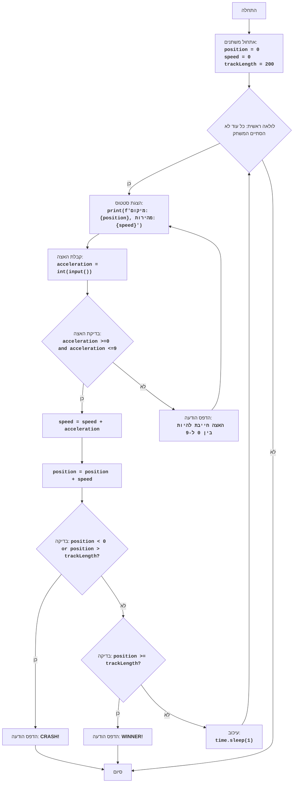

## ניתוח קוד:

### 1. **<algorithm>**:

הקוד מדמה משחק מרוץ פשוט שבו שחקן מזין האצות כדי להגיע לסוף המסלול. להלן תרשים זרימה שלבי אחר שלב:

1. **אתחול משתנים**:
   - הגדרת `position` ל-0 (מיקום התחלתי של המכונית).
   - הגדרת `speed` ל-0 (מהירות התחלתית של המכונית).
   - הגדרת `trackLength` ל-200 (אורך המסלול).
   *דוגמה*: `position = 0`, `speed = 0`, `trackLength = 200`.

2. **לולאה ראשית**:
   - כל עוד המשחק נמשך (המכונית לא התרסקה ולא הגיעה לקו הסיום).
     - הצגת המיקום והמהירות הנוכחיים.
      *דוגמה*: `print(f"Current position: {position}, current speed: {speed}")`.
     - בקשת קלט מהמשתמש להאצה (מספר בין 0 ל-9).
        *דוגמה*: `acceleration = int(input("Enter acceleration (0-9): "))`.
     - עדכון המהירות על ידי הוספת ההאצה.
      *דוגמה*: `speed = speed + acceleration`.
     - עדכון המיקום על ידי הוספת המהירות למיקום הנוכחי.
      *דוגמה*: `position = position + speed`.
     - בדיקה אם המכונית התרסקה (המיקום מחוץ למסלול, קטן מ-0 או גדול מ-`trackLength`).
      - אם המכונית התרסקה, להציג הודעת "CRASH" ולסיים את המשחק.
      *דוגמה*: `if position < 0 or position > trackLength: print("CRASH!")`
     - בדיקה אם המכונית הגיעה לסוף המסלול (המיקום גדול או שווה ל-`trackLength`).
      - אם המכונית הגיעה לסוף המסלול, להציג הודעת "WINNER" ולסיים את המשחק.
     *דוגמה*: `if position >= trackLength: print("WINNER!")`
     - עיכוב של שנייה אחת (להצגת האנימציה).
     *דוגמה*: `time.sleep(1)`.
3. **סיום המשחק**:
   - המשחק מסתיים כשהמכונית התרסקה או הגיעה לסוף המסלול.

### 2. **<mermaid>**:

**הסבר תלויות:**

- `import time`:  מאפשר להשתמש בפונקציה `sleep` להשהיית התוכנית, ומשמש ליצירת עיכובים במהלך המשחק.

### 3. **<explanation>**:

**ייבוא (Imports):**
- `import time`:  המודול `time` מספק פונקציות הקשורות לזמן, כמו `sleep()`. במקרה הזה, הוא משמש ליצירת השהיות של שנייה אחת בין כל מהלך במשחק כדי להאט את קצב המשחק ולאפשר לשחקן לעקוב אחר ההתקדמות. אין קשר ספציפי לתיקיות `src.` אחרות.

**משתנים:**
- `position`: משתנה מסוג `int` המייצג את המיקום הנוכחי של המכונית במסלול. מתחיל ב-0.
- `speed`: משתנה מסוג `int` המייצג את המהירות הנוכחית של המכונית. מתחיל ב-0.
- `trackLength`: משתנה מסוג `int` המייצג את אורך המסלול, שמוגדר כ-200.
- `acceleration`: משתנה מסוג `int` המייצג את ההאצה שהמשתמש מזין.

**פונקציות:**
- `time.sleep(1)`: פונקציה מתוך המודול `time` הגורמת להשהיית ביצוע התוכנית למשך שנייה אחת.
- `int(input(...))`: קולטת קלט מהמשתמש וממירה אותו למספר שלם מסוג `int`.

**לולאה:**
- `while True`: לולאה אינסופית הממשיכה עד להגעה לסיום המשחק (ניצחון או התרסקות).
  - בתוך הלולאה, המשתמש מתבקש להזין האצה. המהירות והמיקום מעודכנים בהתאם.
  - בדיקות נעשות כדי לראות אם המכונית התרסקה או הגיעה לקו הסיום.
  - אם אחד מהתנאים מתקיים, המשחק מסתיים על ידי שימוש ב-`break`.
  - אם המשחק נמשך, יש השהיה קצרה באמצעות `time.sleep(1)`.

**בעיות אפשריות:**
- המשחק הוא בסיסי ואין לו גרפיקה או אפקטים קוליים.
- אין טיפול שגיאות מקיף לקלט המשתמש, למעט בדיקת שגיאות מסוג `ValueError` וכן בדיקה האם ההאצה היא בין 0 ל-9.

**שיפורים אפשריים:**
- להוסיף גרפיקה בסיסית כדי להפוך את המשחק ליותר מושך ויזואלית.
- לשפר את טיפול השגיאות ולבדוק את קלט המשתמש על מנת לוודא שמדובר במספר שלם בין 0 ל-9.
- להוסיף רמות קושי שונות על ידי שינוי אורך המסלול או ההאצה המותרת.
- להוסיף אפקטים קוליים כדי לשפר את חוויית המשחק.
- ניתן ליישם את המשחק באמצעות GUI כדי לספק חוויית משתמש טובה יותר.
- להוסיף מעקב אחר זמן המשחק, ניקוד, והיסטורית משחקים.

**שרשרת קשרים עם חלקים אחרים בפרויקט:**
- קוד זה הוא חלק מתיקיית `ai_games` ולכן ניתן לשלב אותו במערכת משחקי AI, כל עוד יש מסגרת כללית לניהול המשחקים.

לסיכום, הקוד מספק משחק מרוץ פשוט באמצעות ממשק שורת הפקודה. הוא מציג את עקרונות המשחק הבסיסיים ונותן בסיס לשיפורים נוספים.