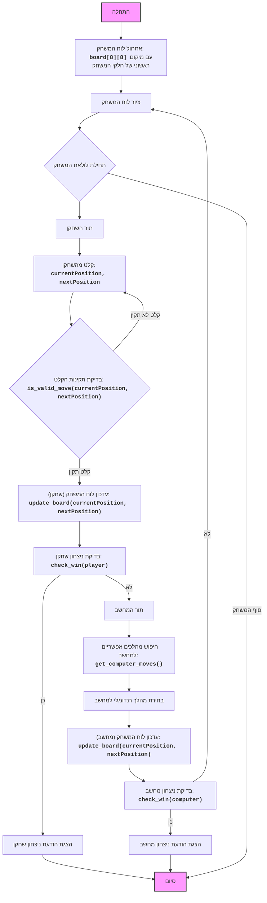

## ניתוח קוד: משחק דמקה בסיסי

### 1. <algorithm>

**תרשים זרימה צעד-אחר-צעד:**

1.  **אתחול לוח המשחק**:
    *   יוצר לוח משחק 8x8 באמצעות רשימה דו-ממדית.
    *   מאתחל את הלוח כאשר השחקן (1) נמצא בשורות 0-2, והמחשב (2) נמצא בשורות 5-7.

    ```python
    board = [[EMPTY for _ in range(BOARD_SIZE)] for _ in range(BOARD_SIZE)]
    # לדוגמא, אחרי אתחול:
    # [['1', '.', '1', '.', '1', '.', '1', '.'],
    #  ['.', '1', '.', '1', '.', '1', '.', '1'],
    #  ['1', '.', '1', '.', '1', '.', '1', '.'],
    #  ['.', '.', '.', '.', '.', '.', '.', '.'],
    #  ['.', '.', '.', '.', '.', '.', '.', '.'],
    #  ['.', '2', '.', '2', '.', '2', '.', '2'],
    #  ['2', '.', '2', '.', '2', '.', '2', '.'],
    #  ['.', '2', '.', '2', '.', '2', '.', '2']]
    ```

2.  **ציור לוח המשחק**:
    *   מציג את לוח המשחק הנוכחי בטרמינל עם מספרי שורות ועמודות.

    ```
       0 1 2 3 4 5 6 7
    0 1 . 1 . 1 . 1 .
    1 . 1 . 1 . 1 . 1
    2 1 . 1 . 1 . 1 .
    3 . . . . . . . .
    4 . . . . . . . .
    5 . 2 . 2 . 2 . 2
    6 2 . 2 . 2 . 2 .
    7 . 2 . 2 . 2 . 2
    ```

3.  **לולאת משחק**:
    *   המשחק ממשיך עד שאחד השחקנים מגיע לצד השני של הלוח.
    *   **תור השחקן:**
        *   מבקש מהמשתמש להזין את מיקום החלק הנוכחי והמיקום החדש.
        *   בודק שהקלט תקין באמצעות `is_valid_move`. אם הקלט לא תקין מבקש מהמשתמש להזין שוב.
        *   מעדכן את לוח המשחק באמצעות `update_board`.
        *   בודק אם השחקן ניצח באמצעות `check_win`.
        *   אם השחקן ניצח, המשחק מסתיים.

    ```python
    # לדוגמא, תור שחקן:
    # Input: current_row = 2, current_col = 0, new_row = 3, new_col = 1
    # אחרי עדכון לוח:
    # [['.', '.', '1', '.', '1', '.', '1', '.'],
    #  ['.', '1', '.', '1', '.', '1', '.', '1'],
    #  ['.', '.', '1', '.', '1', '.', '1', '.'],
    #  ['1', '.', '.', '.', '.', '.', '.', '.'],
    #  ['.', '.', '.', '.', '.', '.', '.', '.'],
    #  ['.', '2', '.', '2', '.', '2', '.', '2'],
    #  ['2', '.', '2', '.', '2', '.', '2', '.'],
    #  ['.', '2', '.', '2', '.', '2', '.', '2']]
    ```

    *   **תור המחשב:**
        *   מוצא את כל המהלכים האפשריים עבור המחשב באמצעות `get_computer_moves`.
        *   בוחר מהלך רנדומלי מבין המהלכים האפשריים.
        *   מעדכן את הלוח באמצעות `update_board`.
        *   בודק אם המחשב ניצח באמצעות `check_win`.
        *   אם המחשב ניצח, המשחק מסתיים.

    ```python
    # לדוגמא, תור מחשב:
    # possible_moves = [(5,1,4,0),(5,1,4,2)...]
    # אחרי בחירה רנדומלית ועדכון לוח (נניח נבחר (5,1,4,0)):
    # [['.', '.', '1', '.', '1', '.', '1', '.'],
    #  ['.', '1', '.', '1', '.', '1', '.', '1'],
    #  ['.', '.', '1', '.', '1', '.', '1', '.'],
    #  ['1', '.', '.', '.', '.', '.', '.', '.'],
    #  ['2', '.', '.', '.', '.', '.', '.', '.'],
    #  ['.', '.', '.', '2', '.', '2', '.', '2'],
    #  ['2', '.', '2', '.', '2', '.', '2', '.'],
    #  ['.', '2', '.', '2', '.', '2', '.', '2']]
    ```

4.  **סיום משחק**:
    *   אם אחד מהשחקנים ניצח, מוצגת הודעה על הנצחון ולוח המשחק הסופי.

### 2. <mermaid>



**תלויות יבוא:**

*   **`import random`**: המודול `random` משמש לבחירת מהלך רנדומלי עבור המחשב. הוא אינו משפיע על מבנה התרשים, אבל חשוב לתפקוד הלוגי של המשחק.

### 3. <explanation>

**ייבואים (Imports):**

*   **`import random`**:
    *   **מטרה**: משמש ליצירת מספרים אקראיים, במקרה הזה, לבחירת מהלך רנדומלי עבור המחשב.
    *   **קשר לחבילות `src.`**: אין קשר ישיר לחבילות `src.`, זהו מודול סטנדרטי של פייתון.

**משתנים (Variables):**

*   **`BOARD_SIZE`**: גודל הלוח (8). משמש כקבוע לקביעת מידות הלוח.
*   **`EMPTY`**: סימון לתא ריק בלוח (`.`).
*   **`PLAYER`**: סימון לשחקן (`1`).
*   **`COMPUTER`**: סימון למחשב (`2`).

**פונקציות (Functions):**

*   **`initialize_board()`**:
    *   **פרמטרים**: אין.
    *   **ערך מוחזר**: רשימה דו-ממדית המייצגת את הלוח עם מיקום החלקים ההתחלתי.
    *   **מטרה**: יוצר לוח משחק ריק ומציב את חלקי המשחק של השחקן והמחשב במיקום הראשוני.
    *   **דוגמה לשימוש**: `board = initialize_board()`
*   **`draw_board(board)`**:
    *   **פרמטרים**: `board` - רשימה דו-ממדית המייצגת את הלוח.
    *   **ערך מוחזר**: אין.
    *   **מטרה**: מציג את הלוח הנוכחי בטרמינל עם מספרי שורות ועמודות.
    *   **דוגמה לשימוש**: `draw_board(board)`
*   **`is_valid_move(board, row, col, new_row, new_col, player)`**:
    *   **פרמטרים**:
        *   `board`: רשימה דו-ממדית המייצגת את הלוח.
        *   `row`, `col`: השורה והעמודה של החלק הנוכחי.
        *   `new_row`, `new_col`: השורה והעמודה של המיקום החדש.
        *   `player`: השחקן שמנסה לבצע את המהלך (`PLAYER` או `COMPUTER`).
    *   **ערך מוחזר**: `True` אם המהלך תקין, `False` אחרת.
    *   **מטרה**: בודק האם המהלך שהשחקן מנסה לעשות אפשרי לפי חוקי המשחק.
    *   **דוגמה לשימוש**: `if is_valid_move(board, 2, 0, 3, 1, PLAYER):`
*   **`update_board(board, row, col, new_row, new_col)`**:
    *   **פרמטרים**:
        *   `board`: רשימה דו-ממדית המייצגת את הלוח.
        *   `row`, `col`: השורה והעמודה של החלק הנוכחי.
        *   `new_row`, `new_col`: השורה והעמודה של המיקום החדש.
    *   **ערך מוחזר**: אין.
    *   **מטרה**: מעדכן את הלוח אחרי ביצוע מהלך על ידי העברת החלק ממקומו הנוכחי למקומו החדש.
    *   **דוגמה לשימוש**: `update_board(board, 2, 0, 3, 1)`
*    **`check_win(board, player)`**:
    *   **פרמטרים**:
        *   `board`: רשימה דו-ממדית המייצגת את הלוח.
        *   `player`: השחקן שבודקים אם הוא ניצח (`PLAYER` או `COMPUTER`).
    *   **ערך מוחזר**: `True` אם השחקן ניצח, `False` אחרת.
    *   **מטרה**: בודק אם השחקן או המחשב הגיעו לקצה השני של הלוח, מה שמסמן ניצחון.
    *   **דוגמה לשימוש**: `if check_win(board, PLAYER):`
*   **`get_computer_moves(board)`**:
    *   **פרמטרים**: `board` - רשימה דו-ממדית המייצגת את הלוח.
    *   **ערך מוחזר**: רשימה של מהלכים אפשריים עבור המחשב (רביעיות: `row, col, new_row, new_col`).
    *   **מטרה**: מוצא את כל המהלכים החוקיים שהמחשב יכול לבצע.
    *   **דוגמה לשימוש**: `moves = get_computer_moves(board)`
*   **`computer_turn(board)`**:
    *   **פרמטרים**: `board` - רשימה דו-ממדית המייצגת את הלוח.
    *   **ערך מוחזר**: אין.
    *   **מטרה**: מבצע מהלך רנדומלי עבור המחשב, אם קיימים מהלכים אפשריים.
    *   **דוגמה לשימוש**: `computer_turn(board)`
*   **`player_turn(board)`**:
    *   **פרמטרים**: `board` - רשימה דו-ממדית המייצגת את הלוח.
    *   **ערך מוחזר**: אין.
    *   **מטרה**: מבקש מהמשתמש קלט למהלך שלו, בודק תקינות, ומבצע את המהלך.
    *   **דוגמה לשימוש**: `player_turn(board)`
*   **`play_checkers()`**:
    *   **פרמטרים**: אין.
    *   **ערך מוחזר**: אין.
    *   **מטרה**: מנהלת את כלל המשחק, מהאתחול ועד הסיום.
    *   **דוגמה לשימוש**: `play_checkers()`

**בעיות אפשריות ותחומים לשיפור:**

*   **חוסר ביישום שדרוג חייל למלכה (Queen)**: המשחק לא מממש את האפשרות להפוך חייל למלכה כאשר הוא מגיע לקצה השני של הלוח.
*   **ממשק משתמש פשוט**: הממשק מוגבל לטרמינל, ללא יכולות גרפיות מתקדמות.
*   **בינה מלאכותית בסיסית**: המחשב בוחר מהלכים באופן רנדומלי, ולכן הוא אינו מהווה יריב חזק.
*   **אין אפשרות לקפיצות**: המשחק לא מממש אפשרות לקפוץ מעל חלקי יריב.
*   **בדיקות קלט לא מלאות**: המשחק בודק רק אם הקלט הוא מספר שלם, ולא בודק אם המספרים נמצאים בתחום הלוח.
*   **קוד לא קריא**: הקוד יכול להיות יותר קריא אם הוא היה מחולק למחלקות.

**שרשרת קשרים עם חלקים אחרים בפרויקט:**

*   אין קשר ישיר לחלקים אחרים בפרויקט (במיוחד `src`), אך ניתן להרחיב ולשפר אותו בעזרת ארכיטקטורה נכונה יותר, לדוגמא להשתמש במחלקות, לשמור היסטוריית משחק, להוסיף AI מתקדם יותר ועוד.