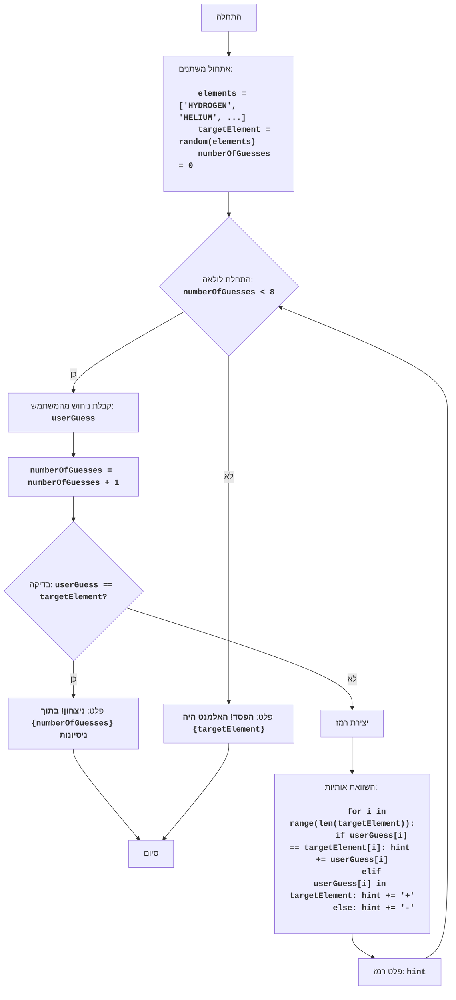

# ניתוח קוד: משחק ניחוש אלמנטים כימיים (CHEMST)

## <algorithm>

1. **אתחול משחק:**
   -  רשימת אלמנטים כימיים (`elements`) מוגדרת: `elements = ['HYDROGEN', 'HELIUM', 'LITHIUM', ...]`.
   -  אלמנט מטרה (`targetElement`) נבחר באופן אקראי מהרשימה, לדוגמה: `targetElement = 'CARBON'`.
   -  מונה ניסיונות (`numberOfGuesses`) מאותחל ל-0.
   
2. **לולאת משחק:**
   -  הלולאה רצה כל עוד `numberOfGuesses < 8`.
     -  המשתמש מתבקש להכניס שם של אלמנט, לדוגמה: `userGuess = input("הכנס שם של אלמנט: ").upper()`, ואז הקלט הופך לאותיות גדולות, למשל, אם המשתמש הכניס "carbon" הערך יהיה 'CARBON'.
     -  מונה הניסיונות עולה ב-1: `numberOfGuesses += 1`.

3. **בדיקת ניחוש:**
   -  אם `userGuess == targetElement` (לדוגמה, 'CARBON' == 'CARBON'), המשחק מסתיים בהודעת ניצחון, ויוצאים מהלולאה.
   -  אחרת, אם הניחוש לא נכון, נוצרת מחרוזת רמז (`hint`).

4. **יצירת רמז:**
   -  עוברים בלולאה על כל אות ב-`targetElement`. לדוגמה, עבור `targetElement = 'CARBON'`:
        -   אם האות ב-`userGuess` נמצאת באותו מיקום כמו ב-`targetElement`, האות מתווספת ל-`hint`. לדוגמה, אם `userGuess = 'CARPET'`, האותיות `C`, `A` ו-`R` יתווספו ל-`hint`.
        - אם האות מ-`userGuess` קיימת ב-`targetElement` אבל לא באותו מיקום, מתווסף סימן '+' ל-`hint`. לדוגמה, עבור `userGuess = 'ORANGE'`, האות `O` קיימת ב-`targetElement = 'CARBON'`, ולכן הסימן `+` יתווסף ל-`hint`.
        -  אם האות מ-`userGuess` לא קיימת ב-`targetElement`, מתווסף סימן '-' ל-`hint`.
        -  אם אורך הניחוש קצר מאורך האלמנט המטרה, אז לאותיות החסרות, יתווסף הסימן '-'.
   - הרמז מוצג למשתמש.

5. **סיום משחק (אם לא ניצח):**
    - אם הלולאה מסתיימת ו-`numberOfGuesses == 8`, המשחק מסתיים בהודעת הפסד עם האלמנט הנכון.

## <mermaid>

**ניתוח תלויות:**

-   **`import random`**: המודול `random` משמש לבחירת אלמנט אקראי מרשימת האלמנטים (`elements`) בהתחלה. זהו ייבוא סטנדרטי של פייתון ולא תלוי בחבילה אחרת בתוך הפרויקט.

## <explanation>

**ייבואים (Imports):**

-   **`import random`**:  
    -   **מטרה**: מספק פונקציות ליצירת מספרים אקראיים, ומשמש לבחירת אלמנט מטרה אקראי מרשימת האלמנטים הכימיים.
    -   **קשר עם חבילות אחרות**: זהו ייבוא סטנדרטי של פייתון ואינו תלוי בחבילות אחרות בתוך הפרויקט.

**משתנים (Variables):**

-   **`elements`**: 
    -   **סוג**: רשימה (list) של מחרוזות (strings).
    -   **שימוש**: מכילה את שמות האלמנטים הכימיים שהמשחק משתמש בהם.

-   **`targetElement`**:
    -   **סוג**: מחרוזת (string).
    -   **שימוש**: מחזיקה את שם האלמנט הכימי שהשחקן צריך לנחש, נבחר באופן אקראי מהרשימה `elements`.
    
-   **`numberOfGuesses`**:
    -   **סוג**: מספר שלם (integer).
    -   **שימוש**: סופר את מספר הניסיונות שהמשתמש עשה לנחש את האלמנט.

-   **`userGuess`**:
    -   **סוג**: מחרוזת (string).
    -   **שימוש**: מחזיקה את שם האלמנט שהמשתמש הכניס כניחוש.
    
-   **`hint`**:
    -   **סוג**: מחרוזת (string).
    -   **שימוש**: מחזיקה את הרמז שמוצג למשתמש אחרי כל ניסיון, בנוי מסימנים של אותיות, + ו-.

**פונקציות (Functions):**

-   אין פונקציות מוגדרות באופן מפורש בקוד הזה מלבד פונקציות בילט-אין של פייתון.

**בעיות אפשריות ותחומים לשיפור:**

1.  **גודל רשימת האלמנטים:**
    -   הרשימה הנוכחית של האלמנטים הכימיים מוגבלת, אפשר להרחיב את הרשימה כדי להוסיף מגוון למשחק.
2.  **בדיקת תקינות קלט:**
    -   הקוד הנוכחי אינו בודק אם הקלט של המשתמש הוא שם אלמנט תקין. אפשר להוסיף בדיקה לכך כדי למנוע תקלות.
3.  **משוב משופר:**
    - הרמז הנוכחי לא נותן הרבה מידע. אפשר לשפר את מערכת הרמזים על ידי ציון כמה אותיות נמצאות במקום הנכון וכמה אותיות קיימות אך לא במקום הנכון.
4.  **ממשק משתמש:**
    -  הממשק הנוכחי הוא בסיסי. אפשר לשפר את חוויית המשתמש על ידי שימוש בספריית ממשק משתמש גרפי (GUI) או על ידי הוספת יכולות נוספות כמו הצגת היסטוריית ניסיונות.
    
**שרשרת קשרים עם חלקים אחרים בפרויקט:**

-   אין קשר ישיר לחלקים אחרים בפרויקט, אך ניתן לשלב את המשחק כמודול בתוך מערכת משחקים גדולה יותר, לדוגמה, יצירת ממשק משתמש מרכזי שבו ניתן לבחור לשחק את המשחק.

**סיכום:**

הקוד מיישם משחק ניחוש פשוט עם רשימת אלמנטים כימיים מוגבלת. הקוד ניתן לשיפור על ידי הוספת בדיקות קלט, שיפור הרמז ושימוש בממשק משתמש נוח יותר.