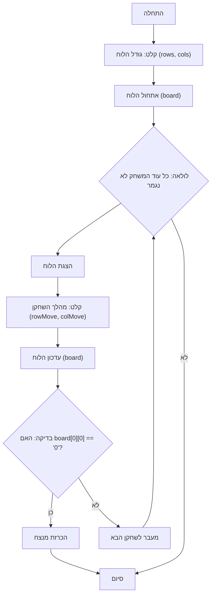

## <algorithm>

1. **התחלת המשחק:**
   - המשחק מתחיל.
   - *דוגמה:* אין נתונים ראשוניים.

2. **קבלת גודל הלוח:**
   - המשתמש מתבקש להכניס את מספר השורות והעמודות של לוח המשחק.
   - *דוגמה:* המשתמש מזין `rows = 5` ו-`cols = 7`.

3. **אתחול הלוח:**
   - לוח המשחק מאותחל כמערך דו-ממדי (רשימה של רשימות) המייצג את לוח השוקולד.
   - כל תא מאותחל לערך כלשהו (למשל, `X`) שמייצג חלק מהשוקולד.
   - *דוגמה:* לוח 5x7 מאותחל: `board = [['X' for _ in range(7)] for _ in range(5)]`.

4. **לולאת המשחק:**
   - הלולאה נמשכת כל עוד המשחק לא הסתיים.
   - כל איטרציה של הלולאה מייצגת תור של שחקן.

5. **הצגת הלוח:**
    - הלוח הנוכחי מוצג למשתמש.
    - *דוגמה:*
    ```
    X X X X X X X
    X X X X X X X
    X X X X X X X
    X X X X X X X
    X X X X X X X
    ```

6. **קבלת מהלך:**
   - המשתמש הנוכחי מתבקש להזין את הקואורדינטות של פיסת השוקולד שהוא רוצה "לנגוס" (שורה ועמודה).
   - *דוגמה:* השחקן מזין `rowMove = 2` ו-`colMove = 3`.

7. **עדכון הלוח:**
   - הלוח מעודכן על ידי הסרת כל החלקים מימין ומהלמטה של המיקום הנבחר.
   - *דוגמה:* אם השחקן בחר (2,3) הלוח משתנה:
    ```
    X X X X 0 0 0
    X X X X 0 0 0
    X X X X 0 0 0
    X X X X X X X
    X X X X X X X
    ```

8. **בדיקת ניצחון:**
   - נבדק האם השחקן הנוכחי אכל את ה"רעל" (הפינה השמאלית התחתונה של הלוח).
   - *דוגמה:* אם התא ב-(0,0) הוא `0` המשחק הסתיים והשחקן הנוכחי הפסיד.

9. **הכרזת מנצח/המשך:**
   - אם השחקן הנוכחי אכל את ה"רעל", מנצח השחקן השני והמשחק נגמר.
   - אחרת, עוברים לשחקן הבא.

10. **סיום המשחק:**
   - המשחק מסתיים כאשר הוכרז מנצח.
   - *דוגמה:* מודפסת הודעה המודיעה על המנצח.

## <mermaid>



**ניתוח התלויות:**

אין תלויות מיובאות (imports) בקוד המתואר. התרשים מייצג את הלוגיקה של המשחק, ומכאן שאין תלות בחבילות חיצוניות.

## <explanation>

**ייבואים (Imports):**
   - אין ייבוא ספציפי בקוד המתואר. המשחק פועל על בסיס לוגיקה פנימית בלבד.

**מחלקות (Classes):**
   - אין שימוש במחלקות בקוד המתואר. המשחק בנוי באמצעות פונקציות ולולאות בלבד.

**פונקציות (Functions):**
   - לא מוגדרות פונקציות ספציפיות, אבל הלוגיקה של המשחק מובנית באופן הבא:
     1.  **אתחול המשחק:** קבלת גודל הלוח ואתחול הלוח.
     2.  **לולאת המשחק:** מעבר בין שחקנים, הצגת הלוח, קבלת קלט, עדכון הלוח, ובדיקת ניצחון.
     3.  **בדיקת ניצחון:** בדיקה האם הפינה השמאלית העליונה של הלוח היא '0' (מסומנת כ"רעל").
     4.  **הכרזת מנצח:** הצגת ההודעה המתאימה.

**משתנים (Variables):**
   - `rows`: מספר השורות של הלוח (int).
   - `cols`: מספר העמודות של הלוח (int).
   - `board`: מערך דו-ממדי (רשימה של רשימות) המייצג את לוח המשחק (list of lists).
   - `rowMove`: השורה שהשחקן בחר לנגוס (int).
   - `colMove`: העמודה שהשחקן בחר לנגוס (int).

**בעיות אפשריות או תחומים לשיפור:**
  - **קלט משתמש:** הקוד המקורי לא מטפל בטעויות בקלט המשתמש (כגון הזנת ערכים לא חוקיים או חריגה מגבולות המערך). יש צורך להוסיף טיפול נכון בקלט משתמש.
  - **ממשק משתמש:** הקוד המקורי מסתמך על קלט ופלט פשוטים. ניתן לשפר את חווית המשתמש על ידי הוספת ממשק גרפי.
  - **אופטימיזציה:** ניתן לייעל את הקוד על ידי שימוש באלגוריתמים יעילים יותר. לדוגמה, ניתן לייעל את תהליך עדכון הלוח.
  - **מבנה מודולרי:** ניתן לשפר את מבנה הקוד על ידי פירוק הלוגיקה לפונקציות מודולריות יותר.
  - **הרחבה למשחק נגד מחשב:** ניתן להרחיב את המשחק על ידי הוספת מצב משחק נגד המחשב.
  - **שמירת מצב המשחק:** ניתן להוסיף פונקציונליות לשמירת מצב המשחק והטענתו מאוחר יותר.

**שרשרת קשרים עם חלקים אחרים בפרויקט:**
  - הקוד המתואר הוא עצמאי ואינו קשור לחלקים אחרים בפרויקט, מאחר שאין ייבוא של מודולים חיצוניים.