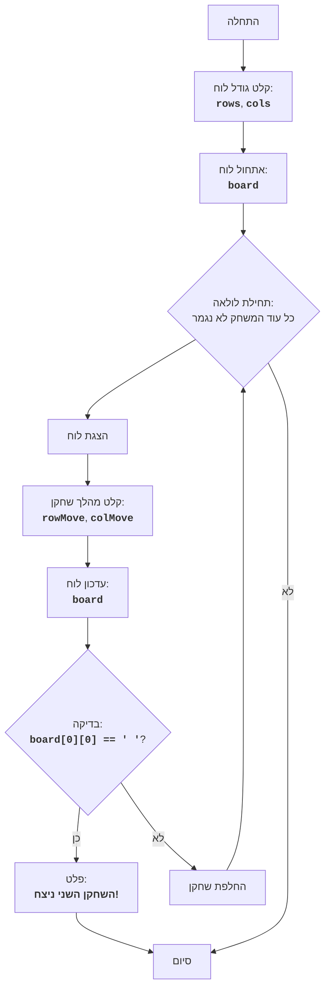

## <algorithm>

1. **התחלה:** המשחק מתחיל.
   - דוגמה: המשחק מופעל ומחכה לקלט.

2. **קלט גודל לוח:** המשתמש מתבקש להכניס את גודל הלוח (מספר שורות ועמודות).
   - דוגמה: המשתמש מזין 5 שורות ו-7 עמודות.

3. **אתחול לוח:** נוצר לוח משחק (דו-ממדי), שמייצג את חפיסת השוקולד.
   - דוגמה: לוח בגודל 5x7 מאותחל עם תווי ריבוע ('█').

4. **לולאת משחק:** המשחק ממשיך עד סיומו.
   - דוגמה: הלולאה ממשיכה כל עוד אף שחקן לא אכל את המשבצת המורעלת.

5. **הצגת לוח:** מצב הלוח הנוכחי מוצג לשחקנים.
   - דוגמה: הלוח מוצג עם '█' במקומות בהם יש שוקולד ו' ' במקומות ריקים.

6. **קלט מהלך:** השחקן הנוכחי מתבקש להזין את הקואורדינטות של החתיכה שהוא רוצה "לנגוס".
   - דוגמה: השחקן מזין שורה 3 ועמודה 4.

7. **עדכון לוח:** כל החלקים מימין ולמעלה לקואורדינטות שהוזנו "נאכלים" (משתנים ל-' ').
   - דוגמה: לאחר שהשחקן בחר 3, 4, כל החלקים מימין ומעלה (בשורות 0-3 ועמודות 4-7) הופכים ל-` ` (רווח).

8. **בדיקת ניצחון:** נבדק האם השחקן אכל את החתיכה המורעלת (בפינה השמאלית התחתונה).
    - דוגמה: אם הריבוע במיקום [0][0] הוא ' ', זה אומר שהשחקן הנוכחי הפסיד.

9. **פלט ניצחון:** אם שחקן אכל את החתיכה המורעלת, מוכרז על ניצחון השחקן השני.
    - דוגמה: מוצגת הודעה שהשחקן השני ניצח.

10. **החלפת שחקן:** אם אין ניצחון, עוברים לשחקן הבא.
    - דוגמה: תורו של שחקן 1 מסתיים ועוברים לשחקן 2.

11. **סיום:** המשחק מסתיים.
    - דוגמה: אחרי שהוכרז מנצח, המשחק מסתיים.

## <mermaid>

התרשים מתאר את זרימת המשחק, מההתחלה ועד הסיום. אין תלויות מיובאות, מכיוון שהאלגוריתם מתואר ברמה גבוהה ללא קוד ספציפי. כל שמות המשתנים בתרשים הם בעלי משמעות ומייצגים את הפעולות והמשתנים שמשמשים במשחק.

## <explanation>

- **ייבואים (Imports):** לא קיימים ייבואים בקוד הזה. מדובר בתיאור של האלגוריתם ולא בקוד ספציפי.
- **מחלקות (Classes):** לא מוגדרות מחלקות בקוד הזה, מכיוון שמדובר בתיאור אלגוריתם.
- **פונקציות (Functions):** אין פונקציות ספציפיות. האפשרויות המרכזיות מוגדרות:
    - **אתחול לוח**: מאתחל את לוח המשחק עם תווי ריבוע ('█') בהתאם לגודל שהוגדר.
    - **הצגת לוח**: מציג את מצב הלוח הנוכחי למשתמש.
    - **עדכון לוח**: מעדכן את הלוח על ידי החלפת ריבועים ברווחים (' ') בהתאם למהלך השחקן.
    - **בדיקת ניצחון**: בודק אם החתיכה המורעלת נאכלה על ידי בדיקה אם המשבצת [0][0] היא רווח (' ').
    - **פלט ניצחון**: מציג הודעה שהשחקן השני ניצח.
- **משתנים (Variables):**
    - `rows`: מספר השורות בלוח המשחק (מסוג שלם).
    - `cols`: מספר העמודות בלוח המשחק (מסוג שלם).
    - `board`: לוח המשחק המייצג את חפיסת השוקולד (דו-ממדי).
    - `rowMove`: השורה שנבחרה על ידי השחקן (מסוג שלם).
    - `colMove`: העמודה שנבחרה על ידי השחקן (מסוג שלם).

**בעיות אפשריות ותחומים לשיפור:**

- חוסר בבדיקת תקינות קלט: הקוד אינו בודק אם הקלט שהמשתמש מזין חוקי (למשל, האם הערכים שהוזנו הם מספרים שלמים חיוביים).
- חוסר בבדיקת תקינות מהלך: הקוד לא בודק אם מהלך שהשחקן מבצע חוקי (כלומר, האם הקואורדינטות שהוזנו הן בתוך גבולות הלוח).
- תמיכה בשחקנים רבים: הקוד מתוכנן לשני שחקנים בלבד, ולא ניתן להרחיב אותו בקלות ליותר שחקנים.
- ממשק משתמש פשוט: הקוד מסתמך על קלט טקסטואלי פשוט. אפשר לשפר את חוויית המשתמש באמצעות ממשק גרפי.

**שרשרת קשרים עם חלקים אחרים בפרויקט:**

- מכיוון שהקוד הוא תיאור אלגוריתם בלבד, אין לו קשר ישיר עם קבצים אחרים בפרויקט.
- הקוד יכול לשמש כבסיס ליצירת משחק "CHOMP" בפועל, שם כל הפונקציות שהוזכרו כאן ייושמו בקוד ממשי.