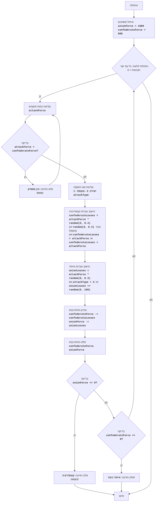

## <algorithm>

1. **התחלה:**
    - אתחול כוחות: צבא האיחוד (`unionForce`) מקבל 1000, צבא הקונפדרציה (`confederateForce`) מקבל 800.
    - דוגמה: `unionForce = 1000`, `confederateForce = 800`

2. **לולאה ראשית (כל עוד שני הצבאות גדולים מ-0):**
    - **קלט כוח התקפה:**
        - השחקן מזין את כמות החיילים שישלח להתקפה (`attackForce`).
        - דוגמה: השחקן מזין `attackForce = 200`.
        - **בדיקה:** האם `attackForce` גדול מ`confederateForce`?
            - אם כן, הדפס "לא מספיק כוחות", וחזור לשלב 2.1 (קלט כוח התקפה).
            - אם לא, המשך.
            - דוגמה: אם `confederateForce` הוא 150, והשחקן מזין `attackForce = 200`, תוצג הודעה "לא מספיק כוחות".
    - **קלט סוג התקפה:**
        - השחקן מזין סוג התקפה: 1 עבור התקפה ישירה, 2 עבור תמרון עוקף (`attackType`).
        - דוגמה: השחקן מזין `attackType = 1`.
    - **חישוב אבדות הקונפדרציה:**
        - `confederateLosses` מחושב כ`attackForce` כפול מספר אקראי בין 0 ל-0.4 (עבור התקפה ישירה) או 0 ל-0.2 (עבור תמרון עוקף).
        - אם `confederateLosses` גדול מ`attackForce`, הגדר `confederateLosses` כשווה ל`attackForce`.
        - דוגמה: אם `attackForce = 200` ו`attackType = 1` ו המספר האקראי הוא 0.3, אז `confederateLosses` שווה 200 * 0.3 = 60.
    - **חישוב אבדות האיחוד:**
        - `unionLosses` מחושב כ`attackForce` כפול מספר אקראי בין 0 ל-0.3.
        - אם `attackType` הוא 2 (תמרון עוקף), הוסף ל`unionLosses` מספר אקראי בין 0 ל-100.
        - דוגמה: אם `attackForce = 200` והמספר האקראי הוא 0.2 אז `unionLosses` הוא 200 * 0.2 = 40. אם `attackType=2` ואקראי נוסף הוא 30 אז `unionLosses` הופך ל 40 + 30=70.
    - **עדכון כוחות:**
         - `confederateForce` = `confederateForce` - `confederateLosses`
        - `unionForce` = `unionForce` - `unionLosses`
        - דוגמה: אם `confederateForce` היה 800 ו `confederateLosses` הוא 60,  `confederateForce` הופך ל740. אם `unionForce` היה 1000 ו `unionLosses` הוא 70, `unionForce` הופך ל930.
    - **פלט כוחות:**
        - הדפס את `confederateForce` ו`unionForce` הנוכחיים.
    - **בדיקה - ניצחון האיחוד:**
         - אם `unionForce` קטן או שווה ל0, הדפס "קונפדרציה ניצחה!" וסיום משחק.
    - **בדיקה - ניצחון הקונפדרציה:**
         - אם `confederateForce` קטן או שווה ל0, הדפס "איחוד ניצח!" וסיום משחק.
         - אם אף אחד לא ניצח, חזור לשלב 2 (לולאה ראשית).

3. **סיום:** המשחק הסתיים.

## <mermaid>

**ניתוח תלויות:**
- אין תלויות חיצוניות (אין `import` בפרויקט המינימלי הזה).
- התרשים מתאר את זרימת הבקרה בין שלבים שונים של המשחק:
    - תחילת המשחק ואתחול משתנים.
    - לולאה ראשית הממשיכה כל עוד שני הצבאות עדיין קיימים.
    - קליטת קלט מהמשתמש וחישוב אבדות.
    - עדכון הכוחות ופלט סטטוס משחק.
    - בדיקות ניצחון והדפסות מתאימות.
    - סיום המשחק.

## <explanation>

**ייבואים (Imports):**
- אין ייבוא. זהו קובץ עצמאי שאינו תלוי בחלקים אחרים בפרויקט (למעט קריאה ושימוש בסיסי במונחים וערכים מספריים).

**פונקציות (Functions):**
- אין פונקציות מוגדרות במפורש, אך הקוד עובד כסדרת פעולות לוגיות שמתפקדות כמו פונקציה ראשית.

**משתנים (Variables):**
- `unionForce` (מספר שלם): מייצג את כמות החיילים של צבא האיחוד. מתחיל ב-1000.
- `confederateForce` (מספר שלם): מייצג את כמות החיילים של צבא הקונפדרציה. מתחיל ב-800.
- `attackForce` (מספר שלם): כמות החיילים שהשחקן בוחר לשלוח להתקפה.
- `attackType` (מספר שלם): סוג ההתקפה שהשחקן בוחר (1 - ישירה, 2 - עוקפת).
- `confederateLosses` (מספר ממשי): כמות החיילים שצבא הקונפדרציה איבד במהלך קרב.
- `unionLosses` (מספר ממשי): כמות החיילים שצבא האיחוד איבד במהלך קרב.

**הסברים מפורטים:**
- **זרימה:** הקוד מתחיל באתחול כוחות. לאחר מכן, ישנה לולאה ראשית שממשיכה כל עוד יש חיילים לשני הצדדים. בתוך הלולאה, השחקן מקבל קלט (כמה כוחות לשלוח ואיזה סוג התקפה לבצע). הקוד מחשב את האבדות עבור שני הצבאות על בסיס הקלט, וגורמים אקראיים, ומעדכן את כמות החיילים של כל צד. הוא גם בודק אם אחד הצבאות הגיע ל-0 חיילים או פחות, ואם כן מכריז על מנצח ויוצא מהלולאה.

- **אקראיות:** השימוש בפונקציה האקראית (שלא צוינה במפורש) מציג אלמנט של אי ודאות בתוצאות הקרבות, מה שמוסיף לאתגר של המשחק.

- **בעיות פוטנציאליות ושיפורים:**
    - **הקוד לא כולל ממשק משתמש:** התקשורת עם השחקן היא טקסטואלית בלבד, שאינה ידידותית למשתמש.
    - **אין שמירת מצב המשחק:** אין שמירת התקדמות המשחק. בכל ריצה מתחילים מאפס.
    - **אפשרות לשיפור:** ניתן לשפר את הקוד באמצעות הוספה של פונקציות נפרדות לחישוב אבדות, עדכון כוחות, בדיקת ניצחון ועוד, כדי להפוך את הקוד לקריא יותר וקל לתחזוקה.
    - **אפשרות לשיפור:**  ניתן להוסיף ממשק גרפי משופר.
    - **אפשרות לשיפור:** ניתן להוסיף אלמנטים אסטרטגיים נוספים כגון: חיזוק, יכולת שינוי סוג כוחות, או אלמנטים נוספים.
    - **אפשרות לשיפור:** ניתן להוסיף רמות קושי על ידי שינוי המקדמים האקראיים.

**קשריים עם חלקים אחרים בפרויקט:**
- מכיוון שהקוד הזה עומד בפני עצמו, אין לו קשרים מורכבים עם חלקים אחרים בפרויקט, אך הוא מציג את הלוגיקה הבסיסית של משחק. ניתן להשתמש ברעיון הזה כבסיס למשחק מורכב יותר.