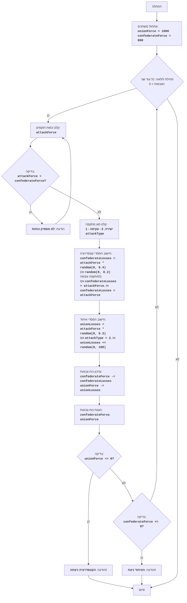

## ניתוח קוד משחק מלחמת האזרחים

### 1. <algorithm>

**תיאור אלגוריתם:**
הקוד מדמה קרב בין שתי ארמיות: צבא הקונפדרציה וצבא האיחוד. המשחק מתחיל באתחול מספר החיילים של כל צד. השחקן, שמגלם את הקונפדרציה, יכול לבחור כמה חיילים לשלוח לקרב ובאיזה סוג מתקפה להשתמש (ישירה או עוקפת). המשחק ממשיך עד שאחת הארמיות מובסת (כאשר מספר החיילים שלה מגיע לאפס או פחות מכך).

**תרשים זרימה צעד-אחר-צעד:**

1.  **אתחול:**
    *   `unionForce` = 1000 (צבא האיחוד)
    *   `confederateForce` = 800 (צבא הקונפדרציה)
    *   _דוגמה:_ הגדרת כמות החיילים ההתחלתית של כל צד.
2.  **לולאת משחק:** (מתבצעת כל עוד שני הצבאות גדולים מאפס)
    *   קלט מהשחקן:
        *   `attackForce`: מספר החיילים שישלח השחקן לקרב.
            *   _דוגמה:_ השחקן מכניס 200.
        *   בדיקה: האם `attackForce` גדול מ- `confederateForce`?
            *   _דוגמה:_ אם `attackForce = 900`, ההודעה "לא מספיק כוחות" תוצג, והקלט יחזור.
        *   `attackType`: סוג המתקפה (1-ישירה, 2-עקיפה).
            *   _דוגמה:_ השחקן מכניס 2.
    *   חישוב הפסדי הקונפדרציה (`confederateLosses`):
        *   חישוב רנדומלי (0-0.4 עבור מתקפה ישירה, 0-0.2 עבור עקיפה), כפול `attackForce`.
        *   אם `confederateLosses` גדול מ- `attackForce`, הערך מתעדכן ל- `attackForce`.
            *   _דוגמה:_ אם `attackForce = 200` ורנדומלי הוא 0.3, הפסדים יהיו 200 * 0.3 = 60.
    *   חישוב הפסדי האיחוד (`unionLosses`):
        *   חישוב רנדומלי (0-0.3) כפול `attackForce`.
            *    _דוגמה:_ אם `attackForce = 200` ורנדומלי הוא 0.2, הפסדים יהיו 200 * 0.2 = 40.
        *   אם `attackType == 2`, מוסיפים ערך רנדומלי (0-100) ל-`unionLosses`.
            *   _דוגמה:_ אם סוג המתקפה הוא עוקפת, נוסיף 50.
    *   עדכון כוח הצבאות:
        *   `confederateForce = confederateForce - confederateLosses`
        *   `unionForce = unionForce - unionLosses`
            *   _דוגמה:_ אם הפסדי הקונפדרציה הם 60, אז  `confederateForce = 800-60=740`.
    *   הדפסת מצב הצבאות הנוכחי.
        *   _דוגמה:_ הדפסת "צבא הקונפדרציה: 740, צבא האיחוד: 910".
    *   בדיקה: האם `unionForce <= 0`?
        *   אם כן, הדפסת "הקונפדרציה ניצחה!" וסיום המשחק.
    *   בדיקה: האם `confederateForce <= 0`?
        *   אם כן, הדפסת "האיחוד ניצח!" וסיום המשחק.
    *   אם אף אחד מהתנאים לא מתקיים, חזרה לתחילת הלולאה.
3.  **סיום המשחק.**

### 2. <mermaid>

**הסבר על התלויות:**

*   אין תלויות ישירות בפונקציות או מחלקות אחרות מלבד ספריית הרנדום של השפה שבשימוש. התרשים מייצג את הלוגיקה הפנימית של הקוד, אין ייבוא של מודולים חיצוניים.

### 3. <explanation>

**ייבוא (Imports):**

*   אין ייבוא חיצוני, הקוד מסתמך על פונקציות מובנות בשפה (בעיקר `random`).

**מחלקות (Classes):**

*   אין מחלקות מוגדרות בקוד.

**פונקציות (Functions):**

*   אין פונקציות מוגדרות בקוד.

**משתנים (Variables):**

*   `unionForce` (סוג: מספר שלם): מייצג את מספר החיילים של צבא האיחוד.
    *   _שימוש:_ מאותחל ל-1000, מעודכן בכל סיבוב, ומשמש לבדיקת תנאי ניצחון.
*   `confederateForce` (סוג: מספר שלם): מייצג את מספר החיילים של צבא הקונפדרציה.
    *   _שימוש:_ מאותחל ל-800, מעודכן בכל סיבוב, ומשמש לבדיקת תנאי ניצחון ולבדיקה האם יש מספיק כוח לתקוף.
*   `attackForce` (סוג: מספר שלם): מייצג את מספר החיילים שנשלחים להתקפה על ידי השחקן.
    *   _שימוש:_ נקלט מהמשתמש ומשמש לחישוב הפסדים.
*   `attackType` (סוג: מספר שלם): מייצג את סוג המתקפה שהשחקן בחר (1 - ישירה, 2 - עקיפה).
    *   _שימוש:_ נקלט מהמשתמש ומשפיע על חישוב הפסדי האיחוד.
*   `confederateLosses` (סוג: מספר ממשי): מייצג את הפסדי צבא הקונפדרציה בסיבוב הנוכחי.
    *   _שימוש:_ מחושב בהתבסס על `attackForce` ומספר רנדומלי, מעדכן את `confederateForce`.
*   `unionLosses` (סוג: מספר ממשי): מייצג את הפסדי צבא האיחוד בסיבוב הנוכחי.
    *   _שימוש:_ מחושב בהתבסס על `attackForce` ומספר רנדומלי, מעדכן את `unionForce`.

**בעיות אפשריות ותחומים לשיפור:**

*   **ממשק משתמש:** המשחק מבוסס על קלט פשוט מהמסוף, ואינו כולל ממשק גרפי.
*   **רנדומיות:** שימוש ברנדומיות פשוטה עלול להביא לתוצאות לא מאוזנות.
*   **מורכבות:** המשחק פשוט ואינו כולל גורמים נוספים שעשויים להשפיע על תוצאות הקרב, כמו תנאי שטח או יחידות מיוחדות.
*   **בדיקות קלט:** הקוד אינו כולל בדיקות קלט מפורטות (למשל, לוודא שקלט הוא אכן מספר).
*   **חוסר בפונקציונליות:** חוסר בפונקציות מקשה על קריאות הקוד.

**שרשרת קשרים עם חלקים אחרים בפרויקט (אם רלוונטי):**

*   הקוד הוא משחק עצמאי ואינו תלוי בשאר חלקי הפרויקט.