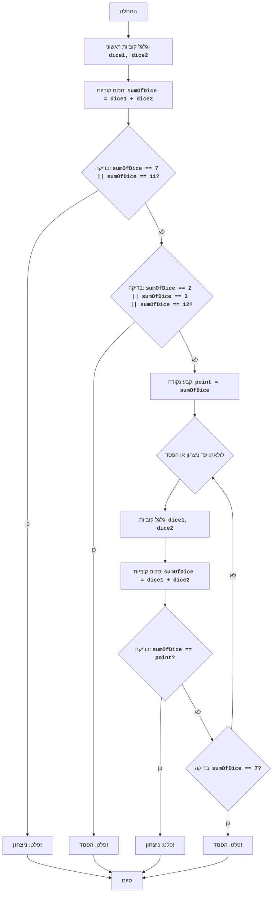

## <algorithm>

האלגוריתם של משחק ה"קראפס" מתואר בצורה של תרשים זרימה, המחלק את המשחק לשני שלבים עיקריים: השלב הראשוני והשלב המעגלי.

**שלב 1: השלב הראשוני (First Roll)**

1. **התחלה (Start)**: המשחק מתחיל.
   
2. **גלגול קוביות (RollDice1)**:
   - שתי קוביות מגולגלות, ומופקות להן תוצאות אקראיות בין 1 ל-6.
   - לדוגמה: `dice1 = 4`, `dice2 = 3`.

3. **חישוב סכום (CalculateSum1)**:
    - הסכום של תוצאות הקוביות מחושב: `sumOfDice = dice1 + dice2`.
    - בדוגמה: `sumOfDice = 4 + 3 = 7`.
4.  **בדיקת ניצחון ראשוני (CheckWin1)**:
    - האלגוריתם בודק אם `sumOfDice` שווה ל-7 או ל-11.
    - בדוגמה: `sumOfDice = 7`, התנאי מתקיים.
5. **פלט ניצחון (OutputWin1)**:
    - אם התנאי מתקיים, מודפסת הודעה "YOU WIN!", והמשחק מסתיים.
    - בדוגמה: מוצג "YOU WIN!", והמשחק מסתיים.
6. **בדיקת הפסד ראשוני (CheckLose1)**:
   - אם `CheckWin1` לא התקיים, האלגוריתם בודק אם `sumOfDice` שווה ל-2, 3 או 12.
   - לדוגמה: אם `sumOfDice` היה 2, התנאי היה מתקיים.
7.  **פלט הפסד (OutputLose1)**:
   - אם התנאי מתקיים, מודפסת הודעה "YOU LOSE!", והמשחק מסתיים.
   - בדוגמה אם `sumOfDice` היה 2, מוצג "YOU LOSE!", והמשחק מסתיים.

**שלב 2: השלב המעגלי (Point Rolls)**

8.  **קביעת נקודה (SetPoint)**:
    - אם לא הושג ניצחון או הפסד בשלב הראשון, הערך של `sumOfDice` נשמר כ"נקודה" (`point`).
   - לדוגמה, אם `sumOfDice` היה 4, אז `point = 4`.
9.  **התחלת לולאה (LoopStart)**:
    - מתחיל לולאה שמתבצעת עד שהמשחק מסתיים (ניצחון או הפסד).

10. **גלגול קוביות (RollDice2)**:
    - שתי קוביות מגולגלות שוב עם תוצאות אקראיות בין 1 ל-6.
    - לדוגמה: `dice1 = 5`, `dice2 = 2`.

11. **חישוב סכום (CalculateSum2)**:
    - מחושב סכום התוצאות: `sumOfDice = dice1 + dice2`.
    - בדוגמה: `sumOfDice = 5 + 2 = 7`.
    
12. **בדיקת ניצחון (CheckWin2)**:
    - האלגוריתם בודק האם `sumOfDice` שווה לערך הנקודה (`point`).
    - לדוגמה: אם `point=4` ו `sumOfDice=7`, התנאי לא מתקיים.
13.  **פלט ניצחון (OutputWin2)**:
    - אם התנאי מתקיים, מודפסת הודעה "YOU WIN!", והמשחק מסתיים.
    - לדוגמה, אם `sumOfDice` היה שווה ל-4, יוצג "YOU WIN!" והמשחק מסתיים.
14.  **בדיקת הפסד (CheckLose2)**:
    - אם לא התקיים ניצחון, האלגוריתם בודק האם `sumOfDice` שווה ל-7.
    - בדוגמה: `sumOfDice=7`, התנאי מתקיים.

15. **פלט הפסד (OutputLose2)**:
    - אם התנאי מתקיים, מודפסת הודעה "YOU LOSE!", והמשחק מסתיים.
     - בדוגמה: מוצג "YOU LOSE!", והמשחק מסתיים.
16. **חזרה ללולאה (LoopStart)**:
    - אם לא הושג ניצחון ולא הפסד, הלולאה חוזרת לנקודה 9 (RollDice2) עד להשגת ניצחון או הפסד.

17. **סיום (End)**: המשחק מסתיים.

## <mermaid>

**ניתוח תלויות `mermaid`:**
- אין תלויות חיצוניות או ספריות נדרשות ליצירת הדיאגרמה, מאחר והסינטקס של `mermaid` עצמאי.

## <explanation>

**תיאור מפורט:**

**משתנים:**
- `dice1`, `dice2`: משתנים מספריים שלמים המייצגים תוצאה של גלגול קוביה (מספר בין 1 ל-6).
- `sumOfDice`: משתנה מספרי שלם המייצג את סכום של שתי הקוביות.
- `point`: משתנה מספרי שלם המייצג את ה"נקודה" (הערך של סכום הקוביות בשלב הראשון שלא גרם לניצחון או הפסד מיידי).

**זרימת נתונים:**
- הזרימה מתחילה בגלגול הקוביות, תוצאותיהן משמשות לחישוב הסכום.
- הסכום נבדק מול תנאי ניצחון והפסד.
- אם נדרש, הסכום משמש כנקודה, ולאחר מכן כל סכום חדש של קוביות נבדק מול הנקודה או מול 7 (תנאי הפסד).

**הסברים מפורטים:**

1.  **משחק קראפס:**
    - המשחק הוא משחק מזל בו שני קוביות מגולגלות, המטרה היא לנצח באמצעות סכום הנקודות.
    - השלב הראשון קובע האם יש ניצחון או הפסד מיידי או שממשיכים לשלב השני.

2.  **משתנים:**
    - `dice1` ו-`dice2` הם תוצאות גלגול הקוביות. הם משמשים לחישוב `sumOfDice`.
    - `sumOfDice` הוא סכום של שתי הקוביות, משמש לבדיקת ניצחון/הפסד מיידי ובשלב השני לבדיקה מול הנקודה או 7.
   - `point` משתנה שמאחסן את הערך הראשוני של סכום הקוביות במקרה ולא הושג ניצחון או הפסד מיידי, ומשמש בשלב השני כנקודת מטרה לניצחון.

3.  **אלגוריתם המשחק:**
    - בתחילת המשחק, מגלגלים שתי קוביות ומחשבים את סכום הנקודות.
    - בשלב הראשון, אם הסכום הוא 7 או 11, השחקן מנצח. אם הסכום הוא 2, 3 או 12 השחקן מפסיד.
    - אם סכום הנקודות הוא 4, 5, 6, 8, 9 או 10, הסכום הופך להיות ה"נקודה".
    - בשלב השני מגלגלים שוב קוביות, עד שאו שהסכום שווה ל"נקודה" (ניצחון) או שהסכום שווה ל-7 (הפסד).

4. **תרשים זרימה:**
   - התרשים מתאר את כל שלבי המשחק, החל מגלגול הקוביות הראשוני, דרך בדיקות ניצחון והפסד, ועד לקביעת הנקודה, השלב המעגלי והסיום.
   - התרשים משתמש במונחים בעלי משמעות (לדוגמה: `RollDice1`, `CalculateSum1`, `CheckWin1`, `OutputWin1`, וכו') כדי לתאר את פעולות האלגוריתם.

**בעיות אפשריות ושיפורים:**
-  האלגוריתם פשוט ליישום, אך חסר בו ממשק משתמש.
- ניתן לשפר את הקוד על ידי הוספת פונקציות נפרדות לגלגול הקוביות, חישוב הסכום ובדיקת הניצחון/הפסד.
-  אפשר לשקול שימוש במחלקות לניהול מצב המשחק והשחקן.

**קשרים לחלקים אחרים בפרויקט:**
-  קוד זה הינו חלק מלימוד ותרגול של אלגוריתמים, הוא יכול לשמש כבסיס ליצירת משחק קראפס אינטראקטיבי עם ממשק משתמש.
-  ניתן לשלב קוד זה עם ממשקים גרפיים (GUI) או ממשקי משתמש אחרים.
- הקוד מתאים ללמידה של לוגיקת תכנות בסיסית, תנאים ולולאות.