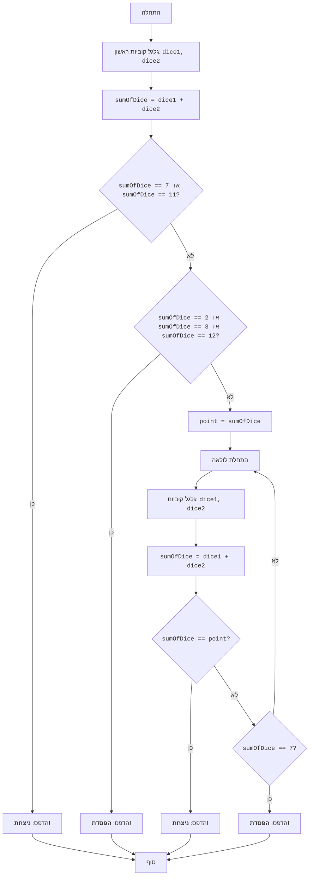

## <algorithm>

1. **תחילת המשחק:**
   - המשחק מתחיל.
   
2. **גלגול קוביות ראשון:**
   - שני קוביות מגולגלות, כאשר כל קובייה מייצרת ערך אקראי בין 1 ל-6.
   - לדוגמה: `dice1 = 4`, `dice2 = 3`.

3. **חישוב סכום:**
    - סכום הערכים של הקוביות מחושב.
    - לדוגמה: `sumOfDice = dice1 + dice2 = 4 + 3 = 7`.

4. **בדיקת ניצחון ראשוני:**
   - בודקים אם הסכום הוא 7 או 11.
    - אם הסכום הוא 7 או 11, השחקן מנצח והמשחק מסתיים.
    - לדוגמה: אם `sumOfDice = 7` אז ניצחון.
   
5. **בדיקת הפסד ראשוני:**
   - אם לא ניצחנו בבדיקה הקודמת, בודקים אם הסכום הוא 2, 3 או 12.
   - אם הסכום הוא 2, 3 או 12, השחקן מפסיד והמשחק מסתיים.
   - לדוגמה: אם `sumOfDice = 3` אז הפסד.

6. **קביעת נקודת מטרה (Point):**
   - אם הסכום אינו 7, 11, 2, 3 או 12, הסכום הופך ל"נקודת מטרה".
   - לדוגמה: אם `sumOfDice = 5` אז `point = 5`.

7. **לולאה:**
   - מתחילים לולאה שמתמשכת עד שהשחקן מנצח או מפסיד.

8. **גלגול קוביות בלולאה:**
   - שוב, מגולגלים שתי קוביות באופן אקראי.
   - לדוגמה: `dice1 = 2`, `dice2 = 6`.

9. **חישוב סכום בלולאה:**
    - סכום הקוביות מחושב שוב.
   - לדוגמה: `sumOfDice = dice1 + dice2 = 2 + 6 = 8`.

10. **בדיקת ניצחון בלולאה:**
    - בודקים אם הסכום שווה ל"נקודת מטרה".
    - אם כן, השחקן מנצח והלולאה מסתיימת.
    - לדוגמה: אם `point = 8` ו-`sumOfDice = 8` אז ניצחון.

11. **בדיקת הפסד בלולאה:**
     - אם לא ניצחנו, בודקים אם הסכום הוא 7.
     - אם כן, השחקן מפסיד והלולאה מסתיימת.
     - לדוגמה: אם `sumOfDice = 7` אז הפסד.

12. **חזרה ללולאה:**
     - אם לא ניצחנו ולא הפסדנו, חוזרים לשלב 7 וממשיכים לגלגל עד שמגיעים לאחד מתנאי הסיום.

13. **סוף המשחק:**
    - המשחק מסתיים כאשר השחקן מנצח או מפסיד.
    
## <mermaid>

**הסבר תלויות (אין תלויות ייבוא בקוד זה):**

בקטע קוד זה, אין שימוש בהוראות `import` ולכן אין תלויות חיצוניות. הקוד פשוט מציג את הלוגיקה של משחק הקראפס באמצעות תרשים זרימה. 

## <explanation>

**ייבואים (Imports):**

אין ייבוא בתוך הקוד הנוכחי.

**מחלקות (Classes):**

אין שימוש במחלקות בקוד הנוכחי.

**פונקציות (Functions):**

אין שימוש בפונקציות בקוד הנוכחי.

**משתנים (Variables):**

- `dice1`, `dice2`: משתנים שלמים המייצגים את ערכי הקוביות לאחר גלגול. הערכים נעים בין 1 ל-6.
    - לדוגמא: `dice1 = 3`, `dice2 = 5`.
- `sumOfDice`: משתנה שלם המייצג את סכום ערכי שתי הקוביות.
   - לדוגמא: `sumOfDice = dice1 + dice2 = 3 + 5 = 8`.
- `point`: משתנה שלם המייצג את נקודת המטרה לאחר גלגול ראשון שלא הסתיים בניצחון או הפסד.

**הסברים נוספים:**

- הקוד מתאר את הלוגיקה הבסיסית של משחק הקראפס באמצעות תרשים זרימה.
- אין בו מימוש ממשי, אלא רק תיאור של השלבים.
- אין צורך בייבואיות או שימוש במחלקות בשביל להבין את הלוגיקה של המשחק.
- הלולאה מסתיימת ברגע שהתנאי לניצחון או הפסד מתקיים.
- **בעיות אפשריות או תחומים לשיפור:**
   - הקוד אינו בר-הרצה, זה רק תיאור של האלגוריתם.
   - כדי ליצור משחק קראפס ממשי, יש להשתמש בקוד ולממש את הפונקציונליות של גלגול קוביות, חישוב סכומים, ובדיקת תנאי ניצחון והפסד.
   - אפשר להוסיף ממשק משתמש כדי לאפשר למשתמש לקיים אינטראקציה עם המשחק.
   
**שרשרת קשרים עם חלקים אחרים בפרויקט:**

הקוד הנוכחי הוא עצמאי ואינו קשור לחלקים אחרים בפרויקט, מאחר שהוא רק תיאור של אלגוריתם.