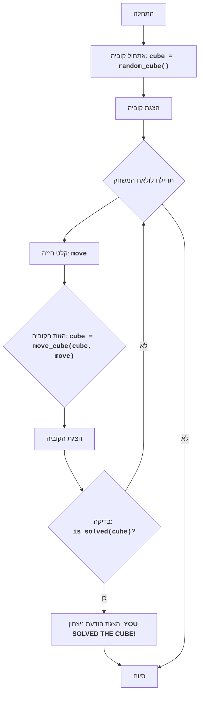

## ניתוח קוד המשחק "קובייה"

הקוד שסופק מתאר משחק קוביה, שהוא חידת היגיון שבה המטרה היא לסדר קוביה שחלקיה מעורבבים. להלן ניתוח מפורט של הקוד:

### 1. <algorithm>

**תיאור אלגוריתם המשחק:**

1. **אתחול הקוביה:**
   - נוצרת מטריצה בגודל 3x3 המייצגת את פני הקוביה.
   - התאים במטריצה מאותחלים בערכים אקראיים בין 1 ל-9.
   - לדוגמה, קוביה אתחול ראשונית: `[[1, 5, 2], [9, 3, 7], [8, 4, 6]]`.

2. **הצגת הקוביה:**
   - מצב הקוביה הנוכחי מוצג למשתמש.
   - לדוגמה, המטריצה תוצג באופן ויזואלי למשתמש.

3. **לולאת משחק:**
   - הלולאה נמשכת עד שהקוביה מסודרת.
   - **קבלת קלט:**
     - המשתמש מתבקש להזין פקודה להזזת הקוביה (U - למעלה, D - למטה, L - שמאלה, R - ימינה).
   - **ביצוע הזזה:**
     - בהתאם לפקודה שהתקבלה:
       - `U`: כל השורות זזות למעלה (השורה הראשונה הופכת לשנייה, השנייה לשלישית, והשלישית לראשונה).
         - דוגמה: `[[1, 5, 2], [9, 3, 7], [8, 4, 6]]` לאחר הזזה `U` תהיה `[[9, 3, 7], [8, 4, 6], [1, 5, 2]]`.
       - `D`: כל השורות זזות למטה (השורה השלישית הופכת לשנייה, השנייה לראשונה, והראשונה לשלישית).
         - דוגמה: `[[1, 5, 2], [9, 3, 7], [8, 4, 6]]` לאחר הזזה `D` תהיה `[[8, 4, 6], [1, 5, 2], [9, 3, 7]]`.
       - `L`: כל העמודות זזות שמאלה (העמודה הראשונה הופכת לשנייה, השנייה לשלישית, והשלישית לראשונה).
         - דוגמה: `[[1, 5, 2], [9, 3, 7], [8, 4, 6]]` לאחר הזזה `L` תהיה `[[5, 2, 1], [3, 7, 9], [4, 6, 8]]`.
       - `R`: כל העמודות זזות ימינה (העמודה השלישית הופכת לשנייה, השנייה לראשונה, והראשונה לשלישית).
         - דוגמה: `[[1, 5, 2], [9, 3, 7], [8, 4, 6]]` לאחר הזזה `R` תהיה `[[2, 1, 5], [7, 9, 3], [6, 8, 4]]`.
   - **הצגת הקוביה המעודכנת:**
     - מצב הקוביה לאחר ההזזה מוצג למשתמש.
   - **בדיקת פתרון:**
     - נבדק האם הקוביה מסודרת לפי הסדר הנכון.
     - אם מסודרת, המשחק מסתיים והודעת ניצחון מוצגת.
     - אחרת, הלולאה חוזרת לקבלת קלט נוסף.

### 2. <mermaid>

**ניתוח התרשים:**

- **Start**: תחילת הפעולה של המשחק.
- **InitializeCube**: פונקציה שיוצרת קוביה אקראית, מיוצגת כמטריצה 3x3 עם ערכים בין 1 ל-9.
- **DisplayCube**: פונקציה שמציגה את מצב הקוביה הנוכחי למשתמש.
- **GameLoopStart**: תחילת לולאה שמאפשרת למשתמש להזיז את הקוביה עד להשגת פתרון.
- **InputMove**: קליטת קלט מהמשתמש להזזת הקוביה (U, D, L, R).
- **MoveCube**: פונקציה שמזיזה את הקוביה בהתאם לקלט שהתקבל (U, D, L או R).
- **DisplayCubeAgain**: פונקציה המציגה את הקוביה לאחר ההזזה.
- **CheckSolved**: פונקציה שבודקת האם הקוביה מסודרת נכון.
- **OutputWin**: פונקציה המציגה הודעת ניצחון אם הקוביה מסודרת.
- **End**: סיום המשחק.

### 3. <explanation>

**הסברים מפורטים:**

- **הגדרות משחק:**
    - המשחק הוא חידת היגיון המשתמשת במטריצה בגודל 3x3, המייצגת את פני הקוביה.
    - המטרה היא לסדר את הקוביה כך שכל הפנים יהיו בסדר הנכון (לפי ערכים מ-1 עד 9).
    - המשתמש יכול להזיז את פני הקוביה באמצעות פקודות: U, D, L, R.
- **אלגוריתם:**
    1. **אתחול:**
       - הקוביה מאותחלת באמצעות מטריצה בגודל 3x3 עם ערכים אקראיים מ-1 עד 9.
       - שימוש בפונקציה `random_cube()` ליצירת הקוביה.
    2. **לולאת משחק:**
       - הלולאה רצה עד שהקוביה מסודרת.
       - המשתמש מתבקש להזין פקודת הזזה (`move`).
       - הפונקציה `move_cube(cube, move)` מבצעת את ההזזה בהתאם לפקודה.
       - הקוביה המעודכנת מוצגת למשתמש.
       - הפונקציה `is_solved(cube)` בודקת האם הקוביה מסודרת.
       - אם הקוביה מסודרת, מוצגת הודעת ניצחון והמשחק מסתיים.
- **פונקציות (דוגמאות):**
    - `random_cube()`: יוצרת מטריצה 3x3 אקראית עם ערכים מ-1 עד 9.
       - דוגמה: מחזירה `[[1, 5, 2], [9, 3, 7], [8, 4, 6]]`.
    - `move_cube(cube, move)`: מבצעת את ההזזה בהתאם לערך `move` (U, D, L, R).
       - דוגמה: אם `cube = [[1, 5, 2], [9, 3, 7], [8, 4, 6]]` ו-`move` הוא `'U'`, הפונקציה תחזיר `[[9, 3, 7], [8, 4, 6], [1, 5, 2]]`.
    - `is_solved(cube)`: בודקת האם הקוביה מסודרת בצורה הנכונה.
       - דוגמה: אם הקוביה מסודרת באופן עולה מ-1 עד 9 הפונקציה תחזיר `True`, אחרת `False`.
- **משתנים:**
    - `cube`: מטריצה 3x3 המייצגת את מצב הקוביה.
    - `move`: מחרוזת המייצגת את הפקודה שהוזנה על ידי המשתמש (U, D, L, R).
- **בעיות אפשריות ושיפורים:**
    - **בדיקת תקינות קלט:** הקוד צריך לכלול בדיקה שהקלט של המשתמש אכן אחד מ-U, D, L או R.
    - **ממשק משתמש:** הקוד הנוכחי פשוט ואינו כולל ממשק משתמש גרפי. ניתן לשפר זאת על ידי הוספת ממשק משתמש גרפי שיהיה ידידותי יותר.
    - **פירוט ההוראות:** יש לספק למשתמש הוראות ברורות על איך לשחק את המשחק, כולל דוגמאות להזזות שונות.
    - **פתרון אוטומטי:** ניתן להוסיף אפשרות לפתרון אוטומטי של הקוביה על ידי אלגוריתם חיפוש.

**שרשרת קשרים עם חלקים אחרים בפרויקט:**

- **קבצי קוד**: הקוד הזה מתאר את הלוגיקה הבסיסית של המשחק, אבל הוא צריך להיות מיושם בקובץ קוד שבו הפונקציות המוגדרות בתיאור קיימות.
- **ממשק משתמש**: כדי להפוך את המשחק למעניין יותר למשתמש, יש ליצור ממשק משתמש גרפי, שיכול להיות בנוי באמצעות ספריות GUI שונות.
- **בדיקות**:  על מנת לוודא את תקינות הקוד, יש לכתוב בדיקות יחידה (unit tests) שיבדקו את תפקוד הפונקציות השונות באופן יסודי.
- **מערכת ניהול משחקים**: במידה וישנה מערכת ניהול משחקים, ניתן להוסיף את המשחק כחלק ממערכת זו.

על ידי ביצוע הניתוח הנ"ל, הקוד של המשחק "קובייה" מובן בצורה יסודית, החל מהאלגוריתם הבסיסי, דרך תיאור זרימת הנתונים בתרשים זרימה, ועד להסבר מפורט של כל החלקים המעורבים במשחק.