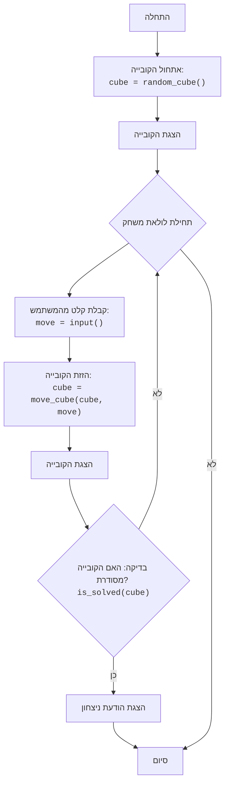

## הוראה:

נתח את הקוד שסופק בפירוט והסבר את הפונקציונליות שלו. התשובה צריכה לכלול שלושה חלקים:

1. **<algorithm>**:
   תאר את תהליך העבודה של הקוד בתרשים זרימה צעד-אחר-צעד.
   - הוסף דוגמאות לכל בלוק לוגי.
   - הצג את הזרימה של נתונים בין פונקציות, מחלקות או שיטות.

2. **<mermaid>**:
   כתוב את קוד התרשים בפורמט `mermaid`.
   - נתח והסבר את כל התלויות המיובאות ביצירת התרשים.
   **חשוב!**: ודא שכל שמות המשתנים בתרשים `mermaid` הם בעלי משמעות ותיאור. שמות כמו `A`, `B`, `C` אסורים!

   **בנוסף**:
   אם הקוד כולל את השורה `import header`, הוסף תרשים זרימה בפורמט `mermaid` המתאר את `header.py`:
   ```mermaid
   flowchart TD
       Start --> Header[<code>header.py</code><br> קביעת שורש הפרויקט]

       Header --> import[ייבוא הגדרות גלובליות: <br><code>from src import gs</code>]
   ```

3. **<explanation>**:
   ספק הסברים מפורטים:
   - **ייבואים (Imports)**: המטרה שלהם והקשר שלהם עם חבילות `src.` אחרות.
   - **מחלקות (Classes)**: התפקיד שלהן, המאפיינים, השיטות והאינטראקציה עם חלקים אחרים בפרויקט.
   - **פונקציות (Functions)**: הפרמטרים, הערכים המוחזרים, המטרה ודוגמאות לשימוש.
   - **משתנים (Variables)**: הסוג והשימוש שלהם.
   - ציין בעיות אפשריות או תחומים לשיפור.

בנוסף, צור שרשרת קשרים עם חלקים אחרים בפרויקט (אם רלוונטי).

הדבר מבטיח ניתוח מקיף ומובנה של הקוד.
## פורמט התשובה: `.md` (markdown)
**סוף ההוראה**
<br>
<br>

## <algorithm>

1. **אתחול הקובייה**:
    - נוצרת מטריצה בגודל 3x3 המייצגת את הקובייה.
    - התאים במטריצה מאותחלים באופן אקראי עם ערכים מ-1 עד 9.
    - *דוגמה*:
      ```
      cube = [
          [5, 2, 9],
          [1, 8, 3],
          [7, 4, 6]
      ]
      ```

2. **הצגת הקובייה**:
    - המצב הנוכחי של הקובייה (המטריצה) מוצג למשתמש.
    - *דוגמה*: הקובייה תוצג בצורה ויזואלית.

3. **לולאת משחק**:
   -  המשחק ממשיך כל עוד הקובייה לא מסודרת.
    - **קלט מהמשתמש**: המשתמש מתבקש להזין פקודה (U, D, L, R).
        - *דוגמה*: המשתמש מזין "U".
    - **הזזת הקובייה**: בהתאם לפקודה, מבוצעת הזזה של שורות או עמודות הקובייה.
        - *דוגמה*:
            - אם הפקודה היא "U", כל שורה זזה שורה אחת למעלה, והשורה העליונה עוברת לתחתית.
            - אם הפקודה היא "D", כל שורה זזה שורה אחת למטה, והשורה התחתונה עוברת לראש.
            - אם הפקודה היא "L", כל עמודה זזה עמודה אחת שמאלה, והעמודה השמאלית עוברת לימין.
            - אם הפקודה היא "R", כל עמודה זזה עמודה אחת ימינה, והעמודה הימנית עוברת לשמאל.
    - **הצגת הקובייה**:
        - המצב החדש של הקובייה מוצג למשתמש.
    - **בדיקת פתרון**:
        - נבדק האם הקובייה מסודרת.
        - אם הקובייה מסודרת, יוצג הודעת ניצחון והמשחק יסתיים.
        - *דוגמה*: אם הקובייה היא:
          ```
          [
            [1, 2, 3],
            [4, 5, 6],
            [7, 8, 9]
           ]
          ```
            - המשחק יסתיים.
        - אם הקובייה לא מסודרת, חוזרים לשלב הקלט מהמשתמש.

4. **סיום המשחק**:
    - אם הקובייה מסודרת, יוצג הודעת ניצחון והמשחק יסתיים.

## <mermaid>


## <explanation>

**תיאור המשחק**:

הקוד מתאר משחק פאזל פשוט בשם "קובייה", בו המטרה היא לסדר מטריצה בגודל 3x3 כך שהמספרים יהיו בסדר עולה משמאל לימין ומלמעלה למטה. השחקן מבצע תזוזות של שורות ועמודות באמצעות פקודות (U, D, L, R).

**זרימת התוכנית**:

1. **אתחול**:
   - הקובייה מאותחלת עם ערכים אקראיים מ-1 עד 9, היוצרים מטריצה לא מסודרת.
   - המטריצה מוצגת למשתמש.
2. **לולאת משחק**:
   - המשחק נכנס ללולאה שממשיכה עד שהקובייה מסודרת.
   - בכל איטרציה, המשתמש מתבקש להזין פקודה (U, D, L, R).
   - הפונקציה `move_cube` מבצעת את התזוזה המתאימה בהתאם לפקודה.
   - המטריצה המעודכנת מוצגת למשתמש.
   - הפונקציה `is_solved` בודקת אם הקובייה מסודרת.
   - אם כן, מוצגת הודעת ניצחון והלולאה מסתיימת.
3. **סיום**:
    - המשחק מסתיים כאשר הקובייה מסודרת.

**משתנים עיקריים**:

- `cube`: מטריצה דו-ממדית (רשימה של רשימות) המייצגת את הקובייה.

**פונקציות עיקריות**:

- `random_cube()`: יוצרת קובייה מאותחלת עם מספרים אקראיים.
- `move_cube(cube, move)`: מבצעת הזזה של שורות או עמודות בהתאם לפקודה.
- `is_solved(cube)`: בודקת האם הקובייה מסודרת.

**בעיות אפשריות או תחומים לשיפור**:

- **ממשק משתמש**: המשחק מוצג כפלט טקסטואלי. ניתן לשפר אותו באמצעות ממשק משתמש גרפי (GUI).
- **היעדר בדיקת תקינות קלט**: הקוד לא בודק שהקלט מהמשתמש הוא אחת מהפקודות המותרות (U, D, L, R). יש להוסיף בדיקה זו.
- **הערות קוד**: ניתן להוסיף הערות קוד לשיפור הקריאות וההבנה.

**קשר לחלקים אחרים בפרויקט**:

- הקוד מתפקד כיחידה עצמאית ואינו תלוי בחלקים אחרים בפרויקט. עם זאת, ייתכן שניתן להשתמש בפונקציות של הקוד בפרויקטים אחרים שקשורים למטריצות ופאזלים.

**סיכום**:

הקוד מתאר משחק פאזל פשוט אך מעניין, המדגים שימוש בלולאות, פונקציות ומטריצות. ניתן לשפר את הקוד על ידי הוספת ממשק משתמש גרפי ובדיקות תקינות קלט.