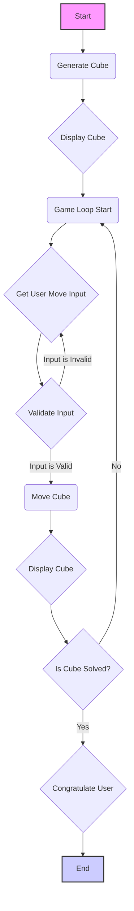

## ניתוח קוד: משחק קוביה

### <algorithm>

1. **התחלה**:
   - תחילת התוכנית.

2. **יצירת קוביה**:
   - קריאה לפונקציה `generate_cube()` ליצירת קוביה אקראית.
   - הפונקציה יוצרת רשימה של מספרים מ-1 עד 9, מערבבת אותם, ומארגנת אותם למטריצה 3x3.
     - לדוגמה, אם הרשימה המעורבבת היא `[4, 2, 9, 1, 5, 3, 8, 7, 6]`, הקוביה תהיה `[[4, 2, 9], [1, 5, 3], [8, 7, 6]]`.

3. **הצגת הקוביה**:
    - קריאה לפונקציה `display_cube(cube)` להצגת מצב הקוביה הנוכחי על המסך.
    - הפונקציה מדפיסה את המטריצה, כך שכל שורה מודפסת בשורה נפרדת.

4. **לולאת המשחק**:
    - התחלת לולאה אינסופית (`while True`).
    
5. **קבלת קלט מהמשתמש**:
   - קריאה ל-`input()` כדי לקבל מהמשתמש את כיוון התזוזה (U, D, L, או R).
   - המשתנה `move` מקבל את הקלט של המשתמש והופך לאותיות גדולות.
     - דוגמה: אם המשתמש הזין `u`, המשתנה `move` יקבל את הערך `U`.

6. **בדיקת תקינות הקלט**:
   - בדיקה האם הקלט חוקי (`move not in ['U', 'D', 'L', 'R']`).
     - אם הקלט לא חוקי, הודעת שגיאה מודפסת והלולאה חוזרת לתחילתה באמצעות `continue`.

7. **הזזת הקוביה**:
    - קריאה לפונקציה `move_cube(cube, move)` להזזת חלקי הקוביה.
    - הפונקציה מעדכנת את הקוביה בהתאם לפקודה:
        -   `U`: הזזה של כל השורות למעלה.
            - לדוגמה:  `[[1, 2, 3], [4, 5, 6], [7, 8, 9]]` הופך ל `[[4, 5, 6], [7, 8, 9], [1, 2, 3]]`
        -   `D`: הזזה של כל השורות למטה.
            - לדוגמה:  `[[1, 2, 3], [4, 5, 6], [7, 8, 9]]` הופך ל `[[7, 8, 9], [1, 2, 3], [4, 5, 6]]`
        -   `L`: הזזה של כל העמודות שמאלה.
            - לדוגמה:  `[[1, 2, 3], [4, 5, 6], [7, 8, 9]]` הופך ל `[[2, 3, 1], [5, 6, 4], [8, 9, 7]]`
        -   `R`: הזזה של כל העמודות ימינה.
            - לדוגמה:  `[[1, 2, 3], [4, 5, 6], [7, 8, 9]]` הופך ל `[[3, 1, 2], [6, 4, 5], [9, 7, 8]]`

8. **הצגת הקוביה לאחר הזזה**:
   - קריאה לפונקציה `display_cube(cube)` להצגת מצב הקוביה המעודכן.

9. **בדיקת פתרון**:
    - קריאה לפונקציה `is_solved(cube)` כדי לבדוק האם הקוביה מסודרת.
    - הפונקציה מחזירה `True` אם הקוביה מסודרת (מספרים 1-9 בסדר עולה) או `False` אם לא.

10. **סיום המשחק**:
   - אם `is_solved(cube)` מחזירה `True`:
       - הודעה "הצלחת!" מודפסת.
       - הלולאה מסתיימת באמצעות `break`.
   - אחרת, הלולאה חוזרת לשלב 5 להמשך המשחק.

### <mermaid>



הקוד אינו כולל `import header` ולכן אין צורך בתרשים זרימה נוסף.

### <explanation>

**ייבואים (Imports)**:

*   `import random`: מודול זה משמש ליצירת מספרים אקראיים, ובמקרה זה, לערבוב אקראי של המספרים בקוביה לפני תחילת המשחק. הוא לא תלוי ישירות בחבילות אחרות בתוך `src.`.

**פונקציות (Functions)**:

*   `generate_cube()`:
    *   **פרמטרים**: אין.
    *   **ערך מוחזר**: רשימה דו-ממדית (מטריצה) בגודל 3x3, המייצגת את הקוביה כאשר הערכים הם מספרים אקראיים בין 1 ל-9.
    *   **מטרה**: לייצר קוביה התחלתית עם ערכים אקראיים.
    *   **דוגמה**: מחזירה `[[4, 2, 9], [1, 5, 3], [8, 7, 6]]`.
*   `display_cube(cube)`:
    *   **פרמטרים**: `cube` - רשימה דו-ממדית המייצגת את הקוביה.
    *   **ערך מוחזר**: אין (הפונקציה מבצעת הדפסה בלבד).
    *   **מטרה**: להציג את מצב הקוביה על המסך בצורה קריאה למשתמש.
    *   **דוגמה**: עבור קוביה `[[1, 2, 3], [4, 5, 6], [7, 8, 9]]`, הפונקציה תדפיס:
        ```
        1  2  3
        4  5  6
        7  8  9
        ```
*   `move_cube(cube, move)`:
    *   **פרמטרים**: `cube` - רשימה דו-ממדית המייצגת את הקוביה, `move` - מחרוזת המייצגת את כיוון התנועה (U, D, L, או R).
    *   **ערך מוחזר**: רשימה דו-ממדית, הקוביה לאחר ביצוע התנועה.
    *   **מטרה**: להזיז את חלקי הקוביה לפי הפקודה של המשתמש.
    *   **דוגמה**: עבור קוביה `[[1, 2, 3], [4, 5, 6], [7, 8, 9]]` ופקודה 'U', הפונקציה תחזיר `[[4, 5, 6], [7, 8, 9], [1, 2, 3]]`.
*   `is_solved(cube)`:
    *   **פרמטרים**: `cube` - רשימה דו-ממדית המייצגת את הקוביה.
    *   **ערך מוחזר**: `True` אם הקוביה מסודרת, `False` אם לא.
    *   **מטרה**: לבדוק האם הקוביה פתורה, כלומר המספרים מסודרים מ-1 עד 9.
    *   **דוגמה**: עבור קוביה `[[1, 2, 3], [4, 5, 6], [7, 8, 9]]` הפונקציה תחזיר `True`.

**משתנים (Variables)**:

*   `cube`: רשימה דו-ממדית המייצגת את מצב הקוביה בכל רגע נתון.
*   `move`: מחרוזת המכילה את הפקודה שהמשתמש הכניס (U, D, L או R).
*   `numbers`: רשימה של המספרים 1 עד 9 שמשמשת ליצירת קוביה חדשה.
*  `temp`: רשימה זמנית המשמשת לשמירת נתונים במהלך ההזזה.
*   `expected`: רשימה המכילה את המספרים 1 עד 9 בסדר עולה, ומשמשת לבדיקת פתרון הקוביה.
*  `actual`: רשימה המכילה את המספרים בקוביה, ומשמשת לבדיקת פתרון הקוביה.

**בעיות אפשריות ושיפורים**:

*   **ממשק משתמש**: הממשק בסיסי ואינו ידידותי. ניתן לשפר אותו בעזרת גרפיקה או טקסטורות ASCII טובות יותר.
*  **אימות קלט**: קיימת רק בדיקת קלט בסיסית, ניתן להרחיב את הבדיקה על ידי טיפול בבעיות קלט נוספות.
*   **יעילות**:  ניתן לשפר את יעילות הפונקציות, כמו `move_cube`, על ידי שימוש באלגוריתמים יעילים יותר להזזת השורות והעמודות.

**קשרים עם חלקים אחרים בפרויקט**:

הקוד הוא עצמאי ואינו תלוי ישירות בחלקים אחרים בפרויקט.
הוא יכול לשמש כמשחק עצמאי או כחלק ממשחק גדול יותר.