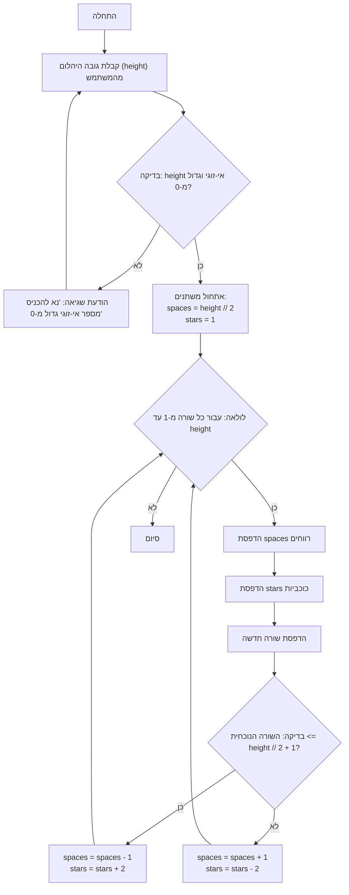

## <algorithm>

הקוד מייצר צורת יהלום (מעוין) העשויה מכוכביות, כאשר גובה היהלום נקבע על ידי קלט מהמשתמש. הקוד פועל בשלבים הבאים:

1. **קלט מהמשתמש:**
   - מבקש מהמשתמש להזין את גובה היהלום (מספר אי-זוגי וחיובי).
   - דוגמה: המשתמש מזין `5`.

2. **אימות קלט:**
   - בודק אם המספר שהוזן הוא אי-זוגי וגדול מ-0.
   - אם הקלט לא תקין (זוגי או קטן מ-1), מוצגת הודעת שגיאה, והמשתמש מתבקש להזין שוב.
   - דוגמה: אם המשתמש מזין `6` או `-1`, מוצגת הודעת שגיאה.

3. **אתחול משתנים:**
   - אם הקלט תקין, המשתנה `space` (מספר הרווחים) מאותחל לערך `height // 2`. בדוגמה שלנו `space` יהיה שווה ל-`2`.
   - המשתנה `stars` (מספר הכוכביות) מאותחל ל-`1`.

4. **לולאה ראשית:**
   - מתחילים לולאה שרצה `height` פעמים (בדוגמה שלנו 5 פעמים, כל פעם עבור שורה אחרת).
   - עבור כל איטרציה (כל שורה):
     - מדפיסים את מספר הרווחים הנוכחי (`space`).
       - בשורה הראשונה: מדפיסים `2` רווחים.
       - בשורה השנייה: מדפיסים `1` רווח.
       - בשורה השלישית: מדפיסים `0` רווחים.
       - בשורה הרביעית: מדפיסים `1` רווח.
       - בשורה החמישית: מדפיסים `2` רווחים.
     - מדפיסים את מספר הכוכביות הנוכחי (`stars`).
       - בשורה הראשונה: מדפיסים `1` כוכבית.
       - בשורה השנייה: מדפיסים `3` כוכביות.
       - בשורה השלישית: מדפיסים `5` כוכביות.
       - בשורה הרביעית: מדפיסים `3` כוכביות.
       - בשורה החמישית: מדפיסים `1` כוכבית.
     - מדפיסים שורה חדשה.

5. **עדכון משתנים:**
   - בודקים אם השורה הנוכחית היא לפני אמצע היהלום (כלומר, אם מספר השורה קטן או שווה ל-`height // 2 + 1`).
   - אם השורה לפני האמצע:
     - מפחיתים את `space` ב-`1` (מקרבים את הכוכביות למרכז).
     - מגדילים את `stars` ב-`2`.
   - אם השורה באמצע או אחרי האמצע:
     - מגדילים את `space` ב-`1` (מרחיקים את הכוכביות מהמרכז).
     - מקטינים את `stars` ב-`2`.

6. **סיום:**
   - הלולאה מסתיימת, וצורת היהלום הושלמה.

 

## <mermaid>

 

## <explanation>

**ייבואים (Imports):**
   - הקוד אינו כולל ייבוא של מודולים חיצוניים או מחבילות `src.`. הוא פועל באופן עצמאי.

**מחלקות (Classes):**
   - אין מחלקות בקוד הזה. הקוד פועל באמצעות פונקציות ולולאות.

**פונקציות (Functions):**
   - הקוד אינו מוגדר בתוך פונקציות. זהו סקריפט עצמאי הפועל בסדר פעולות ישר.

**משתנים (Variables):**
   - `height` (סוג: int): גובה היהלום שהמשתמש מכניס. משמש לקביעת מספר השורות ולחישוב גודל הצורה.
   - `space` (סוג: int): מספר הרווחים לפני הכוכביות בכל שורה. משתנה זה משמש ליצירת צורת היהלום.
   - `stars` (סוג: int): מספר הכוכביות בכל שורה. משתנה זה קובע את רוחב היהלום בכל שורה.
   - **דוגמה:**
     - אם `height` הוא `5`:
       - תחילה, `space` יהיה `2` ו-`stars` יהיה `1`.
       - בלולאה הראשונה, יודפסו 2 רווחים ואחריהם כוכבית אחת, ומשתנים אלו יעודכנו.
       - התהליך ימשיך עד ליצירת היהלום המלא.

**שרשרת קשרים:**
   - מכיוון שקוד זה אינו משתמש במודולים אחרים או חלקים אחרים בפרויקט, אין שרשרת קשרים ישירה עם חלקים אחרים בפרויקט. הוא פועל באופן עצמאי כמשחק טקסטואלי פשוט.

**בעיות אפשריות או תחומים לשיפור:**
   - **טיפול בשגיאות:** הקוד מטפל בשגיאות קלט (מספר לא אי-זוגי ולא חיובי), אך ניתן להרחיב את הטיפול בשגיאות ולהוסיף בדיקות נוספות. למשל, אפשר לבדוק שהקלט הוא אכן מספר ולא מחרוזת.
   - **קריאות הקוד:** הקוד ניתן לפישוט ע"י פיצול לתוך פונקציות, דבר שיכול להקל על הקריאות והתחזוקה. לדוגמה, אפשר ליצור פונקציה נפרדת לציור שורה ביהלום.
   - **הוספת פונקציונליות:** ניתן להוסיף פונקציות כגון אפשרות לשנות את סמל היהלום מכוכבית לתו אחר, או אפשרות ליצור צורות גיאומטריות נוספות.
   - **הפרדה בין לוגיקה לתצוגה:** אפשר להפריד את הלוגיקה של בניית היהלום מהלוגיקה של ההדפסה. זה יכול להקל על בדיקות היחידה (unit tests) ולשינויים עתידיים.

על ידי יישום השיפורים הללו, ניתן להפוך את הקוד ליעיל יותר, קריא יותר וגמיש יותר לשינויים עתידיים.