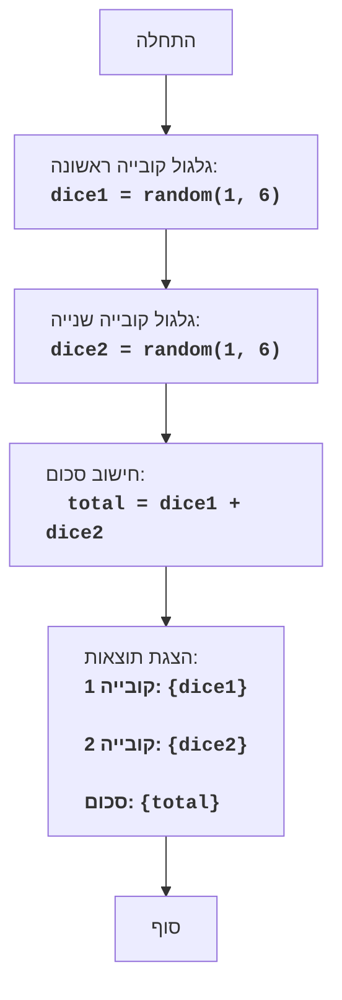

## ניתוח קוד: משחק קוביות

### 1. <algorithm>
הקוד מתאר משחק קוביות פשוט בו המחשב מטיל שתי קוביות וירטואליות ומציג את התוצאות.

**תרשים זרימה צעד-אחר-צעד:**

1. **התחלה:** המשחק מתחיל.
2. **גלגול קובייה ראשונה:**
   - המחשב מגריל מספר אקראי בין 1 ל-6.
   - לדוגמה, אם המספר שהוגרל הוא 4, המשתנה `dice1` יקבל את הערך 4.
3. **גלגול קובייה שנייה:**
   - המחשב מגריל מספר אקראי נוסף בין 1 ל-6.
   - לדוגמה, אם המספר שהוגרל הוא 2, המשתנה `dice2` יקבל את הערך 2.
4. **חישוב סכום:**
   - המחשב מחשב את הסכום של `dice1` ו-`dice2`.
   - לדוגמה, 4 + 2 = 6. המשתנה `total` יקבל את הערך 6.
5. **הצגת תוצאות:**
   - המחשב מציג את התוצאות של הקובייה הראשונה, הקובייה השנייה והסכום.
   - לדוגמה, הוא יציג: "קובייה 1: 4, קובייה 2: 2, סכום: 6".
6. **סוף:** המשחק מסתיים.

**זרימת נתונים:**
הזרימה היא לינארית ופשוטה. אין פונקציות או מחלקות נפרדות. הזרימה מתחילה בייצור מספרים אקראיים, עוברת לחישוב סכום ומסתיימת בהצגת התוצאות למשתמש.

### 2. <mermaid>

**ניתוח תלויות:**
אין תלויות ייבוא בקוד. הבלוקים בתרשים מציגים את הזרימה הלוגית של המשחק.

### 3. <explanation>

**ייבואים (Imports):**
אין ייבוא ספציפי בקוד הזה מכיוון שהוא תיאור טקסטואלי של המשחק ולא קוד בפועל.  אם היה קוד, היינו מצפים לראות ייבוא של מודול `random` כדי ליצור את המספרים האקראיים עבור הקוביות.

**מחלקות (Classes):**
אין מחלקות בקוד הזה, הוא מתאר את הפונקציונליות ברמה של צעדים בסיסיים.

**פונקציות (Functions):**
אין פונקציות מוגדרות, אך ניתן לראות כי קיימת פעולה של יצירת מספר אקראי והצגה של פלט.
*   `random(1, 6)`: זוהי פעולה שמדמה הטלת קוביה, כאשר היא מחזירה ערך אקראי בין 1 ל-6.
*   הצגה של הפלט (`OutputResults`): הפעולה הזו מדפיסה את התוצאות למשתמש.

**משתנים (Variables):**
- `dice1`: משתנה שמחזיק את הערך של הטלת הקובייה הראשונה (מספר אקראי בין 1 ל-6).
- `dice2`: משתנה שמחזיק את הערך של הטלת הקובייה השנייה (מספר אקראי בין 1 ל-6).
- `total`: משתנה שמחזיק את הסכום של `dice1` ו-`dice2`.

**בעיות אפשריות או תחומים לשיפור:**
*   **העדר מימוש קוד בפועל:** הקוד הנוכחי הוא תיאור טקסטואלי, ולכן לא ניתן להריץ אותו. נדרש מימוש בפועל בשפת תכנות (כמו Python) כדי להפעיל את המשחק.
*   **ממשק משתמש:**  כרגע אין מימוש של ממשק משתמש. ניתן לשפר את הקוד על ידי הוספת ממשק משתמש גרפי או טקסטואלי.
*   **אבסטרקציה:** הקוד פשוט מאוד, וניתן להוסיף אבסטרקציה על ידי הפיכת פעולות כמו הטלת קובייה לפונקציות נפרדות.

**שרשרת קשרים:**
*   **יצירת מספרים אקראיים:**  קשור לשימוש בספריות של שפת התכנות לצורך יצירת מספרים אקראיים. לדוגמה, ב-Python משתמשים ב-`random.randint()` כדי להגריל מספר אקראי.
*   **הצגת תוצאות:**  קשור לשימוש בפונקציות הדפסה בסיסיות או פונקציות אחרות להצגת נתונים למשתמש.

**סיכום:**
הקוד מתאר את הלוגיקה הבסיסית של משחק קוביות. הוא פשוט ומובן, אך דורש מימוש קוד בשפת תכנות כדי להפוך אותו לפועל.