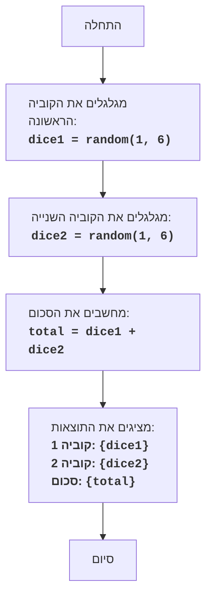

## <algorithm>

1. **התחלה:** התוכנית מתחילה את פעולתה.
2. **גלגול קוביה ראשונה:**
   - מגרילים מספר אקראי בין 1 ל-6 (כולל).
   - המספר שמתקבל נשמר במשתנה `dice1`.
   - לדוגמה: `dice1 = 4`.
3. **גלגול קוביה שנייה:**
   - מגרילים מספר אקראי נוסף בין 1 ל-6 (כולל).
   - המספר שמתקבל נשמר במשתנה `dice2`.
   - לדוגמה: `dice2 = 2`.
4. **חישוב הסכום:**
   - מחברים את הערכים של `dice1` ו-`dice2`.
   - התוצאה נשמרת במשתנה `total`.
   - לדוגמה: `total = dice1 + dice2 = 4 + 2 = 6`.
5. **הצגת התוצאות:**
   - התוכנית מדפיסה את הערכים של `dice1`, `dice2` ו-`total`.
   - לדוגמה: "קוביה 1: 4, קוביה 2: 2, סכום: 6".
6. **סיום:** התוכנית מסיימת את פעולתה.

**זרימת נתונים:**
- התוכנית מתחילה ללא קלט.
- פונקציית יצירת המספר האקראי מייצרת ערכים עבור `dice1` ו-`dice2`.
- ערכים אלה מועברים לפעולת החיבור ליצירת `total`.
- כל שלושת הערכים ( `dice1`, `dice2` ו-`total`) מועברים להדפסה על המסך.

## <mermaid>

## <explanation>

**ייבואים (Imports):**

בקוד זה, אין ייבוא של ספריות חיצוניות או חבילות אחרות מתוך `src`. הקוד מסתמך על פעולות בסיסיות כמו יצירת מספר אקראי ופעולות חשבון. למעשה זה תיאור של המשחק עצמו ולא מימוש קוד מלא.

**מחלקות (Classes):**
אין מחלקות בתיאור זה.

**פונקציות (Functions):**
אין פונקציות מוגדרות בקוד עצמו, אך ישנן פעולות לוגיות שניתן לממשן בפונקציות. לדוגמה:
- `random(1, 6)`: פונקציה זו, אם הייתה ממומשת, הייתה מחזירה מספר אקראי שלם בין 1 ל-6 (כולל). הפונקציה הייתה מקבלת כפרמטרים את הגבולות של המספר האקראי.
- הפעולות החשבוניות כמו חיבור שנעשות בהן לא ניתנות כפונקציות, למרות שאפשר היה גם אותן להגדיר כפונקציה.

**משתנים (Variables):**
- `dice1`: משתנה מסוג מספר שלם, המייצג את התוצאה של הטלת הקוביה הראשונה.
- `dice2`: משתנה מסוג מספר שלם, המייצג את התוצאה של הטלת הקוביה השנייה.
- `total`: משתנה מסוג מספר שלם, המייצג את סכום התוצאות של שתי הקוביות.

**בעיות אפשריות או תחומים לשיפור:**

1.  **חוסר מימוש קוד:** הקוד המוצג הוא תיאור אלגוריתמי ולא מימוש קוד מלא. יש צורך לממש את הפעולות כמו `random(1, 6)` בשפת תכנות כדי שזה יהיה קוד שניתן להריץ.
2.  **חוסר התייחסות לקלט/פלט משתמש:** התיאור מתמקד בעיבוד פנימי ואינו מתייחס לאינטראקציה עם המשתמש, כמו האופן שבו המשתמש מתחיל את המשחק או רואה את התוצאות.
3.  **אין בדיקות תקינות:** הקוד אינו כולל בדיקות תקינות למספרים האקראיים או למקרים חריגים, למרות שזה פשוט למדי ואינו קריטי לתיאור הפונקציונליות הבסיסית של המשחק.

**שרשרת קשרים:**
הקוד מתאר משחק פשוט שאינו תלוי ישירות בחלקים אחרים בפרויקט. עם זאת, הוא עשוי להיות חלק ממערכת משחקים גדולה יותר, כאשר כל משחק ממומש כמודול עצמאי. במקרה כזה, קוד זה יתקשר למערכת הכללית דרך ממשק משותף לטיפול בקלט ופלט של המשתמש.