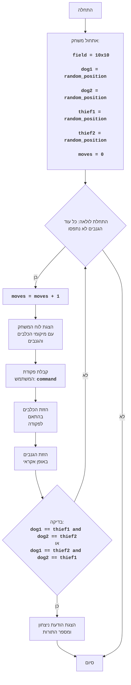

## ניתוח קוד:

### 1. **<algorithm>**

הקוד מיישם משחק טקסט פשוט שבו השחקן מנסה ללכוד שני גנבים באמצעות שליטה בשתי כלבים על גבי לוח משחק בגודל 10x10.

**תהליך צעד אחר צעד:**

1.  **אתחול משחק:**
    *   יצירת לוח משחק בגודל 10x10.
    *   מיקום שני כלבים (`D`) ושני גנבים (`T`) במיקומים אקראיים על הלוח.
    *   איפוס מונה התורות.
2.  **לולאת משחק:**
    *   **הצגת המצב הנוכחי:** הדפסת מספר התור הנוכחי והצגת הלוח עם מיקומי הכלבים והגנבים.
        *   דוגמה:
            ```
            תור: 1
            . . . . . . . . . .
            . . . . . D . . . .
            . . . . . . . T . .
            . . . . . . . . . .
            . . T . . . . . . .
            . . . . . . D . . .
            . . . . . . . . . .
            . . . . . . . . . .
            . . . . . . . . . .
            . . . . . . . . . .
            ```
    *   **קבלת פקודה מהמשתמש:**
        *   המשתמש יכול להזין פקודה להזזת הכלבים: `L` (שמאל), `R` (ימין), `U` (למעלה), `D` (למטה), `F` (הזזת כלב ראשון), `S` (הזזת כלב שני).
        *   דוגמה: `R`
    *   **הזזת הכלבים:**
        *   הזזת הכלבים בהתאם לפקודה של המשתמש.
        *   אם הפקודה היא `F` או `S`, יש לקבל כיוון נוסף (L,R,U,D).
            * דוגמה: אם פקודת המשתמש היא `F` ואז `L`, הכלב הראשון יזוז שמאלה.
    *   **הזזת הגנבים:**
        *   הזזת הגנבים באופן אקראי לאחד הכיוונים (L,R,U,D).
        *   דוגמה: הגנב הראשון יכול לזוז למטה, והשני ימינה.
    *   **בדיקת לכידה:**
        *   בדיקה אם מיקום הכלבים תואם למיקום הגנבים.
        *   אם כלב 1 נמצא במיקום של גנב 1 וגם כלב 2 נמצא במיקום של גנב 2 או אם כלב 1 נמצא במיקום של גנב 2 וגם כלב 2 נמצא במיקום של גנב 1, אז המשחק מסתיים.
        *   דוגמה: אם כלב1 במיקום (2,3) וגם גנב1 במיקום (2,3) וגם כלב2 במיקום (5,6) וגם גנב2 במיקום (5,6) אז המשחק מסתיים.
    *   **סיום או המשך המשחק:**
        *   אם הכלבים לכדו את הגנבים, הוצג הודעת ניצחון עם מספר התורות שהושקעו.
        *   אחרת, חזור לראש הלולאה.
3.  **סיום המשחק:**
    *   המשחק מסתיים כאשר הכלבים תפסו את הגנבים.

### 2. **<mermaid>**



**ניתוח תלויות:**

*   `random`: מודול זה משמש ליצירת מיקומים אקראיים עבור הכלבים והגנבים וגם לבחירת הכיוון האקראי של הגנבים.

**הסבר שמות משתנים:**

*   `Start`: תחילת התהליך.
*   `InitializeGame`: אתחול משתני המשחק (לוח, מיקומי כלבים, מיקומי גנבים, מונה תורות).
*   `LoopStart`: נקודת התחלה של הלולאה הראשית במשחק.
*   `IncreaseMoves`: הגדלת מספר התורות.
*   `DisplayField`: הצגת לוח המשחק למשתמש.
*   `InputCommand`: קבלת קלט מהמשתמש (פקודה לתנועת הכלבים).
*   `MoveDogs`: הזזת הכלבים בהתאם לפקודה.
*   `MoveThieves`: הזזת הגנבים באופן אקראי.
*   `CheckCatch`: בדיקה האם הכלבים תפסו את הגנבים.
*   `OutputWin`: הצגת הודעה המציינת ניצחון, מספר התורות שלקח וסיום המשחק.
*   `End`: סיום התהליך.

### 3. **<explanation>**

**ייבוא (Imports):**

*   `import random`: מודול זה משמש ליצירת מיקומים אקראיים עבור הכלבים והגנבים וגם לבחירת הכיוון האקראי של הגנבים.

**מחלקות (Classes):**

*   בקוד זה אין שימוש במחלקות.

**פונקציות (Functions):**

*   `create_field()`:
    *   פרמטרים: אין.
    *   ערך מוחזר: רשימה דו-ממדית המייצגת את לוח המשחק, מלאה בתווים `.`.
    *   מטרה: ליצור לוח משחק חדש בגודל `FIELD_SIZE`x`FIELD_SIZE`.
    *   דוגמה: `create_field()` תחזיר לוח בגודל 10x10 שבו כל התאים ריקים.
*   `place_object(field, symbol)`:
    *   פרמטרים: `field` (רשימה דו-ממדית), `symbol` (תו לייצוג האובייקט).
    *   ערך מוחזר: קורט (tuple) של קואורדינטות (row, col) של המיקום האקראי שבו האובייקט מוקם.
    *   מטרה: למקם אובייקט באופן אקראי על הלוח.
    *   דוגמה: `place_object(field, 'D')` יכול להחזיר לדוגמה את הערך `(3, 5)` ולעדכן את הלוח כך שהתא בשורה 3 ועמודה 5 יכיל את הסימן `D`.
*   `print_field(field)`:
    *   פרמטרים: `field` (רשימה דו-ממדית).
    *   ערך מוחזר: אין.
    *   מטרה: להדפיס את מצב לוח המשחק הנוכחי למסך.
    *   דוגמה: `print_field(field)` תציג את לוח המשחק למשתמש עם מיקומי הכלבים והגנבים.
*   `get_user_command()`:
    *   פרמטרים: אין.
    *   ערך מוחזר: מחרוזת המייצגת את פקודת המשתמש (`L`, `R`, `U`, `D`, `F`, `S`).
    *   מטרה: לקבל פקודה מהמשתמש עבור תנועת הכלבים.
    *   דוגמה: לאחר שהמשתמש מזין `R`, הפונקציה תחזיר את המחרוזת `"R"`.
*   `move_dogs(field, dog1, dog2, command)`:
    *   פרמטרים: `field` (רשימה דו-ממדית), `dog1` (קואורדינטות של כלב 1), `dog2` (קואורדינטות של כלב 2), `command` (פקודת המשתמש).
    *   ערך מוחזר: קורט של קואורדינטות מעודכנות של הכלבים `((dog1_row, dog1_col), (dog2_row, dog2_col))`.
    *   מטרה: להזיז את הכלבים בהתאם לפקודת המשתמש ולעדכן את מיקומם בלוח.
    *   דוגמה:  `move_dogs(field, (1, 2), (3, 4), 'R')` יכול להזיז את שני הכלבים ימינה, אם זה אפשרי בתוך גבולות הלוח.
*   `move_thieves(field, thief1, thief2)`:
    *   פרמטרים: `field` (רשימה דו-ממדית), `thief1` (קואורדינטות של גנב 1), `thief2` (קואורדינטות של גנב 2).
    *   ערך מוחזר: קורט של קואורדינטות מעודכנות של הגנבים `((thief1_row, thief1_col), (thief2_row, thief2_col))`.
    *   מטרה: להזיז את הגנבים באופן אקראי ולעדכן את מיקומם בלוח.
    *   דוגמה: `move_thieves(field, (4, 4), (5, 6))` תזיז את הגנבים באופן אקראי לאחד מהכיוונים (למעלה, למטה, ימינה או שמאלה).
*   `check_catch(dog1, dog2, thief1, thief2)`:
    *   פרמטרים: `dog1`, `dog2`, `thief1`, `thief2` (קואורדינטות של הכלבים והגנבים).
    *   ערך מוחזר: בוליאני (True או False) המציין האם הכלבים תפסו את הגנבים.
    *   מטרה: לבדוק אם הכלבים תפסו את הגנבים.
    *   דוגמה: `check_catch((1,2), (3,4), (1,2), (3,4))` תחזיר `True`, אם המיקום של שני הכלבים תואם למיקום שני הגנבים (בכל סדר).
*   `play_dogs_game()`:
    *   פרמטרים: אין.
    *   ערך מוחזר: אין.
    *   מטרה: לארגן את כל המהלך של המשחק, מאתחול, דרך קבלת פקודות מהמשתמש, הזזת הכלבים והגנבים, ועד סיום המשחק.
    *   דוגמה: `play_dogs_game()` תפעיל את המשחק מהתחלה ועד הסוף, עד שהמשתמש מנצח.

**משתנים (Variables):**

*   `FIELD_SIZE`: קבוע המגדיר את גודל הלוח (10).
*   `field`: רשימה דו-ממדית המייצגת את הלוח המשחק.
*   `dog1`, `dog2`: קורט (tuple) של קואורדינטות (row, col) המייצגות את מיקומי הכלבים.
*   `thief1`, `thief2`: קורט (tuple) של קואורדינטות (row, col) המייצגות את מיקומי הגנבים.
*   `moves`: מונה של מספר התורות שבוצעו במשחק.
*  `command`: מחרוזת המייצגת את פקודת המשתמש.

**בעיות אפשריות ותחומים לשיפור:**

*   **ממשק משתמש:** ממשק המשתמש הוא טקסטואלי ופשוט, אפשר לשפר אותו ולהוסיף ממשק גרפי.
*   **תנועה:** אין טיפול במקרים בהם הכלבים או הגנבים נעים אל מחוץ ללוח.
*   **אלגוריתם:** אלגוריתם תנועת הגנבים הוא אקראי ופשוט, ניתן לשפר את האינטליגנציה שלהם.

**שרשרת קשרים עם חלקים אחרים בפרויקט:**

*   הקוד עצמאי ואינו תלוי בחלקים אחרים בפרויקט. הוא משתמש רק במודול `random` מתוך ספריית Python הסטנדרטית.

הקוד מספק משחק פשוט וברור אך ניתן להרחיב אותו בעתיד לגרסה מורכבת יותר.