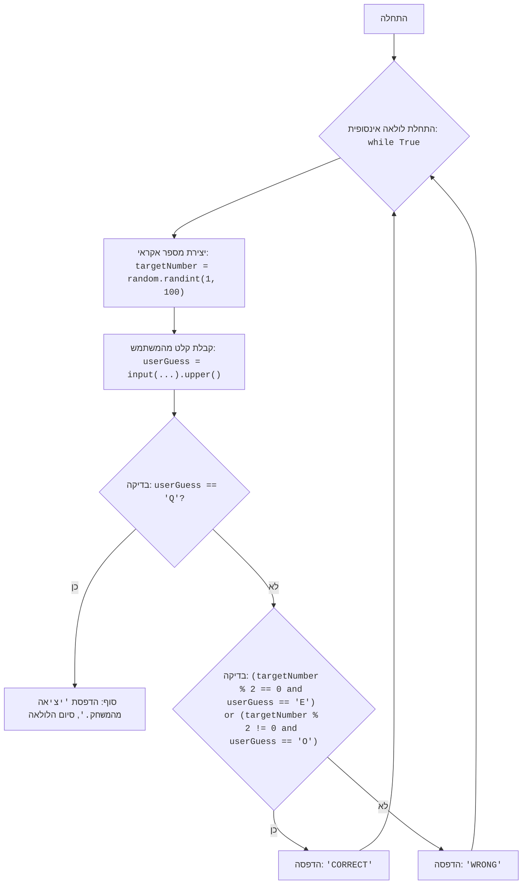

## <algorithm>

1. **התחלה:**
   - המשחק מתחיל בלולאה אינסופית `while True`.

2. **יצירת מספר אקראי:**
   - פונקציה `random.randint(1, 100)` יוצרת מספר שלם אקראי בין 1 ל-100.
     - לדוגמה, `targetNumber` יכול להיות 42.

3. **קבלת קלט מהמשתמש:**
   - פונקציית `input()` מקבלת קלט מהמשתמש, ומציגה את ההנחיה: "הזן 'E' לזוגי, 'O' לאי-זוגי, 'Q' ליציאה:".
   - פונקציית `.upper()` ממירה את הקלט לאותיות גדולות, כדי לאפשר השוואה ללא תלות באותיות קטנות או גדולות.
     - לדוגמה, אם המשתמש מזין "e", המשתנה `userGuess` יהיה "E".

4. **בדיקת יציאה:**
   - הקוד בודק אם `userGuess` שווה ל-"Q".
     - אם כן, ההודעה "יציאה מהמשחק." מודפסת, והלולאה נשברת עם `break`, מה שמסיים את המשחק.
     - לדוגמה, אם `userGuess` שווה ל-"Q", המשחק מסתיים.

5. **בדיקת ניחוש:**
   - הקוד בודק אם המספר שנוצר `targetNumber` הוא זוגי (באמצעות אופרטור מודולו `%`) וגם שהמשתמש ניחש "E", או שהמספר אי-זוגי והמשתמש ניחש "O".
      - אם התנאי מתקיים, מודפסת ההודעה "CORRECT".
        - לדוגמה, אם `targetNumber` שווה ל-42 (זוגי) ו-`userGuess` שווה ל-"E", ההודעה "CORRECT" תודפס.
        - או אם `targetNumber` שווה ל-33 (אי-זוגי) ו-`userGuess` שווה ל-"O", ההודעה "CORRECT" תודפס.
     - אחרת, מודפסת ההודעה "WRONG".
       - לדוגמה, אם `targetNumber` שווה ל-42 ו-`userGuess` שווה ל-"O", ההודעה "WRONG" תודפס.

6. **חזרה ללולאה:**
   - הלולאה חוזרת לשלב 2, ומתחילה מחדש עם יצירת מספר אקראי חדש וקבלת קלט מהמשתמש, עד שהמשתמש בוחר לצאת.

## <mermaid>

## <explanation>

**ייבואים (Imports):**
- `import random`: מייבאת את המודול `random`, אשר מספק פונקציות ליצירת מספרים אקראיים. המודול משמש כאן כדי ליצור מספר אקראי שהמשתמש צריך לנחש אם הוא זוגי או אי זוגי. המודול `random` הוא חלק מן הספריה הסטנדרטית של פייתון, והוא לא חלק מחבילות `src` אחרות.

**פונקציות (Functions):**
- `random.randint(a, b)`: פונקציה מתוך המודול `random`. היא יוצרת מספר שלם אקראי בטווח שבין `a` ל-`b` (כולל שתי הקצוות).
    - פרמטרים: `a` (מספר שלם התחלתי), `b` (מספר שלם סופי).
    - ערך מוחזר: מספר שלם אקראי בין `a` ל-`b`.
    - מטרה: ליצור מספר אקראי שהמשתמש ינסה לנחש אם הוא זוגי או אי זוגי.
    - דוגמאות: `random.randint(1, 100)` יחזיר מספר בין 1 ל-100.
- `input(prompt)`: פונקציה מובנית בפייתון. היא מציגה את הטקסט `prompt` למשתמש ומחכה לקלט.
    - פרמטרים: `prompt` (מחרוזת טקסט שמוצגת למשתמש).
    - ערך מוחזר: מחרוזת הקלט שהמשתמש הזין.
    - מטרה: לאפשר למשתמש להזין את הניחוש שלו (E לזוגי, O לאי-זוגי, Q ליציאה).
    - דוגמאות: `input("הזן 'E' לזוגי, 'O' לאי-זוגי, 'Q' ליציאה: ")` מציגה את ההנחיה ומחכה לקלט מהמשתמש.
- `.upper()`: שיטה שמופעלת על מחרוזת. היא ממירה את כל האותיות במחרוזת לאותיות גדולות.
    - פרמטרים: אין.
    - ערך מוחזר: מחרוזת חדשה עם כל האותיות גדולות.
    - מטרה: להבטיח שהקלט מהמשתמש (E, O או Q) יזוהה נכון ללא תלות באם המשתמש הזין אות גדולה או קטנה.
    - דוגמאות: `"e".upper()` יחזיר `"E"`.

**משתנים (Variables):**
- `targetNumber` (סוג: int): משתנה המכיל את המספר האקראי שנוצר על ידי `random.randint()`. הוא משמש כבסיס לבדיקת הזוגיות, שהמשתמש צריך לנחש.
    - דוגמה: אם `random.randint(1, 100)` מחזיר 73, אז `targetNumber` יהיה 73.
- `userGuess` (סוג: str): משתנה המכיל את הקלט מהמשתמש (E, O או Q). הוא משמש כדי לקבוע אם המשתמש צדק בניחוש שלו, או אם המשתמש רוצה לצאת מהמשחק.
    - דוגמה: אם המשתמש מזין 'o', לאחר ההמרה ל-`upper()`, `userGuess` יהיה 'O'.

**בעיות אפשריות ותחומים לשיפור:**
- **אימות קלט**: הקוד אינו בודק אם הקלט של המשתמש הוא באמת "E", "O" או "Q". אם המשתמש יזין קלט לא תקין, המשחק פשוט ימשיך בלי לתת הודעה ברורה על השגיאה. אפשר לשפר את זה על ידי הוספת לולאה שתבדוק שהקלט תקין.
- **ממשק משתמש**: ממשק המשתמש פשוט מאוד. ניתן לשפר אותו על ידי הוספת הודעות ברורות יותר, למשל, להוסיף הודעה שאומרת אם המשתמש ניצח או הפסיד, וגם כמה משחקים המשתמש שיחק, וכמה ניצח.
- **הודעות קלט:** יש להוסיף הודעות שונות עבור קלט לא תקין, ולבקש מהמשתמש להזין שוב קלט תקין.
- **אפשרות לשחק שוב**: כרגע אחרי כל ניחוש, המשחק ממשיך לניחוש הבא. אפשר לשנות זאת, כך שניתן יהיה לשחק שוב את המשחק עם אותו מספר, אם המשתמש מעוניין.

**שרשרת קשרים עם חלקים אחרים בפרויקט:**
- קוד זה הוא משחק עצמאי ואינו תלוי באופן ישיר בחלקים אחרים בפרויקט. הוא משתמש רק בספריות הסטנדרטיות של פייתון.