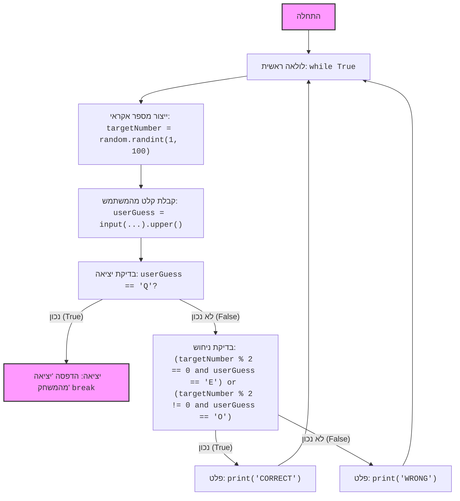

## <algorithm>
1. **התחלה:** התוכנית מתחילה את פעולתה.
   - לדוגמה: תחילת הביצוע של קובץ הפייתון.

2. **לולאה ראשית:** התוכנית נכנסת ללולאה אינסופית (`while True`).
   - לדוגמה: התוכנית מתחילה לחזור על הפעולות שבלולאה.

3. **יצירת מספר אקראי:** התוכנית מייצרת מספר אקראי שלם בין 1 ל-100 ושומרת אותו במשתנה `targetNumber`.
   - לדוגמה: `targetNumber = 42`.

4. **קלט משתמש:** התוכנית מבקשת מהמשתמש להכניס 'E' (זוגי), 'O' (אי-זוגי) או 'Q' (יציאה) ושומרת את הקלט במשתנה `userGuess`.
    - לדוגמה: המשתמש מכניס 'e', ו `userGuess = 'E'`.

5. **בדיקת יציאה:** התוכנית בודקת אם הקלט של המשתמש הוא 'Q'.
   - לדוגמה: `userGuess == 'Q'` הוא `False` ולכן ממשיכה.
   - לדוגמה: `userGuess == 'Q'` הוא `True`, התוכנית מדפיסה "יציאה מהמשחק" ויוצאת מהלולאה.

6. **בדיקת ניחוש:** אם המשתמש לא ביקש לצאת, התוכנית בודקת האם המספר שנוצר אקראית הוא זוגי והמשתמש ניחש 'E', או שהמספר אי-זוגי והמשתמש ניחש 'O'.
   - לדוגמה: `targetNumber = 42` (זוגי) ו`userGuess = 'E'`. הביטוי `(targetNumber % 2 == 0 and userGuess == 'E')` יהיה `True`.
   - לדוגמה: `targetNumber = 43` (אי-זוגי) ו`userGuess = 'O'`. הביטוי `(targetNumber % 2 != 0 and userGuess == 'O')` יהיה `True`.

7. **פלט נכון/לא נכון:** אם הניחוש נכון, התוכנית מדפיסה "CORRECT", אחרת מדפיסה "WRONG".
   - לדוגמה: אם הניחוש נכון (אחד מהביטויים בשלב 6 אמת) יודפס "CORRECT".
   - לדוגמה: אם הניחוש לא נכון (אף אחד מהביטויים בשלב 6 אמת) יודפס "WRONG".

8. **חזרה ללולאה:** התוכנית חוזרת לשלב 2, עד שהמשתמש יכניס 'Q'.
   - לדוגמה: התוכנית תחזור לייצר מספר אקראי ולבקש קלט מהמשתמש.

## <mermaid>

**הסבר על התלויות:**

*   `random`: המודול `random` מיובא כדי ליצור מספר אקראי שלם. המודול מספק פונקציות כמו `randint` המשמשות ליצירת מספרים אקראיים בטווח מסוים.
    *   ללא `import random`, הפונקציה `random.randint` לא תהיה זמינה.

## <explanation>
**ייבואים (Imports):**
*   `import random`: מייבא את המודול `random` של פייתון. מודול זה משמש ליצירת מספרים אקראיים. בשימוש בקוד, הפונקציה `random.randint(1, 100)` יוצרת מספר אקראי שלם בין 1 ל-100 (כולל).

**פונקציות (Functions):**
*   אין פונקציות שמוגדרות בקוד הזה.

**משתנים (Variables):**
*   `targetNumber`: משתנה זה שומר את המספר האקראי שנוצר על ידי `random.randint(1, 100)`. זהו מספר שלם המשמש כדי לקבוע האם הוא זוגי או אי-זוגי.
*   `userGuess`: משתנה זה שומר את הקלט מהמשתמש (האות 'E', 'O' או 'Q'), לאחר שהומר לאותיות רישיות על ידי `.upper()`. זהו מחרוזת המשמשת להשוואה עם הניחוש של המשתמש.

**הסברים מפורטים:**
*   **לולאת `while True`:**
    *   לולאה זו יוצרת לולאה אינסופית, שמאפשרת לשחק במשחק מספר פעמים עד שהמשתמש בוחר לצאת.
    *   בתוך הלולאה, כל מחזור מתחיל ביצירת מספר אקראי חדש ושואל את המשתמש על ניחושו.
*   **קבלת קלט משתמש:**
    *   הפונקציה `input()` מציגה הודעה למשתמש ומחכה לקלט.
    *   המתודה `.upper()` הופכת את הקלט לאותיות רישיות כדי להשוות אותו נכון בלי תלות באם המשתמש הזין אותיות קטנות או גדולות.
*   **בדיקת יציאה:**
    *   אם המשתמש הכניס 'Q', התוכנית מדפיסה הודעה ויוצאת מהלולאה בעזרת הפקודה `break`.
*   **בדיקת ניחוש:**
    *   התנאי המורכב בודק אם המספר האקראי זוגי (`targetNumber % 2 == 0`) והמשתמש הכניס 'E', או אם המספר האקראי אי-זוגי והמשתמש הכניס 'O'. אם אחד מהמקרים מתקיים, המשתמש צדק.
*   **פלט:**
    *   אם הניחוש נכון, התוכנית מדפיסה "CORRECT".
    *   אם הניחוש לא נכון, התוכנית מדפיסה "WRONG".

**בעיות אפשריות ושיפורים:**
*   **קלט שגוי:** הקוד לא מטפל במקרה שבו המשתמש מכניס קלט שאינו 'E', 'O' או 'Q'. ניתן להוסיף בדיקה שתטפל בקלט לא תקין ותבקש מהמשתמש להכניס קלט תקין.
*   **ממשק משתמש:** הממשק הוא פשוט, אפשר לשפר אותו עם הודעות ברורות יותר, להוסיף ניקוד או לתת כמה ניסיונות.
*   **הודעת יציאה:** ניתן לשנות את הודעת היציאה להודעה משמעותית יותר.

**קשר עם חלקים אחרים בפרויקט:**
*   אין קשר ישיר לחלקים אחרים בפרויקט לפי הקוד שסופק, מכיוון שהקוד עומד בפני עצמו. עם זאת, אם קובץ זה היה חלק מהפרויקט גדול יותר, יהיה אפשר להגדיר את המודול כחלק ממשק משתמש, או להשתמש בפונקציות מחלקים אחרים.