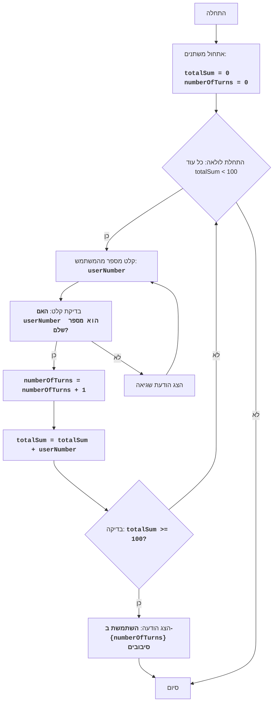

## <algorithm>
1. **התחלה:**
   - אתחול `totalSum` ל-0 (סכום המספרים שהוזנו).
   - אתחול `numberOfTurns` ל-0 (מספר הסיבובים).
2. **לולאה ראשית:**
   - התחלת לולאה `while totalSum < 100` (כל עוד סכום המספרים קטן מ-100):
     - **קלט משתמש:**
       - מוצגת הודעה למשתמש: "הכנס מספר:".
       - המשתמש מזין מספר, והתוכנה מנסה להמיר אותו למספר שלם.
         - לדוגמה: המשתמש מזין '25'. `userNumber` יהיה 25.
       - אם הקלט אינו מספר שלם, מוצגת הודעת שגיאה והלולאה חוזרת לנקודת הקלט.
     - **עדכון סיבובים:**
       - מגדילים את `numberOfTurns` ב-1.
        - לדוגמה: אם `numberOfTurns` היה 2, עכשיו הוא יהיה 3.
     - **עדכון הסכום:**
       - מוסיפים את `userNumber` ל-`totalSum`.
        - לדוגמה: אם `totalSum` היה 60 ו-`userNumber` הוא 25, אז `totalSum` יהיה 85.
   - הלולאה ממשיכה עד ש-`totalSum` גדול או שווה ל-100.
3. **פלט:**
    - מוצגת הודעה למשתמש עם מספר הסיבובים שהשתמש בהם.
     - לדוגמה: "השתמשת ב-4 סיבובים".
4. **סיום:**
   - התוכנית מסתיימת.

## <mermaid>

**ניתוח תלויות:**

אין תלויות חיצוניות (imports) בקוד הזה. הקוד מסתמך רק על פונקציות מובנות של פייתון.

## <explanation>
**ייבואים (Imports):**
   - אין ייבוא חבילות בקוד.

**מחלקות (Classes):**
   - אין מחלקות בקוד.

**פונקציות (Functions):**
   - `input(prompt)`: פונקציה מובנית בפייתון המציגה את ההודעה `prompt` למשתמש ומחזירה את הקלט שלו כמחרוזת.
      - לדוגמה: `input("הכנס מספר: ")` תציג "הכנס מספר:" ותחזיר את הקלט של המשתמש, לדוגמה, אם המשתמש יקליד 25, הפונקציה תחזיר את המחרוזת "25".
   - `int(x)`: פונקציה מובנית בפייתון הממירה את הערך `x` למספר שלם.
      - לדוגמה: `int("25")` יחזיר את המספר השלם 25.
   - `print(*objects, sep=' ', end='\n', file=sys.stdout, flush=False)`: פונקציה מובנית בפייתון המדפיסה את האובייקטים שניתנו לה לפלט סטנדרטי (בדרך כלל המסך).
      - לדוגמה: `print("השתמשת ב-", numberOfTurns, "סיבובים")` תדפיס את המחרוזת "השתמשת ב-" ולאחר מכן את הערך של המשתנה `numberOfTurns` ולאחר מכן את המחרוזת "סיבובים".

**משתנים (Variables):**
   - `totalSum`: משתנה מסוג שלם, שמאחסן את סכום המספרים שהמשתמש הזין. מתחיל מ-0 ומצטבר בלולאה.
   - `numberOfTurns`: משתנה מסוג שלם, שמאחסן את מספר הסיבובים (המספרים שהוזנו). מתחיל מ-0 ומגדיל ב-1 בכל סיבוב.
   - `userNumber`: משתנה מסוג שלם, שמאחסן את המספר שהמשתמש הזין בכל סיבוב.

**שרשרת קשרים עם חלקים אחרים בפרויקט:**
   - לקוד הזה אין תלות בקוד אחר בפרויקט, הוא פועל כיחידה עצמאית.

**בעיות אפשריות ותחומים לשיפור:**
   - **טיפול לא מספיק בקלט משתמש:** הקוד מטפל רק בשגיאה כאשר המשתמש מזין קלט שאינו מספר שלם, אבל לא מטפל בבעיות נוספות כמו קלט שלילי או קלט שהוא לא מספר בכלל (למשל, מחרוזת).
   - **אין מגבלות על קלט:** המשתמש יכול להזין מספרים גדולים, כך שבסיבוב אחד הסכום יכול לעבור את 100. כדאי להוסיף בדיקה שמגבילה את סכום המספרים המוכנסים.
   - **משוב חלקי:** הקוד רק מציג את מספר הסיבובים בסוף, אין משוב למשתמש לגבי הסכום הנוכחי לאחר כל מספר.

**הערות נוספות:**
   - הקוד פשוט ומבצע את מטרתו: סימולציה של משחק בו המשתמש מזין מספרים עד שהסכום הכולל מגיע ל-100, עם ספירת סיבובים.
   - הקוד קל לקריאה ולהבנה.