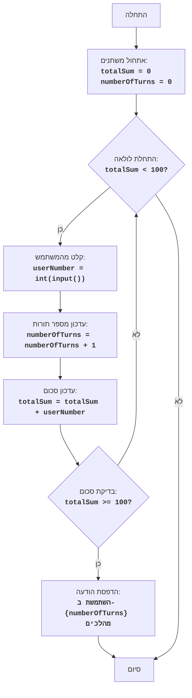

## <algorithm>
1. **אתחול משתנים:**
   - `totalSum` (סכום המספרים שהוזנו) מאותחל ל-0. לדוגמה: `totalSum = 0`.
   - `numberOfTurns` (מספר התורות) מאותחל ל-0. לדוגמה: `numberOfTurns = 0`.

2. **לולאת משחק (while):**
   - מתחיל לולאה שרצה כל עוד `totalSum` קטן מ-100. לדוגמה: `while totalSum < 100:`.
     - **קבלת קלט מהמשתמש:**
       - מבקש מהמשתמש להזין מספר שלם. לדוגמה: `userNumber = int(input("הכנס מספר: "))`.
       - אם המשתמש לא מזין מספר שלם, מודפסת הודעת שגיאה והלולאה חוזרת להתחלה.
     - **עדכון מספר התורות:**
       - מגדיל את `numberOfTurns` ב-1. לדוגמה: `numberOfTurns = numberOfTurns + 1`.
     - **עדכון סכום:**
       - מוסיף את `userNumber` ל-`totalSum`. לדוגמה: `totalSum = totalSum + userNumber`.
   - הלולאה מסתיימת כאשר `totalSum` שווה או גדול מ-100.

3. **הדפסת תוצאה:**
   - מדפיס הודעה המציגה את מספר התורות שלקח לשחקן להגיע ל-100. לדוגמה: `print(f"השתמשת ב- {numberOfTurns} מהלכים")`.

4. **סוף המשחק:**
   - המשחק מסתיים.

## <mermaid>

**הסבר על התלויות:**
תרשים הזרימה אינו כולל תלויות מיובאות, כיוון שכל הקוד ממומש בתוך קובץ אחד. התרשים מציג את זרימת הפעולות בתוך המשחק בלבד, בלי תלות בספריות חיצוניות או מודולים אחרים.

## <explanation>
**ייבואים (Imports):**
אין ייבוא מודולים חיצוניים בקוד זה. כל הקוד ממומש באופן עצמאי.

**מחלקות (Classes):**
אין שימוש במחלקות בקוד זה.

**פונקציות (Functions):**
אין שימוש בפונקציות המוגדרות באופן מפורש בקוד זה. השימוש בפונקציות נעשה על ידי פונקציות מובנות בפייתון כמו `int()`, `input()`, ו-`print()`.

**משתנים (Variables):**
- `totalSum`: משתנה מסוג `int` שמאחסן את סכום המספרים שהמשתמש הכניס עד כה. הוא מתחיל מ-0 וגדל בהתאם לקלט המשתמש.
- `numberOfTurns`: משתנה מסוג `int` שמאחסן את מספר התורות שבוצעו עד כה במשחק. הוא מתחיל מ-0 וגדל ב-1 בכל תור.
- `userNumber`: משתנה מסוג `int` שמאחסן את המספר שהמשתמש הכניס בכל תור.

**הסברים מפורטים:**
- **אתחול משתנים:**
   - הקוד מתחיל על ידי אתחול שני משתנים: `totalSum` ו-`numberOfTurns`, שניהם מתחילים בערך 0. `totalSum` ישמש לשמירת הסכום הכולל של המספרים שהמשתמש הכניס, ו-`numberOfTurns` ישמש לספירת מספר התורות שבוצעו.
- **לולאת המשחק:**
   - לולאת `while totalSum < 100:` היא לולאה הממשיכה לרוץ כל עוד סכום המספרים שהמשתמש הכניס קטן מ-100. בתוך הלולאה:
     - הקוד מבקש מהמשתמש להזין מספר שלם באמצעות הפונקציה `input()` וממיר אותו למספר שלם באמצעות הפונקציה `int()`.
     - קיימת לולאת try...except שמטפלת במקרה בו המשתמש מזין קלט שאינו מספר שלם, ואם מתרחשת שגיאה, מודפסת הודעת שגיאה והלולאה ממשיכה לסיבוב הבא.
     - לאחר מכן, מספר התורות גדל ב-1, והמספר שהמשתמש הכניס מתווסף לסכום הכולל.
- **הצגת תוצאה:**
   - לאחר שהלולאה מסתיימת (כלומר, כאשר סכום המספרים שהמשתמש הכניס גדול או שווה ל-100), הקוד מדפיס הודעה המציגה את מספר התורות שהשתמשו בהן עד שהסכום הגיע ל-100 או יותר.

**בעיות אפשריות ותחומים לשיפור:**
- **טיפול בקלט שאינו מספר:** הקוד מטפל כרגע בשגיאת ערך (ValueError), אך ניתן לשפר את הטיפול בשגיאות ע"י בדיקה של קלט ריק או קלט מיוחד.
- **הוספת חוקים נוספים:** ניתן להוסיף חוקים נוספים למשחק, כגון הגבלת טווח המספרים שהמשתמש יכול להכניס או הוספת מצב ניצחון/הפסד.
- **הפרדת לוגיקה:** ניתן להפריד את לוגיקת המשחק לפונקציות שונות כדי להפוך את הקוד לקריא ומאורגן יותר.

**שרשרת קשרים עם חלקים אחרים בפרויקט:**
הקוד הזה ממוקם במשחק בשם FIPFOP תחת תיקיית 101_basic_computer_games, ואינו תלוי בחלקים אחרים בפרויקט. מדובר במשחק בסיסי הפועל באופן עצמאי, ללא יחסי תלות או קשרים מורכבים עם רכיבים אחרים.