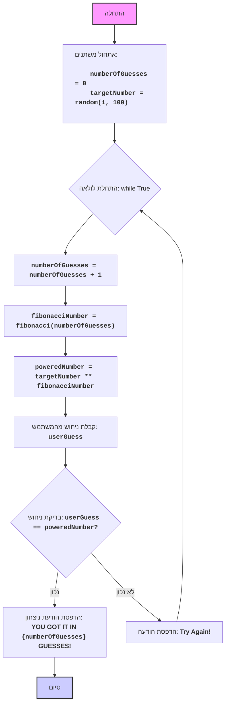

## הוראה:

נתח את הקוד שסופק בפירוט והסבר את הפונקציונליות שלו. התשובה צריכה לכלול שלושה חלקים:

1.  **<algorithm>**:
    תאר את תהליך העבודה של הקוד בתרשים זרימה צעד-אחר-צעד.
    *   הוסף דוגמאות לכל בלוק לוגי.
    *   הצג את הזרימה של נתונים בין פונקציות, מחלקות או שיטות.

2.  **<mermaid>**:
    כתוב את קוד התרשים בפורמט `mermaid`.
    *   נתח והסבר את כל התלויות המיובאות ביצירת התרשים.
    **חשוב!**: ודא שכל שמות המשתנים בתרשים `mermaid` הם בעלי משמעות ותיאור. שמות כמו `A`, `B`, `C` אסורים!

    **בנוסף**:
    אם הקוד כולל את השורה `import header`, הוסף תרשים זרימה בפורמט `mermaid` המתאר את `header.py`:
    ```mermaid
    flowchart TD
        Start --> Header[<code>header.py</code><br> קביעת שורש הפרויקט]

        Header --> import[ייבוא הגדרות גלובליות: <br><code>from src import gs</code>]
    ```

3.  **<explanation>**:
    ספק הסברים מפורטים:
    *   **ייבואים (Imports)**: המטרה שלהם והקשר שלהם עם חבילות `src.` אחרות.
    *   **מחלקות (Classes)**: התפקיד שלהן, המאפיינים, השיטות והאינטראקציה עם חלקים אחרים בפרויקט.
    *   **פונקציות (Functions)**: הפרמטרים, הערכים המוחזרים, המטרה ודוגמאות לשימוש.
    *   **משתנים (Variables)**: הסוג והשימוש שלהם.
    *   ציין בעיות אפשריות או תחומים לשיפור.

בנוסף, צור שרשרת קשרים עם חלקים אחרים בפרויקט (אם רלוונטי).

הדבר מבטיח ניתוח מקיף ומובנה של הקוד.
## פורמט התשובה: `.md` (markdown)
**סוף ההוראה**

<algorithm>
1.  **התחלה:**
    *   אתחול משתנה `numberOfGuesses` ל-0 (מונה ניסיונות).
    *   יצירת מספר אקראי `targetNumber` בין 1 ל-100.
    *   לדוגמה: `numberOfGuesses = 0`, `targetNumber = 42`.

2.  **לולאה ראשית (while True):**
    *   הלולאה רצה עד שהמשתמש מנחש את המספר.

    3.  **הגדלת מונה הניסיונות:**
        *   `numberOfGuesses` גדל ב-1.
        *   לדוגמה: אם קודם היה `numberOfGuesses = 0`, כעת הוא יהיה `1`.

    4.  **חישוב מספר פיבונאצ'י:**
        *   חישוב מספר פיבונאצ'י ה-n-י `fibonacciNumber` כאשר `n` הוא `numberOfGuesses` (מספר הניסיון הנוכחי).
        *   לדוגמה: אם `numberOfGuesses = 1`, אז `fibonacciNumber = 1`. אם `numberOfGuesses = 2`, אז `fibonacciNumber = 1`, אם  `numberOfGuesses = 3`, אז `fibonacciNumber = 2`.

    5.  **חישוב המספר המועלה בחזקה:**
        *   חישוב `poweredNumber` על ידי העלאת `targetNumber` בחזקת `fibonacciNumber`.
        *   לדוגמה: אם `targetNumber = 42` ו-`fibonacciNumber = 1`, אז `poweredNumber = 42 ** 1 = 42`. אם `targetNumber = 42` ו-`fibonacciNumber = 2`, אז `poweredNumber = 42 ** 2 = 1764`.

    6.  **קבלת קלט מהמשתמש:**
        *   קבלת ניחוש המשתמש כקלט והמרתו למספר שלם `userGuess`.
        *   לדוגמה: המשתמש מזין את המספר `42`, אז `userGuess = 42`.

    7.  **בדיקת הניחוש:**
        *   השוואה בין `userGuess` ו-`poweredNumber`.
            *   **אם הניחוש נכון:**
                *   הודעה למשתמש: "YOU GOT IT IN {numberOfGuesses} GUESSES!".
                *   יציאה מהלולאה.
            *   **אם הניחוש לא נכון:**
                *   הודעה למשתמש: "Try Again!".
                *   חזרה לתחילת הלולאה.
</algorithm>

<mermaid>

</mermaid>

<explanation>

*   **ייבואים (Imports):**
    *   `import random`: מודול `random` משמש ליצירת מספרים אקראיים. במקרה הזה, הוא משמש ליצירת `targetNumber` בין 1 ל-100 בתחילת המשחק.
*   **פונקציות (Functions):**
    *   `fibonacci(n)`: פונקציה שמקבלת מספר שלם `n` ומחזירה את המספר ה-n-י בסדרת פיבונאצ'י.
        *   **פרמטרים:** `n` (מספר שלם).
        *   **ערך מוחזר:** המספר ה-n-י בסדרת פיבונאצ'י (מספר שלם).
        *   **דוגמאות שימוש:**
            *   `fibonacci(1)` תחזיר `1`.
            *   `fibonacci(6)` תחזיר `8`.
*   **משתנים (Variables):**
    *   `numberOfGuesses`: משתנה מסוג שלם שמאחסן את מספר הניסיונות שהשחקן ביצע. הוא מאותחל ל-0 ומוגדל ב-1 בכל סיבוב של הלולאה הראשית.
    *   `targetNumber`: משתנה מסוג שלם שמאחסן את המספר האקראי שהוגרל בתחילת המשחק.
    *   `fibonacciNumber`: משתנה מסוג שלם שמאחסן את המספר הפיבונאצ'י המתאים לניסיון הנוכחי.
    *    `poweredNumber`: משתנה מסוג שלם שמאחסן את הערך של `targetNumber` בחזקת `fibonacciNumber`.
    *   `userGuess`: משתנה מסוג שלם שמאחסן את המספר שהמשתמש הזין.

*   **הסבר נוסף:**
    *   הקוד מיישם משחק ניחוש בו המחשב בוחר מספר אקראי. השחקן מנסה לנחש את המספר, כאשר מספר זה מועלה בחזקת מספר פיבונאצ'י המתאים למספר הניסיון הנוכחי. המשחק נמשך עד שהשחקן מנחש נכון.
    *   השימוש בלולאת `while True` מאפשר משחק רציף עד שהתנאי הסיום (ניחוש נכון) מתקיים.
    *   השימוש ב-`try-except ValueError` מאפשר טיפול נכון במקרה שהמשתמש מזין קלט שאינו מספר שלם.

*   **תחומים לשיפור:**
    *   **הוספת רמת קושי:** ניתן להוסיף אפשרות לבחירת רמת קושי על ידי שינוי טווח המספרים האקראיים או הגדלת המקסימום של סדרת פיבונאצ'י.
    *   **יותר פידבק:** לספק פידבק נוסף למשתמש כמו "המספר שלך גבוה מדי" או "המספר שלך נמוך מדי".

    *   **הגבלת ניסיונות:** ניתן להגביל את מספר הניסיונות.
    *   **הפרדת לוגיקה:** הפרדת לוגיקת המשחק למספר פונקציות או מחלקות יכולה להפוך את הקוד לקריא וניתן לתחזוקה יותר.
</explanation>