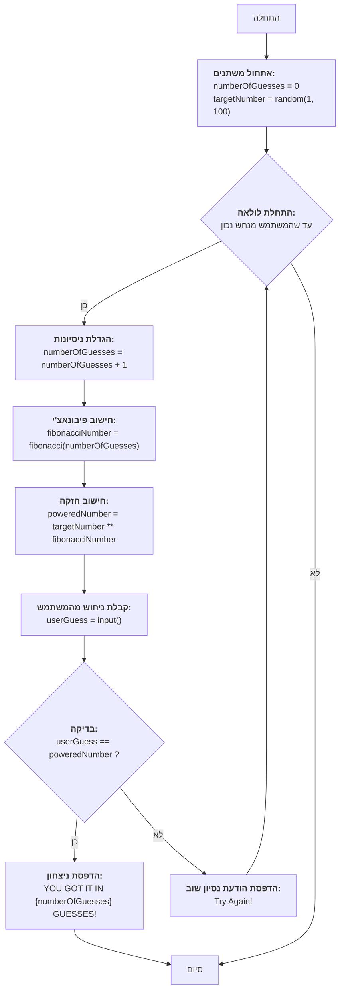

## הוראה:

נתח את הקוד שסופק בפירוט והסבר את הפונקציונליות שלו. התשובה צריכה לכלול שלושה חלקים:

1. **<algorithm>**:
   תאר את תהליך העבודה של הקוד בתרשים זרימה צעד-אחר-צעד.
   - הוסף דוגמאות לכל בלוק לוגי.
   - הצג את הזרימה של נתונים בין פונקציות, מחלקות או שיטות.

2. **<mermaid>**:
   כתוב את קוד התרשים בפורמט `mermaid`.
   - נתח והסבר את כל התלויות המיובאות ביצירת התרשים.
   **חשוב!**: ודא שכל שמות המשתנים בתרשים `mermaid` הם בעלי משמעות ותיאור. שמות כמו `A`, `B`, `C` אסורים!

   **בנוסף**:
   אם הקוד כולל את השורה `import header`, הוסף תרשים זרימה בפורמט `mermaid` המתאר את `header.py`:
   ```mermaid
   flowchart TD
       Start --> Header[<code>header.py</code><br> קביעת שורש הפרויקט]

       Header --> import[ייבוא הגדרות גלובליות: <br><code>from src import gs</code>]
   ```

3. **<explanation>**:
   ספק הסברים מפורטים:
   - **ייבואים (Imports)**: המטרה שלהם והקשר שלהם עם חבילות `src.` אחרות.
   - **מחלקות (Classes)**: התפקיד שלהן, המאפיינים, השיטות והאינטראקציה עם חלקים אחרים בפרויקט.
   - **פונקציות (Functions)**: הפרמטרים, הערכים המוחזרים, המטרה ודוגמאות לשימוש.
   - **משתנים (Variables)**: הסוג והשימוש שלהם.
   - ציין בעיות אפשריות או תחומים לשיפור.

בנוסף, צור שרשרת קשרים עם חלקים אחרים בפרויקט (אם רלוונטי).

הדבר מבטיח ניתוח מקיף ומובנה של הקוד.
## פורמט התשובה: `.md` (markdown)
**סוף ההוראה**
```markdown
## <algorithm>

הקוד מיישם משחק ניחושים בו המחשב בוחר מספר רנדומלי, והמשתמש מנסה לנחש אותו. לאחר כל ניחוש, המספר של המחשב מועלה בחזקת מספר פיבונאצ'י (שהוא מספר הסדרה המתאים למספר הניסיון). המשחק ממשיך עד שהמשתמש מנחש את המספר הנכון.

1. **אתחול:**
   - `numberOfGuesses = 0`: מאתחל את מספר הניסיונות ל-0.
   - `targetNumber = random.randint(1, 100)`: בוחר מספר אקראי שלם בין 1 ל-100 ושומר אותו במשתנה `targetNumber`.

   *דוגמה:* `targetNumber = 42`

2. **לולאה ראשית:**
   - `while True:`: מתחיל לולאה אינסופית שתמשיך עד שהמשתמש ינחש נכון.
     - `numberOfGuesses += 1`: מגדיל את מספר הניסיונות ב-1.
     *דוגמה:* אם זה הניסיון הראשון, `numberOfGuesses` יהיה 1.
     - `fibonacciNumber = fibonacci(numberOfGuesses)`: מחשב את מספר פיבונאצ'י המתאים למספר הניסיון הנוכחי.
     *דוגמה:* אם `numberOfGuesses` הוא 3,  `fibonacciNumber` יהיה 2.
     - `poweredNumber = targetNumber ** fibonacciNumber`: מחשב את `targetNumber` בחזקת `fibonacciNumber`.
     *דוגמה:* אם `targetNumber` הוא 42 ו`fibonacciNumber` הוא 2, `poweredNumber` יהיה 42**2 שזה 1764.
     - `userGuess = int(input(f"Попытка {numberOfGuesses}: Введите число: "))`: מבקש מהמשתמש להזין ניחוש וממיר אותו למספר שלם.

3. **בדיקה:**
   - `if userGuess == poweredNumber:`: בודק האם הניחוש של המשתמש שווה למספר המחושב.
     - אם כן:
        -  `print(f"ПОЗДРАВЛЯЮ! Вы угадали число за {numberOfGuesses} попыток!")`: מודיע על ניצחון ומדפיס את מספר הניסיונות.
        -  `break`: יוצא מהלולאה.
     - אם לא:
        -  `print("Попробуйте ещё раз!")`: מודיע למשתמש לנסות שוב.

4. **סיום:**
   - ברגע שהלולאה מסתיימת (כי המשתמש ניחש נכון), המשחק מסתיים.

**זרימת נתונים:**

1. המשתנה `targetNumber` נוצר בהתחלה בצורה רנדומלית ונשמר לאורך כל המשחק.
2. המשתנה `numberOfGuesses` מתעדכן בכל איטרציה של הלולאה.
3. בכל איטרציה, הפונקציה `fibonacci()` מקבלת את `numberOfGuesses` ומחזירה את מספר פיבונאצ'י המתאים.
4. המספר `poweredNumber` מחושב באמצעות `targetNumber` ו- `fibonacciNumber`.
5. המספר `userGuess` מתקבל מהקלט של המשתמש בכל איטרציה.

## <mermaid>



**ניתוח תלויות:**

התרשים משתמש בספרייה `random` כדי לייצר את המשתנה `targetNumber` בהתחלה.
הלולאה הראשית (While Loop) משתמשת בפונקציה `fibonacci()` שמחושבת בהתאם למספר הנסיונות, ומבצעת חישוב חזקה.
המשתמש מספק קלט (`userGuess`) שמשמש להשוואה, ולאחר ההשוואה מודפסת הודעה למשתמש.

## <explanation>

**ייבואים:**

- `import random`: מייבאת את המודול `random` המספק פונקציות ליצירת מספרים אקראיים. במקרה זה, הוא משמש ליצירת מספר אקראי עבור משתנה `targetNumber` בתחילת המשחק.

**פונקציות:**

- `fibonacci(n)`:
  - **פרמטרים**: `n` - מספר שלם המייצג את המיקום בסדרת פיבונאצ'י.
  - **ערך מוחזר**: המספר ה-n בסדרת פיבונאצ'י.
  - **מטרה**: מחשבת את המספר ה-n בסדרת פיבונאצ'י. הסדרה מתחילה ב-0, 1, 1, 2, 3 וכו'.
    *דוגמה:* `fibonacci(6)` יחזיר 8.
   -  **הקשר לפרויקט:** משמשת לחישוב חזקה עבור המספר האקראי שבחר המחשב.

**משתנים:**

- `numberOfGuesses`:
  - **סוג**: מספר שלם (int).
  - **שימוש**: מונה את מספר הניסיונות של המשתמש לנחש את המספר הנכון. מאותחל ל-0, וגדל ב-1 בכל סיבוב של הלולאה.
- `targetNumber`:
  - **סוג**: מספר שלם (int).
  - **שימוש**: מספר אקראי שלם שנוצר בתחילת המשחק בטווח 1-100. המספר שהמשתמש מנסה לנחש.
- `fibonacciNumber`:
  - **סוג**: מספר שלם (int).
  - **שימוש**: מכיל את המספר בסדרת פיבונאצ'י, המתאים למספר הניסיונות הנוכחי.
- `poweredNumber`:
  - **סוג**: מספר שלם (int).
  - **שימוש**: תוצאת החישוב של `targetNumber` בחזקת `fibonacciNumber`, אליה מושווה ניחוש המשתמש.
- `userGuess`:
  - **סוג**: מספר שלם (int).
  - **שימוש**: ניחוש של המשתמש, שהתקבל כקלט, והומר למספר שלם.

**הסברים מפורטים:**

- המשחק מתחיל בהגדרת משתנים (מספר הניסיונות, המספר המטרה).
- לאחר מכן, מתחיל לולאה אינסופית (while True) שמאפשרת למשחק לרוץ עד שהמשתמש מצליח.
- בכל סיבוב, המשחק מגדיל את מספר הניסיונות, מחשב את מספר פיבונאצ'י, מחשב את החזקה של מספר המטרה במספר פיבונאצ'י, ומקבל את הניחוש מהמשתמש.
- אם הניחוש שווה לחזקה המחושבת, המשחק מסתיים בהצלחה ומציג את כמות הניסיונות.
- אחרת, המשחק מבקש מהמשתמש לנסות שוב.

**בעיות אפשריות ותחומים לשיפור:**

- **טיפול בקלט משתמש:** הקוד בודק אם המשתמש הכניס מספר שלם, אך לא בודק אם הקלט חוקי (למשל, אם המשתמש הכניס ערך שלילי). כדאי להוסיף בדיקה נוספת עבור ערכים לא חוקיים ולהציג הודעה מתאימה.
- **מספר גדול של ניסיונות:** הערך של `poweredNumber` יכול לגדול מאוד עם כל ניסיון, מה שיכול להקשות על המשחק. ניתן להוסיף מגבלה על מספר הניסיונות כדי למנוע משחק אינסופי.
- **חוסר בהודעות הסבר:** המשחק יכול להיות יותר ידידותי למשתמש אם היו מוצגות הודעות הסבר נוספות, כמו למשל טווח של המספרים שניתן להזין.

**שרשרת קשרים:**

הקוד הנוכחי הוא משחק עצמאי ואינו תלוי בחלקים אחרים בפרויקט.
```