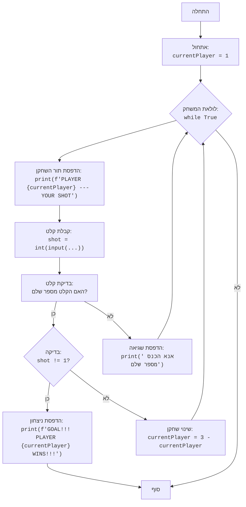

## ניתוח קוד המשחק "כדורגל"

### 1. <algorithm>
תהליך העבודה של הקוד מתואר בתרשים זרימה הבא:

1. **אתחול המשחק:**
   - מתחילים עם משתנה `currentPlayer` שערכו ההתחלתי הוא 1, המייצג את השחקן הראשון.
   - לדוגמה: `currentPlayer = 1`

2. **לולאת משחק:**
   - הלולאה ממשיכה עד שאחד השחקנים מבקיע שער.
   - לדוגמה: `while True:`

3. **תור השחקן:**
   - מודפס הודעה המציינת את תורו של השחקן הנוכחי.
   - לדוגמה: `print(f"PLAYER {currentPlayer} --- YOUR SHOT")`

4. **קבלת קלט מהשחקן:**
   - המשתמש מתבקש להזין מספר (ניסיון בעיטה).
   - לדוגמה: `shot = int(input("הכנס מספר מ-1 עד 10: "))`
   - אם הקלט אינו מספר שלם, מוצגת הודעת שגיאה והלולאה ממשיכה לאיטרציה הבאה.

5. **בדיקת שער:**
   - בודקים אם המספר שהוזן שונה מ-1. אם כן, מדובר בשער.
   - לדוגמה: `if shot != 1:`
   - אם התנאי מתקיים:
     - מודפסת הודעה שהשחקן הנוכחי ניצח.
     - לדוגמה: `print(f"GOAL!!! PLAYER {currentPlayer} WINS!!!")`
     - הלולאה מסתיימת באמצעות `break`.

6. **מעבר לשחקן הבא:**
   - אם לא הובקע שער, מעבירים את התור לשחקן השני.
   - לדוגמה: `currentPlayer = 3 - currentPlayer`
   - אם `currentPlayer` היה 1, הוא משתנה ל-2, ואם היה 2, הוא משתנה ל-1.
   - חוזרים לשלב 2 (תחילת הלולאה).

### 2. <mermaid>

**הסבר התלויות והמשתנים:**

- **`Start`**: נקודת ההתחלה של התוכנית.
- **`InitializePlayer`**: אתחול משתנה `currentPlayer` לשחקן הראשון (1).
- **`GameLoopStart`**: תחילת לולאת המשחק הראשית.
- **`OutputPlayerTurn`**: הדפסת הודעה המציינת את תור השחקן הנוכחי, `currentPlayer`.
- **`InputShot`**: קבלת קלט מהמשתמש, המייצג את הניסיון של השחקן, ושמירתו במשתנה `shot`.
- **`CheckInput`**: בדיקה האם הקלט מהמשתמש הוא מספר שלם.
- **`InputError`**: הדפסת הודעה המציינת שהקלט אינו תקין.
- **`CheckGoal`**: בדיקה האם המספר שהוזן שונה מ-1. אם כן, מדובר בשער.
- **`OutputWin`**: הדפסת הודעה שהשחקן הנוכחי ניצח.
- **`End`**: סוף המשחק.
- **`SwitchPlayer`**: מעבר לתור של השחקן השני על ידי שינוי הערך של `currentPlayer` ל- `3 - currentPlayer`.

### 3. <explanation>

**ייבואים (Imports):**
- אין ייבואים בקוד זה.

**מחלקות (Classes):**
- אין מחלקות בקוד זה.

**פונקציות (Functions):**
- אין פונקציות בקוד זה.

**משתנים (Variables):**
- `currentPlayer`: משתנה מסוג `int` המייצג את השחקן הנוכחי (1 או 2). משמש לשמירת השחקן שמשחק כרגע. ערכו ההתחלתי הוא 1.
- `shot`: משתנה מסוג `int` המייצג את הניסיון של השחקן, קרי, מספר בין 1 ל-10. הקלט מהמשתמש נשמר בו.

**הסברים מפורטים:**

- הקוד מדמה משחק טקסטואלי פשוט בין שני שחקנים, בו כל שחקן מנסה להבקיע שער על ידי הזנת מספר.
- המשחק מתחיל עם השחקן הראשון (`currentPlayer = 1`).
- הלולאה האינסופית `while True:` ממשיכה עד שאחד השחקנים מבקיע שער.
- כל תור, הקוד מדפיס הודעה המציינת את תורו של השחקן הנוכחי.
- השחקן מתבקש להזין מספר בין 1 ל-10. אם המספר אינו 1, זה נחשב לשער והשחקן הנוכחי מנצח.
- אם השחקן הזין 1, התור עובר לשחקן השני.
- הקוד משתמש ב-`try-except` לטיפול בשגיאות קלט. אם השחקן מזין ערך שאינו מספר שלם, הודעת שגיאה תוצג והלולאה תמשיך לאיטרציה הבאה.
- הקוד מוגבל מאוד מבחינת אפשרויות הקלט, אך הוא פשוט ומדמה את המכניקה הבסיסית של המשחק.

**בעיות אפשריות ותחומים לשיפור:**

- **הגבלת קלט:** הקוד מקבל רק מספרים שלמים, אך לא בודק את התחום (1 עד 10). אפשר להוסיף בדיקה שהקלט הוא בטווח הנכון.
- **משחק פשוט:** המשחק מאוד בסיסי ואין בו שום מורכבות. ניתן להוסיף ספירת שערים, אפשרות לתורות נוספים, או אפשרויות משחק שונות.
- **הודעות למשתמש:** ניתן לשפר את ההודעות למשתמש, למשל, להוסיף הודעה ברורה יותר כאשר השחקן מזין קלט שגוי.
- **אינטראקציה מוגבלת:** המשחק תלוי רק בקלט של מספרים, ואין בו אינטראקציה נוספת.

**שרשרת קשרים עם חלקים אחרים בפרויקט:**
- הקוד הזה הוא חלק מהפרויקט `hypotez/src/endpoints/ai_games/101_basic_computer_games`, אך הוא אינו משתמש בחלקים אחרים בפרויקט.