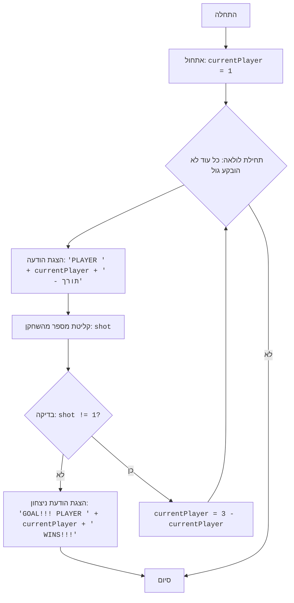

# ניתוח קוד המשחק "כדורגל"

## 1. <algorithm>

תהליך העבודה של הקוד מתואר בתרשים זרימה שלב אחר שלב:

1.  **התחלה:** המשחק מתחיל.
    *   דוגמה: מתחילים את המשחק כאשר המשתנה `currentPlayer` מאותחל ל-1.

2.  **אתחול שחקן נוכחי:** המשתנה `currentPlayer` מקבל את הערך 1, המייצג את השחקן הראשון.
    *   דוגמה: `currentPlayer = 1`

3.  **לולאת משחק:** מתחיל לולאה אינסופית (while True) שממשיכה עד שמוכרז ניצחון.
    *   דוגמה: הלולאה ממשיכה לפעול עד שמוצאים את הפקודה `break`.

4.  **הצגת הודעה לשחקן:** מוצגת הודעה שמבקשת מהשחקן הנוכחי לבצע את המהלך שלו.
    *   דוגמה: הפלט יהיה `PLAYER 1 --- YOUR SHOT` עבור השחקן הראשון.

5.  **קליטת קלט מהשחקן:** קולטים קלט מספרי מהשחקן המייצג את ניסיון הבעיטה שלו.
    *   דוגמה: השחקן מזין את המספר 5.

6.  **בדיקת גול:** בודקים אם הקלט שנקלט שווה ל-1.
    *   דוגמה: אם הקלט הוא 5 (שונה מ-1), אז זה גול.

7.  **אם גול:** אם הקלט שונה מ-1, מוצגת הודעת ניצחון והמשחק מסתיים.
    *   דוגמה: אם הקלט הוא 5, הפלט יהיה `GOAL!!! PLAYER 1 WINS!!!` והמשחק יסתיים.

8.  **אם לא גול:** אם הקלט שווה ל-1, מחליפים את תור השחקן.
    *   דוגמה: אם הקלט הוא 1, `currentPlayer` משתנה ל-2.

9.  **חזרה ללולאה:** חוזרים לשלב 3 להמשך המשחק עם השחקן הבא.
    *   דוגמה: התור עובר לשחקן 2, ואז חוזרים לשלב 3 ומבקשים משחקן 2 לבצע מהלך.

## 2. <mermaid>

**ניתוח תלויות:**
אין תלויות חיצוניות או ייבוא של ספריות חיצוניות בקוד זה. כל הפונקציונליות ממומשת ישירות בקובץ ה-Python הנתון.

## 3. <explanation>

### ייבואים (Imports):

*   אין ייבוא מיוחד בקוד זה, מכיוון שהוא משתמש בפונקציות בסיסיות של Python כמו `print` ו-`input`.

### משתנים (Variables):

*   **`currentPlayer`**: משתנה מסוג מספר שלם (int) ששומר את מספר השחקן הנוכחי (1 או 2). הוא משמש כדי לעקוב אחרי מי השחקן שצריך לבצע את המהלך שלו. הערך שלו משתנה בין 1 ל-2 לאורך המשחק.

*   **`shot`**: משתנה מסוג מספר שלם (int) שמייצג את המספר שהשחקן הזין כניסיון בעיטה. הוא משמש לבדיקה אם השחקן הבקיע גול. הערך שלו נקלט באמצעות הפונקציה `input` ומומר למספר שלם באמצעות הפונקציה `int`.

### פונקציות (Functions):

*   **`print()`**: פונקציה מובנית של Python המשמשת להדפסת הודעות למסך, כגון הודעות השחקן, הודעות ניצחון והודעות שגיאה.
*   **`input()`**: פונקציה מובנית של Python המשמשת לקבלת קלט מהמשתמש. הקלט מוחזר כטקסט.
*   **`int()`**: פונקציה מובנית של Python המשמשת להמרת מחרוזת למספר שלם. היא משמשת כדי להמיר את הקלט שהתקבל מהמשתמש למספר.

### הסברים מפורטים:

1.  **אתחול המשחק:**
    *   `currentPlayer = 1`: מאתחל את השחקן הנוכחי לשחקן 1.

2.  **לולאת המשחק (`while True`)**:
    *   הלולאה ממשיכה לרוץ עד שהמשחק מסתיים (שחקן מבקיע גול).

3.  **הצגת תור השחקן:**
    *   `print(f"PLAYER {currentPlayer} --- YOUR SHOT")`: מציג הודעה מי השחקן שמשחק כרגע.

4.  **קליטת קלט מהשחקן:**
    *   `shot = int(input("הכנס מספר בין 1 ל-10:"))`: מקבל קלט מהמשתמש וממיר אותו למספר שלם.
    *   במקרה של קלט שגוי (לא מספר), הקוד קולט את השגיאה ומדפיס הודעה מתאימה.

5.  **בדיקת גול:**
    *   `if shot != 1:`: בודק אם הקלט שונה מ-1. אם כן, השחקן הבקיע גול.
    *   `print(f"GOAL!!! PLAYER {currentPlayer} WINS!!!")`: מציג הודעה שהשחקן הנוכחי ניצח.
    *   `break`: עוצר את הלולאה ומסיים את המשחק.

6.  **מעבר שחקן:**
    *   `currentPlayer = 3 - currentPlayer`: מעביר את התור לשחקן השני. אם השחקן הנוכחי הוא 1, הוא יהפוך ל-2, ואם הוא 2, הוא יהפוך ל-1.

### בעיות אפשריות או תחומים לשיפור:

*   **אימות קלט:** הקוד בודק אם הקלט הוא מספר שלם, אבל לא בודק אם הקלט הוא בטווח 1 עד 10. אפשר להוסיף בדיקה כדי לוודא שהקלט הוא אכן מספר בין 1 ל-10.
*   **הודעות למשתמש:** אפשר להפוך את ההודעות ליותר ידידותיות למשתמש, למשל, להציג הודעה המבקשת מהמשתמש להזין מספר בין 1 ל-10 אחרי שהמשתמש מזין קלט שגוי.

### שרשרת קשרים עם חלקים אחרים בפרויקט:

*   אין תלות ישירה עם חלקים אחרים בפרויקט, אך הקוד הזה הוא חלק ממערך משחקי מחשב בסיסיים. ניתן ליצור אינטגרציה עם מנגנון הוספת משחקים או ניהול משתמשים, אם רלוונטי.

בסה"כ, הקוד מספק מימוש פשוט וברור למשחק "כדורגל" טקסטואלי, ומאפשר לשני שחקנים להתחרות אחד נגד השני.