## <algorithm>

הקוד מיישם משחק ניחושים פשוט שבו המחשב בוחר 4 מילים אקראיות מתוך רשימה ו-4 מספרים אקראיים בין 0 ל-9, והמשתמש מנסה לנחש אותם.

1. **אתחול משחק**:
   - **פעולה**: רשימת מילים `words` מאותחלת, ורשימות ריקות `chosenWords` ו-`chosenDigits` נוצרות לאחסון המילים והמספרים שנבחרו על ידי המחשב.
   - **דוגמה**: `words = ['A', 'B', 'C', 'D', 'E', 'F', 'G', 'H', 'I', 'J']`, `chosenWords = []`, `chosenDigits = []`

2. **בחירת מילים ומספרים אקראיים**:
   - **פעולה**: המחשב בוחר 4 מילים אקראיות מרשימת המילים (`words`) ו-4 מספרים אקראיים בין 0 ל-9.
   - **דוגמה**: `chosenWords` יכול להיות `['C', 'A', 'F', 'J']`, ו-`chosenDigits` יכול להיות `[3, 8, 1, 5]`.

3. **לולאת המשחק**:
   - **פעולה**: המשחק נכנס ללולאה אינסופית `while True`, שמאפשרת למשתמש לנחש עד שהוא מנצח.
   - **תנאי עצירה**: הלולאה ממשיכה עד שהמשתנה `all_correct` יהיה `True`.
   - **קלט מהמשתמש**: המשחק מבקש מהמשתמש להזין 4 מילים ו-4 מספרים המופרדים ברווח.
   - **דוגמה**: קלט משתמש: `"A B C D 1 2 3 4"`

4. **עיבוד הקלט**:
   - **פעולה**: הקלט מחולק לשני רשימות: `userWords` (4 מילים ראשונות) ו-`userDigits` (4 מספרים אחרי המילים).
   - **דוגמה**:
     - אם הקלט מהמשתמש היה `"A B C D 1 2 3 4"`, אז `userWords` יהיה `['A', 'B', 'C', 'D']` ו-`userDigits` יהיה `['1', '2', '3', '4']`.
     - אם הקלט מהמשתמש היה `"X Y Z W 9 8 7 6"`, אז `userWords` יהיה `['X', 'Y', 'Z', 'W']` ו-`userDigits` יהיה `['9', '8', '7', '6']`.

5. **בדיקת ניחוש מילים**:
   - **פעולה**: מעבר על המילים שהמשתמש הזין, השוואה מול המילים הנבחרות, והצגת הודעה אם נמצאה התאמה במיקום מסוים.
   - **דוגמה**: אם `chosenWords` הוא `['C', 'A', 'F', 'J']`, ו-`userWords` הוא `['C', 'B', 'F', 'H']` אז המשחק ידפיס:
    ```
    Слово C в позиции 1 угадано
    Слово F в позиции 3 угадано
    ```

6. **בדיקת ניחוש מספרים**:
   - **פעולה**: מעבר על המספרים שהמשתמש הזין, המרה למספרים שלמים, השוואה מול המספרים הנבחרים, והצגת הודעה אם נמצאה התאמה במיקום מסוים.
   - **טיפול בשגיאות**: אם המשתמש הזין ערך שאינו מספר, תוצג הודעת שגיאה, והניחוש ייחשב לא נכון.
   - **דוגמה**: אם `chosenDigits` הוא `[3, 8, 1, 5]` ו-`userDigits` הוא `['3', '9', '1', '7']` אז המשחק ידפיס:
    ```
    Цифра 3 в позиции 1 угадана
    Цифра 1 в позиции 3 угадана
    ```
   - **דוגמה לשגיאה**: אם `userDigits` הוא `['3', 'X', '1', '7']`, המשחק ידפיס הודעת שגיאה עבור הערך `X` והמשחק לא יחשב שהמשתמש ניחש נכון את הספרה.

7. **בדיקת ניצחון**:
   - **פעולה**: אם כל המילים והמספרים שסופקו על ידי המשתמש תואמים למילים והמספרים שנבחרו על ידי המחשב, המשתנה `all_correct` נשאר `True`.
   - אם כל המילים והמספרים תואמים, מוצגת הודעת ניצחון "YOU GOT IT!" והלולאה מסתיימת.
   - אם לפחות מילה או מספר אחד לא תואמים, המשתנה `all_correct` הופך ל-`False`, והלולאה ממשיכה.

```mermaid
flowchart TD
    Start["התחלה"] --> InitializeGame["<p align='left'>אתחול:\n    <code><b>\n    words = ['A', 'B', 'C', 'D', 'E', 'F', 'G', 'H', 'I', 'J']\n    chosenWords = []\n    chosenDigits = []\n    </b></code></p>"]
    InitializeGame --> ChooseWordsDigits["<p align='left'>בחירת מילים ומספרים אקראיים:\n    <code><b>\n    chosenWords = random.sample(words, 4)\n    chosenDigits = [random.randint(0, 9) for _ in range(4)]\n    </b></code></p>"]
    ChooseWordsDigits --> GameLoopStart{"<p align='left'>תחילת לולאת המשחק:\n    <code><b>\n    while True\n    </b></code></p>"}
    GameLoopStart --> InputUserGuess["קבלת קלט מהמשתמש:\n4 מילים ו-4 מספרים"]
    InputUserGuess --> ParseInput["<p align='left'>פיצול הקלט:\n<code><b>\n    userWords = input.split()[:4]\n    userDigits = input.split()[4:]\n    </b></code></p>"]
    ParseInput --> CheckWords["<p align='left'>בדיקת מילים:\n<code><b>\n for i in range(4):\n  if userWords[i] == chosenWords[i]:\n     print(...)\n  else:\n     all_correct = False\n</b></code></p>"]
    CheckWords --> CheckDigits["<p align='left'>בדיקת מספרים:\n<code><b>\n for i in range(4):\n    try:\n        if int(userDigits[i]) == chosenDigits[i]:\n           print(...)\n        else:\n            all_correct = False\n    except ValueError:\n       print(...)\n       all_correct = False\n       break\n</b></code></p>"]
    CheckDigits --> CheckWin["<p align='left'>בדיקת ניצחון:\n    <code><b>\n if all_correct:\n    </b></code></p>"]
    CheckWin -- "כן" --> OutputWin["הצגת הודעת ניצחון:\n<b>YOU GOT IT!</b>"]
    OutputWin --> End["סיום"]
    CheckWin -- "לא" --> GameLoopStart
    GameLoopStart -- "break" --> End
```

## <mermaid>



**הסבר תלויות (Imports):**

-   `import random`:  המודול `random` משמש לייצור ערכים אקראיים. הפונקציה `random.sample(words, 4)` משמשת לבחירת 4 מילים אקראיות מרשימת המילים, ו-`random.randint(0, 9)` משמשת ליצירת מספרים שלמים אקראיים בין 0 ל-9.

## <explanation>

**ייבואים (Imports):**

-   `import random`: מודול זה מספק פונקציות ליצירת מספרים אקראיים וביצוע פעולות הקשורות לאקראיות, כמו בחירת איברים מרשימה באופן אקראי.

**משתנים (Variables):**

-   `words`: רשימה קבועה של מילים (`['A', 'B', 'C', 'D', 'E', 'F', 'G', 'H', 'I', 'J']`), שמהן נבחרות מילים אקראיות למשחק.
-   `chosenWords`: רשימה ריקה שתאכלס את 4 המילים האקראיות שנבחרו על ידי המחשב.
-   `chosenDigits`: רשימה ריקה שתאכלס את 4 המספרים האקראיים שנבחרו על ידי המחשב.
-   `user_input`: מחרוזת שמכילה את הקלט מהמשתמש, כלומר את המילים והמספרים שהמשתמש מנסה לנחש.
-   `userWords`: רשימה שמכילה את 4 המילים הראשונות שהמשתמש הזין.
-   `userDigits`: רשימה שמכילה את 4 המספרים שהמשתמש הזין לאחר 4 המילים הראשונות.
-   `all_correct`: משתנה בוליאני, שמאותחל לערך `True` בתחילת כל ניסיון ניחוש, והופך ל- `False` אם יש טעות בניחוש.

**פונקציות (Functions):**

-   אין פונקציות מוגדרות בקוד זה, אבל המודול `random` מספק פונקציות כמו:
    -   `random.sample(words, 4)`: בוחר 4 איברים אקראיים מתוך הרשימה `words` ללא חזרה.
    -   `random.randint(0, 9)`: מחזיר מספר אקראי שלם בטווח שבין 0 ל-9.
-   `input()`:  פונקציה מובנית של Python שמקבלת קלט מהמשתמש מהקונסולה.

**הסברים:**

1.  **בחירת מילים ומספרים אקראיים**:
    -   המחשב בוחר 4 מילים אקראיות מהרשימה `words` באמצעות `random.sample()`, ו-4 מספרים שלמים אקראיים בין 0 ל-9 באמצעות `random.randint()`.

2.  **לולאת המשחק**:
    -   הלולאה `while True:` רצה עד שהמשתמש ינחש נכון את כל המילים והמספרים, מה שמוביל ליציאה מהלולאה עם פקודה `break`.
    -   בתוך הלולאה, הקלט מהמשתמש מתקבל באמצעות הפונקציה `input()`.
    -   הקלט מהמשתמש מפוצל לרשימות `userWords` ו-`userDigits`.

3.  **בדיקת ניחוש**:
    -   הקוד עובר על כל מילה וכל מספר שהמשתמש הזין ומשווה אותם למילים ולמספרים שנבחרו על ידי המחשב.
    -   אם יש התאמה, מוצגת הודעה שהמילה או המספר במיקום מסוים נכונים.
    -   אם יש טעות באחד הניחושים, המשתנה `all_correct` הופך ל- `False`.

4.  **טיפול בשגיאות**:
    -   הקוד כולל טיפול בשגיאות מסוג `ValueError` באמצעות בלוק `try-except`. שגיאה זו תופסת את המקרה שבו המשתמש הכניס תו שאינו ספרה, ובמצב זה תוצג הודעה שהקלט אינו תקין.

5.  **הכרזת ניצחון**:
    -   אם המשתנה `all_correct` נשאר `True` לאחר כל הבדיקות, זה אומר שהמשתמש ניחש נכון את כל המילים והמספרים, ואז הקוד מציג הודעת ניצחון "YOU GOT IT!" והלולאה מסתיימת באמצעות `break`.

**בעיות אפשריות ותחומים לשיפור:**

1.  **קלט לא תקין**: המשחק דורש מהמשתמש להזין בדיוק 4 מילים ואחר כך 4 מספרים, אך אין בדיקה מפורשת שמוודאת שזה אכן מה שסופק. אפשר להוסיף בדיקה לכמות האיברים שסופקו בקלט.
2.  **חוסר אינטראקציה**: המשחק מספק רק פידבק על המיקום הנכון של המילה או המספר. אפשר לשפר את האינטראקציה עם המשתמש על ידי מתן רמזים נוספים או אפשרויות נוספות.
3. **חוסר שימוש בפונקציות**: הקוד אינו מודולרי, כל הקוד רץ ברצף, לכן לא ניתן להשתמש בקוד בצורה נוחה בחלקים אחרים בפרויקט. מומלץ להגדיר פונקציות שיבצעו כל פעולה.

**שרשרת קשרים עם חלקים אחרים בפרויקט:**

אין תלות ישירה בחלקים אחרים בפרויקט, הקוד עומד בפני עצמו. אם היה שימוש ב`header.py`, היה ניתן לייבא הגדרות גלובליות.
```mermaid
flowchart TD
    Start --> Header[<code>header.py</code><br> קביעת שורש הפרויקט]

    Header --> import[ייבוא הגדרות גלובליות: <br><code>from src import gs</code>]