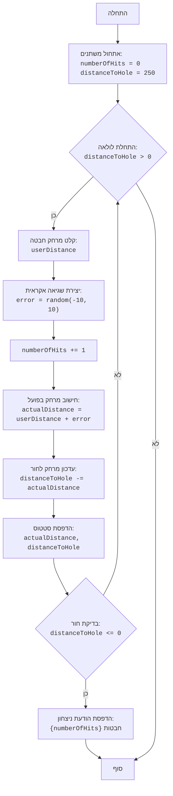

## ניתוח קוד משחק גולף

### 1. <algorithm>

הקוד מדמה משחק גולף טקסטואלי. להלן תיאור שלבי המשחק:

1.  **אתחול:**
    *   `numberOfHits` (מספר החבטות) מאותחל ל-0.
    *   `distanceToHole` (מרחק לחור) מאותחל ל-250 יארד.

2.  **לולאה ראשית (כל עוד המרחק לחור גדול מ-0):**
    *   **קלט מרחק:** המשתמש מתבקש להכניס מרחק חבטה רצוי (`userDistance`).
        *   דוגמה: המשתמש מכניס 50.
    *   **יצירת שגיאה אקראית:** נוצרת שגיאת חבטה אקראית בטווח של -10 עד 10 (`error`).
        *   דוגמה: `error` = -3.
    *   **הגדלת מונה חבטות:** `numberOfHits` גדל ב-1.
        *   דוגמה: אם `numberOfHits` היה 0, כעת הוא 1.
    *   **חישוב מרחק חבטה בפועל:** המרחק בפועל (`actualDistance`) מחושב כסכום של המרחק שהמשתמש הכניס והשגיאה האקראית.
        *   דוגמה: `actualDistance` = 50 + (-3) = 47.
    *   **עדכון מרחק לחור:** המרחק לחור (`distanceToHole`) מעודכן ע"י הפחתת מרחק החבטה בפועל ממנו.
        *   דוגמה: אם `distanceToHole` היה 250, כעת הוא 250 - 47 = 203.
    *   **הדפסת סטטוס:** מרחק החבטה בפועל והמרחק הנותר לחור מודפסים למסך.
        *   דוגמה: יודפס "מרחק חבטה בפועל: 47.00 יארד. מרחק לחור: 203.00 יארד".

3.  **סיום המשחק:**
    *   ברגע ש-`distanceToHole` קטן או שווה ל-0, הלולאה מסתיימת.
    *   הודעת ניצחון מוצגת למשתמש, כולל מספר החבטות הכולל שנדרש.
        *   דוגמה: יודפס "ברכות! הגעת לחור ב-5 חבטות".

### 2. <mermaid>

**הסבר על התרשים:**

*   `flowchart TD`: מגדיר את סוג התרשים כתרשים זרימה (Flowchart) מלמעלה למטה (TD - Top Down).
*   כל מלבן מייצג פעולה או שלב בקוד.
*   החיצים מראים את זרימת השליטה מהתחלה ועד הסוף.
*   שמות המשתנים בתרשים הם תיאוריים ובעלי משמעות, כגון `numberOfHits`, `distanceToHole`, `userDistance` וכו'.
*   הקוד המופיע בתוך הבלוקים מספק דוגמאות לפעולות המתבצעות בכל שלב.

### 3. <explanation>

**ייבוא (Imports):**

*   `import random`: מייבא את מודול `random` המובנה של פייתון, שמשמש ליצירת מספרים אקראיים. הוא חיוני למשחק זה, שכן הוא מספק את השגיאה האקראית בחבטה.

**משתנים (Variables):**

*   `numberOfHits`: משתנה מסוג שלם (integer) שסופר את מספר החבטות שהשחקן ביצע. הוא מאותחל ל-0 בתחילת המשחק ומוגדל ב-1 בכל סיבוב של הלולאה.
*   `distanceToHole`: משתנה מסוג שלם (integer) המייצג את המרחק הנותר לחור. הוא מאותחל ל-250 יארד ומתעדכן בכל סיבוב של הלולאה על ידי הפחתת מרחק החבטה בפועל.
*   `userDistance`: משתנה מסוג float המייצג את המרחק שהשחקן הכניס. הוא מתקבל כקלט מהמשתמש.
*   `error`: משתנה מסוג שלם (integer) המייצג את השגיאה האקראית שנוצרה לכל חבטה. הוא נוצר בעזרת `random.randint(-10, 10)`.
*   `actualDistance`: משתנה מסוג float המייצג את המרחק בפועל שהכדור התקדם בחבטה. הוא מחושב על ידי הוספת השגיאה למרחק שהשחקן הכניס.

**פונקציות (Functions):**

*   אין פונקציות מותאמות אישית בקוד זה. הקוד משתמש בפונקציות המובנות של פייתון:
    *   `input()`: מקבל קלט מהמשתמש.
    *   `float()`: ממיר את הקלט למספר עשרוני (float).
    *   `random.randint()`: מחזיר מספר אקראי שלם בטווח נתון.
    *   `print()`: מדפיס טקסט לפלט.
    *   השימוש ב-`try...except ValueError` מבצע טיפול בשגיאות קלט ומונע קריסה של התוכנית במקרה של קלט לא תקין מהמשתמש.

**בעיות אפשריות ותחומים לשיפור:**

*   **קלט לא תקין:** הקוד מטפל בשגיאות קלט רק בתוך הלולאה, אבל לא מטפל בקלט לא תקין בפעם הראשונה שהקוד מתחיל.
*   **משוב משתמש:** המשחק יכול לספק יותר משוב למשתמש (לדוגמא, האם החבטה הייתה חזקה או חלשה).
*   **ממשק משתמש:** כרגע זהו משחק טקסטואלי, אבל ניתן לשדרג לממשק גרפי כדי לשפר את חוויית המשתמש.
*   **רמות קושי:** ניתן להוסיף רמות קושי שונות על ידי שינוי טווח השגיאה האקראית או המרחק ההתחלתי לחור.
*   **בדיקה של מרחק שלילי:** אין בקרה על מרחק שלילי שהשחקן מכניס, מה שיכול להוביל למצבים לא אינטואיטיביים.

**שרשרת קשרים עם חלקים אחרים בפרויקט:**

*   הקוד הזה פועל כיחידה עצמאית, ואין לו תלות ישירה בחלקים אחרים בפרויקט מלבד השימוש במודול ה-`random` של פייתון. עם זאת, הוא יכול להיות חלק ממערכת גדולה יותר של משחקים, שם הוא ישתף את אותו מבנה הפרויקט הבסיסי (לדוגמה, תפריט משחק או מנהל משחקים).