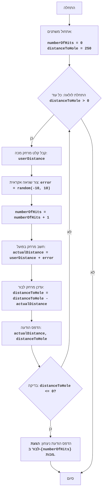

## ניתוח קוד המשחק "גולף"

### 1. <algorithm>

**תרשים זרימה:**

1.  **אתחול:**
    *   `numberOfHits` = 0 (מספר המכות)
    *   `distanceToHole` = 250 (מרחק לבור)

2.  **לולאה:** כל עוד `distanceToHole` > 0:
    *   קבל מהמשתמש קלט `userDistance` (מרחק המכה). לדוגמה: 50
    *   צור מספר אקראי `error` בין -10 ל-10. לדוגמה: -3
    *   הגדל את `numberOfHits` ב-1. לדוגמה: 1
    *   חשב את המרחק בפועל `actualDistance = userDistance + error`. לדוגמה: 50 + (-3) = 47
    *   עדכן את המרחק לבור `distanceToHole = distanceToHole - actualDistance`. לדוגמה: 250 - 47 = 203
    *   הדפס את המרחק בפועל ואת המרחק שנותר לבור
    *   בדוק אם `distanceToHole` קטן או שווה ל-0.
        *   אם כן, צא מהלולאה.
        *   אם לא, חזור לתחילת הלולאה.

3.  **סיום:** הדפס הודעת ניצחון עם מספר המכות שנדרשו.

**זרימת נתונים:**

*   המשתמש מספק קלט `userDistance`.
*   הקלט עובר לפונקציה `random.randint` כדי ליצור שגיאה אקראית.
*   הערכים `userDistance` ו-`error` משמשים לחישוב `actualDistance`.
*   `actualDistance` משמש לעדכון `distanceToHole`.
*   `numberOfHits` מתעדכן בכל מכה.
*   הערכים `actualDistance`, `distanceToHole`, `numberOfHits` מוצגים למשתמש.

### 2. <mermaid>

**ניתוח התלויות:**

*   `random`: המודול `random` משמש ליצירת מספר אקראי עבור שגיאת המכה. הוא מיובא עם `import random`.

### 3. <explanation>

**ייבוא (Imports):**

*   `import random`: מייבא את המודול `random` של פייתון, המאפשר יצירת מספרים אקראיים. הוא משמש ליצירת שגיאת מכה אקראית, מה שמוסיף אלמנט של אי ודאות למשחק.

**משתנים:**

*   `numberOfHits` (int): מונה את מספר המכות שביצע השחקן. הוא מאותחל ל-0 וגדל ב-1 בכל מכה.
*   `distanceToHole` (int): מייצג את המרחק הנוכחי לבור. הוא מאותחל ל-250 יארד ומתעדכן בהתאם למרחק המכה בכל תור.
*   `userDistance` (float): מאחסן את המרחק שהשחקן בחר להכות, כקלט משתמש.
*   `error` (int): מייצג שגיאה אקראית במכה, ערך בין -10 ל-10.
*   `actualDistance` (float): מייצג את המרחק בפועל שהכדור עבר, מחושב על ידי הוספת שגיאה למרחק המתוכנן.

**פונקציות:**

*   אין פונקציות מוגדרות באופן ישיר, אך הקוד משתמש בפונקציות מובנות של פייתון כמו `input` (לקבלת קלט משתמש), `float` (להמרת קלט למספר), `print` (להצגת הודעות), ו-`random.randint` (ליצירת מספר אקראי).

**הסברים מפורטים:**

1.  **אתחול:** התוכנית מתחילה באתחול שני משתנים: `numberOfHits` שמאותחל ל-0, ו-`distanceToHole` שמאותחל ל-250.
2.  **לולאת משחק:**
    *   הלולאה `while distanceToHole > 0:` ממשיכה כל עוד המרחק לבור גדול מ-0, כלומר המשחק נמשך עד שהשחקן מגיע לבור.
    *   **קבלת קלט משתמש:** הפונקציה `input` מבקשת מהשחקן להזין מרחק מכה. הפונקציה `float` מבטיחה שהקלט יהפוך למספר, גם אם הקלט המקורי של המשתמש היה מחרוזת. טיפול השגיאות באמצעות `try/except` מטפל במקרים בהם השחקן לא מזין מספר תקין.
    *   **יצירת שגיאה אקראית:** `random.randint(-10, 10)` יוצר מספר אקראי בין -10 ל-10, המייצג את אי הדיוק במכה.
    *   **עדכון מספר מכות:** `numberOfHits += 1` מגדיל את מספר המכות שביצע השחקן.
    *   **חישוב המרחק בפועל:** `actualDistance = userDistance + error` מחשב את המרחק בפועל של הכדור, על ידי הוספת השגיאה למרחק המתוכנן.
    *   **עדכון המרחק לבור:** `distanceToHole -= actualDistance` מעדכן את המרחק לבור על ידי הפחתת המרחק בפועל מהמרחק הקיים.
    *   **הצגת הודעות:** הפונקציה `print` מציגה למשתמש את המרחק בפועל של המכה ואת המרחק שנותר לבור.
3.  **סיום המשחק:** לאחר שהמרחק לבור הופך לקטן או שווה ל-0, הלולאה מסתיימת, והפונקציה `print` מציגה הודעת ניצחון עם מספר המכות שהשחקן ביצע.

**בעיות אפשריות ותחומים לשיפור:**

*   **משוב משתמש:** המשחק מספק משוב בסיסי בלבד למשתמש. ניתן לשפר את המשוב על ידי הוספת הודעות מעודדות או מנחות, או על ידי הצגת גרפיקה פשוטה.
*   **רמות קושי:** המשחק כרגע ברמת קושי יחידה. ניתן להוסיף רמות קושי על ידי שינוי המרחק ההתחלתי לבור, או על ידי שינוי טווח השגיאה האקראית.
*   **התנהגות לא ריאליסטית:** המשחק אינו משקף במדויק את הפיזיקה של משחק הגולף, למשל אין התחשבות בכיוון המכה.
*   **קלט לא תקין:** הקוד מטפל רק במקרה בו המשתמש מזין ערך שאינו מספר. ניתן להוסיף עוד בדיקות וטיפול בקלט, כגון וידוא שהקלט הוא חיובי.

**קשרים עם חלקים אחרים בפרויקט:**

*   אין קשרים ישירים לחלקים אחרים בפרויקט, מכיוון שזהו קובץ משחק עצמאי. אך קוד זה יכול לשמש כבסיס למשחקים אחרים המשתמשים במודול random ליצירת אלמנט של אי ודאות. כמו כן, הוא יכול להיות חלק ממערכת משחקים גדולה יותר, כאשר קוד זה הוא משחק מסוים בתוך המערכת.