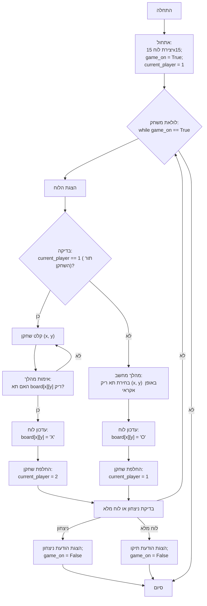

## ניתוח קוד גומוקו

### 1. <algorithm>

הקוד מיישם משחק גומוקו (חמש בשורה) בסיסי בין שחקן למחשב. הנה תהליך העבודה של הקוד צעד אחר צעד:

1.  **אתחול:**
    *   מערך דו-ממדי `board` בגודל 15x15 מאותחל עם רווחים, המייצגים את לוח המשחק הריק.
    *   משתנה בוליאני `game_on` מאותחל ל-`True`, כדי לציין שהמשחק פעיל.
    *   משתנה `current_player` מאותחל ל-1, המציין שהשחקן הראשון (אנושי) מתחיל.
    *   **דוגמה:** אחרי האתחול, `board` הוא לוח ריק, `game_on` הוא `True` ו-`current_player` הוא 1.

2.  **לולאת משחק:**
    *   הלולאה נמשכת כל עוד `game_on` הוא `True`.
    *   לוח המשחק מוצג באמצעות הפונקציה `print_board`.
    *   **דוגמה:** לוח המשחק הריק מוצג בהתחלה.

3.  **תור השחקן (אם `current_player` הוא 1):**
    *   השחקן מתבקש להזין קואורדינטות x ו-y למיקום המהלך שלו.
    *   קלט השחקן מאומת כדי לוודא שהוא בטווח המותר ושהתא ריק. אם הקלט לא תקין, השחקן מתבקש לנסות שוב.
    *   אם הקלט תקין, התא על הלוח מתעדכן עם הסימן 'X'.
    *   הערך של `current_player` משתנה ל-2, כדי לעבור לתור של המחשב.
    *   **דוגמה:** השחקן מזין x=2, y=3, אם התא ריק, התא `board[2][3]` מקבל את הערך 'X' ו-`current_player` הופך ל-2.

4.  **תור המחשב (אם `current_player` הוא 2):**
    *   הקואורדינטות x ו-y נבחרות באופן אקראי.
    *   אם התא שנבחר ריק, הוא מתעדכן עם הסימן 'O'.
    *   הערך של `current_player` משתנה ל-1, כדי לחזור לתור השחקן.
    *   **דוגמה:** המחשב בוחר x=5, y=7, אם התא ריק, התא `board[5][7]` מקבל את הערך 'O' ו-`current_player` הופך ל-1.

5.  **בדיקת ניצחון או תיקו:**
    *   הפונקציה `check_winner` נקראת כדי לבדוק אם יש מנצח. אם כן, המשחק מסתיים, מוצגת הודעה מתאימה, ו-`game_on` משתנה ל-`False`.
    *   הפונקציה `check_full_board` נקראת כדי לבדוק אם הלוח מלא. אם כן, המשחק מסתיים, מוצגת הודעת תיקו ו-`game_on` משתנה ל-`False`.
    *   אם אין מנצח והלוח אינו מלא, המשחק חוזר ללולאה ומתחיל תור חדש.
    *   **דוגמה:** אם קיימים 5 איקסים או עיגולים ברצף, מוכרז מנצח, אחרת אם הלוח מלא ללא מנצח, מוכרז תיקו.

### <mermaid>



**הסבר התרשים:**

*   **Start:** תחילת המשחק.
*   **InitializeBoard:** אתחול לוח המשחק, משתנה `game_on` ל-`True` ומשתנה `current_player` ל-1.
*   **GameLoopStart:** תחילת לולאת המשחק. הלולאה ממשיכה כל עוד `game_on` הוא `True`.
*   **DisplayBoard:** הצגת מצב הלוח הנוכחי.
*   **CheckPlayer:** בדיקה האם תור השחקן (1) או המחשב (2).
*   **PlayerInput:** השחקן מזין את הקואורדינטות x ו-y.
*   **ValidatePlayerMove:** בדיקה האם המהלך חוקי (התא ריק). אם לא, השחקן מזין שוב.
*   **UpdateBoardPlayer:** עדכון הלוח עם סימן 'X' במיקום שנבחר.
*   **ChangePlayerP1:** שינוי השחקן ל-2 (תור המחשב).
*    **ComputerMove:** המחשב בוחר תא ריק באופן אקראי.
*   **UpdateBoardComputer:** עדכון הלוח עם סימן 'O' במיקום שנבחר.
*   **ChangePlayerP2:** שינוי השחקן ל-1 (תור השחקן).
*   **CheckWinOrFull:** בדיקה האם יש מנצח או האם הלוח מלא.
*   **OutputWinner:** הצגת הודעת ניצחון וסיום המשחק.
*   **OutputDraw:** הצגת הודעת תיקו וסיום המשחק.
*   **End:** סיום המשחק.

### 3. <explanation>

**ייבוא (Imports):**

*   `import random`: מודול המשמש ליצירת מספרים אקראיים, ומשמש למימוש המהלכים של המחשב.

**משתנים:**

*   `board`: רשימה דו-ממדית המייצגת את לוח המשחק. כל תא מכיל מחרוזת ריקה ' ', 'X' (עבור השחקן) או 'O' (עבור המחשב).
*   `game_on`: משתנה בוליאני השולט על המשך המשחק. ערכו הוא `True` כל עוד המשחק נמשך ו-`False` כאשר המשחק מסתיים (בניצחון או בתיקו).
*   `current_player`: משתנה שלם המציין את תורו של מי כעת, 1 עבור השחקן ו-2 עבור המחשב.

**פונקציות:**

*   `print_board(board)`:
    *   **פרמטר:** `board` - רשימה דו-ממדית המייצגת את לוח המשחק.
    *   **ערך מוחזר:** אין.
    *   **מטרה:** להדפיס את הלוח הנוכחי לקונסולה בצורה קריאה ונוחה.
    *   **דוגמה:** הפונקציה מדפיסה את הלוח הנוכחי לאחר כל מהלך, כמו לדוגמה:

    ```
       0  1  2  3  4  5  6  7  8  9 10 11 12 13 14
     -------------------------------------------------
    0|     X     O
    1|  O        X
    2|  X  O        ...
    ```

*   `check_winner(board, player)`:
    *   **פרמטרים:** `board` - לוח המשחק, `player` - מספר השחקן הנוכחי (1 או 2).
    *   **ערך מוחזר:** `True` אם יש מנצח, `False` אחרת.
    *   **מטרה:** בדיקה האם השחקן הנוכחי ניצח על ידי יצירת רצף של חמישה סימנים זהים (X או O) בשורה, טור או אלכסון.
    *   **דוגמה:** הפונקציה עוברת על כל האפשרויות לזכייה ומחזירה `True` אם נמצאה שורת ניצחון.

*   `check_full_board(board)`:
    *   **פרמטר:** `board` - לוח המשחק.
    *   **ערך מוחזר:** `True` אם הלוח מלא, `False` אם קיימים תאים ריקים.
    *   **מטרה:** לבדוק האם כל התאים בלוח מלאים, מה שמצביע על תיקו.
    *   **דוגמה:** הפונקציה מחזירה `True` רק אם אין תאים ריקים בלוח.

**בעיות אפשריות או תחומים לשיפור:**

*   **אלגוריתם המחשב:** אלגוריתם בחירת המהלכים של המחשב הוא אקראי לחלוטין, מה שהופך אותו ליריב חלש. ניתן לשפר את הבינה המלאכותית על ידי מימוש אלגוריתמים מתקדמים יותר כגון אלגוריתם מינימקס.
*   **אימות קלט:** אימות הקלט מוגבל לבדיקת המספרים השלמים ולטווח הערכים. ניתן להוסיף טיפול טוב יותר בקלט שאינו תקין.
*   **ממשק משתמש:** ממשק המשתמש מוגבל לקונסולה. ניתן לשפר את חוויית המשתמש על ידי הוספת ממשק גרפי.

**שרשרת קשרים עם חלקים אחרים בפרויקט:**

*   קובץ זה אינו תלוי בחלקים אחרים בפרויקט `hypotez`.

לסיכום, הקוד מספק יישום בסיסי של משחק גומוקו, המדגים כיצד לבנות משחק מבוסס תורות עם לוגיקה של שחקן ושל מחשב, תוך שימוש בבחירה אקראית עבור מהלכי המחשב ובסיסי אימות קלט. יש מקום לשיפור במובן של AI, קלט ו-UI.