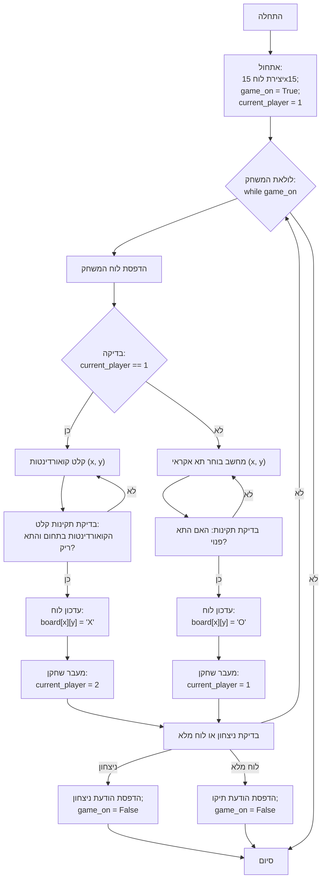

## ניתוח קוד - Gomoku

### 1. <algorithm>

הקוד מיישם משחק גומוקו (חמש בשורה) בסיסי בין שחקן למחשב. להלן תיאור תהליך העבודה צעד אחר צעד:

1. **אתחול:**
   - יצירת לוח משחק ריק בגודל 15x15 (`board`).
   - הגדרת משתנה `game_on` כ-`True` כדי לסמן שהמשחק פעיל.
   - הגדרת `current_player` כ-1, מה שמציין שהשחקן הראשון מתחיל.
   *דוגמה:*
     - `board` =  `[[' ', ' ', ' ', ..., ' '], [' ', ' ', ' ', ..., ' '], ..., [' ', ' ', ' ', ..., ' ']]`
     - `game_on` = `True`
     - `current_player` = `1`

2. **לולאת המשחק:**
   - המשחק רץ בלולאה כל עוד `game_on` הוא `True`.
   - הדפסת לוח המשחק הנוכחי באמצעות `print_board(board)`.
   - בדיקה האם תורו של השחקן (`current_player == 1`):
     - קבלת קלט מהמשתמש עבור קואורדינטות X ו-Y.
     - בדיקת תקינות הקלט - לוודא שהקואורדינטות בתחום הלוח והתא ריק.
     - אם התא תקין, הכנסת סימן השחקן ("X").
     - מעבר לתור של השחקן הבא (`current_player = 2`).
     - אם הקלט לא תקין, בקשה חוזרת לקלט מהמשתמש.
   *דוגמה:*
     - לוח המשחק מוצג למשתמש עם סימנים קיימים.
     - משתמש מזין `x = 3, y = 4`.
     - לוח המשחק מתעדכן ב: `board[3][4] = 'X'`.
     - `current_player` הופך ל-`2`.

   - אחרת, תור המחשב (`current_player == 2`):
     - בחירת תא אקראי בלוח.
     - בדיקה האם התא פנוי.
     - אם התא פנוי, הכנסת סימן המחשב ("O").
     - מעבר לתור של השחקן הקודם (`current_player = 1`).
     - אם התא לא פנוי, חוזרים לבחירת תא אקראי.
  *דוגמה:*
     - מחשב בוחר אקראית `x = 7, y = 2`.
     - לוח המשחק מתעדכן ב: `board[7][2] = 'O'`.
     - `current_player` הופך ל-`1`.

   - בדיקה האם יש מנצח באמצעות הפונקציה `check_winner()`.
     - אם יש מנצח, הדפסת הודעת ניצחון, וסיום המשחק על ידי הגדרת `game_on` ל-`False`.
   - בדיקה האם הלוח מלא, באמצעות הפונקציה `check_full_board()`.
     - אם הלוח מלא, הדפסת הודעת תיקו, וסיום המשחק על ידי הגדרת `game_on` ל-`False`.
   *דוגמה:*
     - אם `check_winner()` מחזיר `True` עבור שחקן 1, מוצגת הודעת ניצחון לשחקן 1 ו`game_on` הופך ל `False`.
     - אם `check_full_board()` מחזיר `True`, מוצגת הודעת תיקו ו`game_on` הופך ל `False`.

3. **סיום המשחק:**
   - לולאת המשחק מסתיימת כאשר `game_on` הוא `False`.
   *דוגמה:*
     - המשחק מסתיים בהודעת ניצחון או תיקו.

*זרימת נתונים:*
  - לוח המשחק `board` משותף בין כל הפונקציות והלולאה הראשית, כאשר משתנים כמו `current_player` משפיעים על מי משחק וכיצד הלוח מתעדכן.

### 2. <mermaid>

**הסבר התלויות:**
   - אין תלויות מיובאות, הקוד משתמש רק במודול `random` לצורך מהלכי המחשב.

### 3. <explanation>

**ייבואים (Imports):**

*   `import random`: מודול `random` משמש ליצירת מספרים אקראיים, אשר נחוצים לצורך בחירת תאים אקראית על ידי המחשב.

**מחלקות (Classes):**
   - אין מחלקות בקוד זה.

**פונקציות (Functions):**

*   `print_board(board)`:
    *   פרמטרים: `board` - לוח המשחק.
    *   ערך מוחזר: אין.
    *   מטרה: מדפיסה את לוח המשחק הנוכחי למסוף, כולל מספור שורות ועמודות.
    *   דוגמה לשימוש: `print_board(board)`

*   `check_winner(board, player)`:
    *   פרמטרים: `board` - לוח המשחק, `player` - מספר השחקן הנוכחי (1 או 2).
    *   ערך מוחזר: `True` אם יש מנצח, `False` אחרת.
    *   מטרה: בודקת האם אחד השחקנים ניצח במשחק, על ידי בדיקה האם יש חמישה סימנים ברצף (אופקית, אנכית או אלכסונית).
    *   דוגמה לשימוש: `if check_winner(board, current_player): ...`

* `check_full_board(board)`:
   *   פרמטרים: `board` - לוח המשחק.
   *   ערך מוחזר: `True` אם הלוח מלא, `False` אחרת.
   *   מטרה: בודקת האם כל התאים בלוח מלאים, מצב שמוביל לתיקו.
   *   דוגמה לשימוש: `if check_full_board(board): ...`

**משתנים (Variables):**

*   `board`:
    *   סוג: רשימה דו-ממדית (רשימה של רשימות).
    *   שימוש: מייצג את לוח המשחק, כאשר כל תא מכיל רווח (תא ריק), 'X' (סימן השחקן הראשון) או 'O' (סימן השחקן השני).

*   `game_on`:
    *   סוג: בוליאני (`True` או `False`).
    *   שימוש: מציין האם המשחק עדיין פעיל.

*   `current_player`:
    *   סוג: מספר שלם (1 או 2).
    *   שימוש: מציין את מספר השחקן שתורו כעת.

**בעיות אפשריות או תחומים לשיפור:**

*   **אלגוריתם המחשב:** המחשב בוחר מהלכים בצורה אקראית, מה שהופך אותו ליריב קל מאוד. ניתן לשפר את הבינה המלאכותית של המחשב באמצעות אלגוריתם מינימקס פשוט או הערכה של מצב הלוח.
*   **טיפול שגיאות:** הקוד מטפל בשגיאות בסיסיות בקלט המשתמש (למשל, קלט שאינו מספרים), אך ניתן להוסיף טיפול שגיאות נוסף.
*   **עיצוב ממשק משתמש:** הממשק מוגבל להדפסה למסוף. ניתן לשפר את חוויית המשתמש על ידי שימוש בספריית GUI.
* **בדיקת ניצחון:** בדיקת הניצחון מבוצעת על ידי סריקה של כל השורות, עמודות ואלכסונים, פעולה שגוזלת זמן. ניתן לבצע אופטימיזציה של הבדיקה כך שתרוץ רק באזורים הסמוכים למהלך האחרון שבוצע.

**קשרים עם חלקים אחרים בפרויקט:**

*   אין קשרים ישירים עם חלקים אחרים בפרויקט בגרסה זו של הקוד.
*   במסגרת הפרויקט הכולל, קוד זה יכול להשתלב כיחידה עצמאית של משחק.