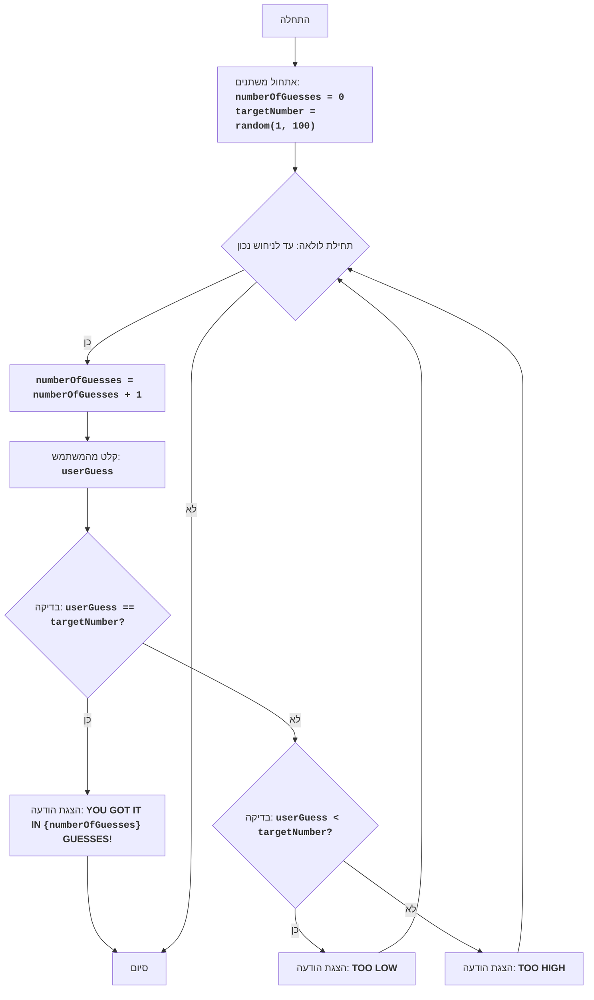

## ניתוח קוד: משחק ניחוש מספרים

### 1. **<algorithm>**

תיאור תהליך העבודה של הקוד בתרשים זרימה צעד-אחר-צעד:

1.  **התחלה:** התחלת המשחק.
    *   דוגמה: תחילת ריצת התוכנית.

2.  **אתחול משתנים:** אתחול שני משתנים:
    *   `numberOfGuesses` (מספר הניסיונות) מתחיל מ-0.
    *   `targetNumber` (המספר שיש לנחש) מקבל ערך אקראי בין 1 ל-100.
    *   דוגמה: `numberOfGuesses = 0`, `targetNumber = 42` (מספר אקראי).

3.  **תחילת לולאה:** מתחילים לולאה שרצה עד שהשחקן מנחש את המספר הנכון.

4.  **הגדלת מספר הניסיונות:** מגדילים את מספר הניסיונות ב-1.
    *   דוגמה: אם `numberOfGuesses` היה 0, הוא יהפוך ל-1.

5.  **קבלת קלט מהמשתמש:** המשתמש מתבקש להזין ניחוש (`userGuess`).
    *   דוגמה: המשתמש מזין 50.

6.  **בדיקת ניחוש:** בדיקה האם הניחוש שווה למספר המטרה (`userGuess == targetNumber`).
    *   דוגמה: אם `userGuess` הוא 50 ו-`targetNumber` הוא 42, התוצאה תהיה `false`.

7.  **ניחוש נכון:** אם הניחוש נכון:
    *   הצגת הודעת ניצחון: "YOU GOT IT IN {numberOfGuesses} GUESSES!".
    *   סיום המשחק.
    *   דוגמה: אם `userGuess` הוא 42 ו-`targetNumber` הוא 42, יוצג "YOU GOT IT IN 2 GUESSES!" (אם זה היה הניסיון השני).

8.  **ניחוש שגוי:** אם הניחוש שגוי, בודקים:
    *   האם הניחוש נמוך מהמספר המטרה (`userGuess < targetNumber`)?
        *   אם כן, מציגים "TOO LOW" וחוזרים לתחילת הלולאה.
        *   דוגמה: אם `userGuess` הוא 30 ו-`targetNumber` הוא 42, יוצג "TOO LOW".
    *   אחרת (הניחוש גבוה מהמספר המטרה):
        *   מציגים "TOO HIGH" וחוזרים לתחילת הלולאה.
        *   דוגמה: אם `userGuess` הוא 60 ו-`targetNumber` הוא 42, יוצג "TOO HIGH".

9.  **סיום:** סיום התוכנית לאחר שהמשתמש ניחש נכון.

### 2. **<mermaid>**



**ניתוח תלויות וייבוא:**

*   אין תלויות חיצוניות או ייבוא (import) בקוד עצמו, מכיוון שהוא תיאור אלגוריתמי של המשחק ולא מימוש קוד.
*  הפונקציה `random(1,100)` מדגימה את השימוש בספרייה ליצירת מספר אקראי.

**הסבר על שמות המשתנים בתרשים:**

*   `numberOfGuesses`: משתנה שלם שמייצג את מספר הניסיונות של המשתמש.
*   `targetNumber`: משתנה שלם שמייצג את המספר האקראי שהמחשב בחר.
*   `userGuess`: משתנה שלם שמייצג את הניחוש של המשתמש.
*   השמות משמעותיים ומתארים במדויק את המשתנים, ובכך מקלים על הבנת התהליך.

### 3. **<explanation>**

**הסברים מפורטים:**

*   **ייבואים (Imports):** אין ייבוא ספציפי בקוד זה, מכיוון שהוא מתאר אלגוריתם ולא קוד ממשי. במימוש בפועל, יהיה צורך לייבא ספרייה ליצירת מספרים אקראיים (כמו `random` בפייתון).
*   **מחלקות (Classes):** אין שימוש במחלקות בקוד זה. הקוד מבוסס על זרימת שליטה פשוטה של לולאה ותנאים.
*   **פונקציות (Functions):** לא מוגדרות פונקציות ספציפיות, אך הפעולות המרכזיות מיוצגות כשלבים בתרשים הזרימה. לדוגמה, פעולת קבלת קלט המשתמש (`InputGuess`) תמומש כפונקציה בקוד ממשי.
    *   דוגמה לפונקציה אפשרית במימוש:
        ```python
        def get_user_guess():
            while True:
              try:
                guess = int(input("Enter your guess: "))
                return guess
              except ValueError:
                print("Invalid input. Please enter a number.")
        ```
*   **משתנים (Variables):**
    *   `numberOfGuesses`: משתנה מסוג שלם, המשמש לספירת מספר הניסיונות של המשתמש.
    *   `targetNumber`: משתנה מסוג שלם, המייצג את המספר האקראי שיש לנחש.
    *   `userGuess`: משתנה מסוג שלם, המשמש לאחסון הניחוש שהמשתמש הכניס.

**בעיות אפשריות או תחומים לשיפור:**

1.  **טיפול בקלט שגוי:** לא מוגדר טיפול במקרה בו המשתמש מכניס קלט שאינו מספר. יש להוסיף בדיקת תקינות קלט (Validation).
2.  **הצגת טווח אפשרויות:** ניתן להוסיף הצגה של טווח הערכים האפשריים למשתמש בהודעות כמו "TOO LOW" ו- "TOO HIGH", לדוגמה, "TOO LOW. Try a number between 50 and 100".
3.  **מספר ניסיונות מוגבל:** לאפשר למשתמש רק מספר מסוים של ניסיונות, ובסופם להודיע על הפסד אם לא הצליח לנחש.
4.  **רמת קושי משתנה:** לאפשר למשתמש לבחור רמת קושי שמשפיעה על טווח המספרים (למשל, 1-1000 במקום 1-100).

**שרשרת קשרים עם חלקים אחרים בפרויקט:**

*   בהקשר של פרויקט גדול יותר, משחק זה יכול להיות חלק מתיקיית משחקים בסיסיים (כפי שמצוין בשם הקובץ: `101_basic_computer_games`).
*   במימוש בפועל, המשחק יכול להשתמש במנגנון קלט/פלט גלובלי של הפרויקט, ולכן יהיו תלויות בסיסיות בספריות או מודולים של הפרויקט.

ניתוח זה מספק הסבר מקיף ומובנה על המשחק "ניחוש מספרים", כולל פירוט של האלגוריתם, תרשים זרימה, והסבר מפורט על כל חלק בקוד.