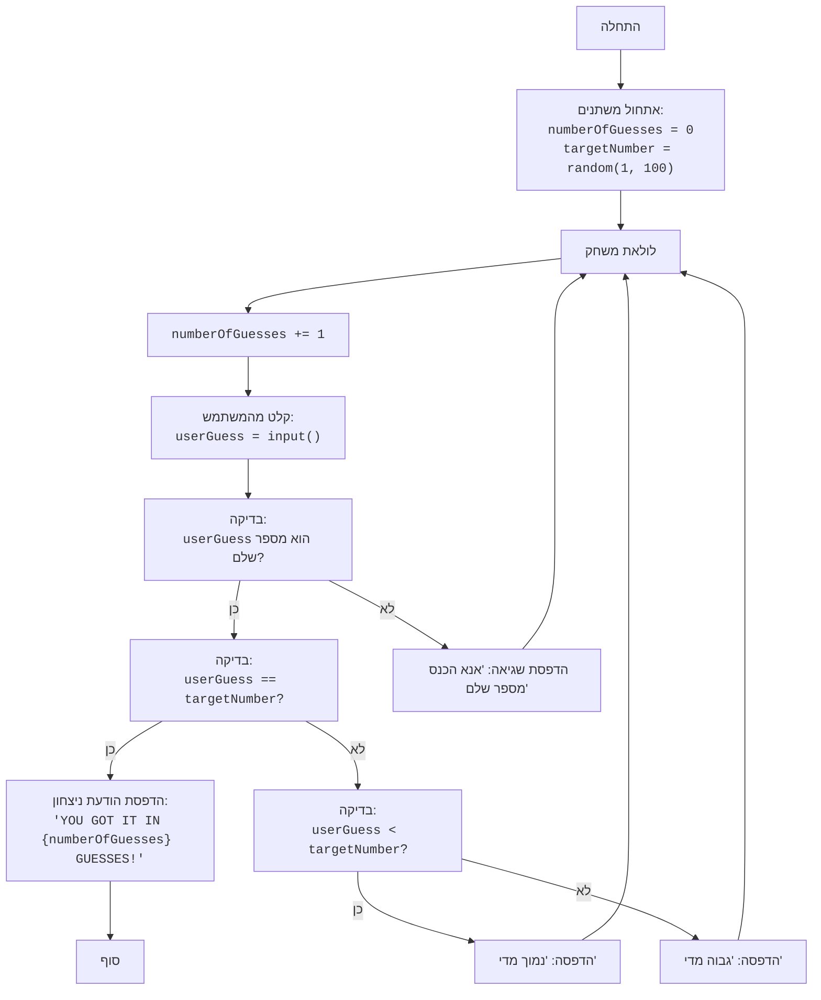

## ניתוח קוד: משחק ניחוש מספרים

### <algorithm>

1. **התחלה:**
   - אתחל את `numberOfGuesses` ל-0.
   - בחר מספר אקראי בין 1 ל-100 ושמור אותו ב-`targetNumber`.
   *דוגמה:* `numberOfGuesses` = 0, `targetNumber` = 42
2. **לולאה ראשית:**
   - התחל לולאה אינסופית (`while True`).
3. **הגדלת מספר ניסיונות:**
   - הגדל את `numberOfGuesses` ב-1.
   *דוגמה:* `numberOfGuesses` = 1
4. **קבלת קלט מהמשתמש:**
   - בקש מהמשתמש להזין ניחוש.
   - המר את הקלט למספר שלם (`userGuess`).
   - אם הקלט אינו מספר שלם, הדפס הודעת שגיאה וחזור לראש הלולאה.
   *דוגמה:* משתמש מזין "50", `userGuess` = 50.
5. **בדיקת ניצחון:**
   - אם `userGuess` שווה ל-`targetNumber`, הדפס הודעת ניצחון עם מספר הניסיונות (`numberOfGuesses`) וצא מהלולאה.
   *דוגמה:* אם `userGuess` = 42 ו-`targetNumber` = 42, תודפס הודעת ניצחון והמשחק יסתיים.
6. **בדיקת "נמוך מדי":**
   - אם `userGuess` קטן מ-`targetNumber`, הדפס "נמוך מדי".
   *דוגמה:* אם `userGuess` = 30 ו-`targetNumber` = 42, תודפס ההודעה "נמוך מדי".
7. **בדיקת "גבוה מדי":**
   - אם `userGuess` גדול מ-`targetNumber`, הדפס "גבוה מדי".
    *דוגמה:* אם `userGuess` = 60 ו-`targetNumber` = 42, תודפס ההודעה "גבוה מדי".
8.  **חזרה ללולאה:**
   - חזור לשלב 3 להמשך המשחק עד הניצחון.

### <mermaid>

### <explanation>

1.  **ייבוא מודולים:**
    -   `import random`: מייבא את המודול `random` שמאפשר לייצר מספרים אקראיים. השימוש בו הוא ליצירת מספר המטרה (targetNumber) אותו המשתמש צריך לנחש.

2.  **משתנים:**
    -   `numberOfGuesses` (`int`): משמש לספירת ניסיונות הניחוש של המשתמש, ומאותחל ל-0 בתחילת המשחק.
    -   `targetNumber` (`int`): מכיל את המספר האקראי שנוצר על ידי המחשב, אותו המשתמש צריך לנחש.
    -   `userGuess` (`int`): משתנה שמאחסן את הניחוש שהמשתמש מזין.

3.  **פונקציות:**
    - אין פונקציות מוגדרות בקוד מלבד פונקציות בסיסיות של פייתון כמו `input`, `print`, `int` ו-`random.randint`.
    - `random.randint(a, b)`: פונקציה מתוך מודול `random`, אשר מייצרת מספר שלם אקראי בין a ל-b כולל (a ו-b). כאן היא משמשת להגרלת מספר המטרה שהמשתמש ינסה לנחש, בין 1 ל-100.
    - `input()`: פונקציה מובנית של פייתון אשר קולטת קלט מהמשתמש.
    - `int()`: פונקציה מובנית של פייתון אשר ממירה מחרוזת למספר שלם. משמשת להמרת הקלט של המשתמש ממחרוזת למספר.
    - `print()`: פונקציה מובנית של פייתון אשר מדפיסה פלט למסך. משמשת להדפסת הודעות שונות במהלך המשחק.

4.  **לולאות:**
    -   `while True`: לולאה אינסופית שרצה עד שהמשתמש מנחש את המספר הנכון, אז נעשה שימוש ב-`break` כדי לצאת מהלולאה.

5.  **תנאים:**
    -   `if userGuess == targetNumber`: בודק אם הניחוש של המשתמש שווה למספר המטרה. אם כן, מוצגת הודעת ניצחון והלולאה מסתיימת באמצעות `break`.
    -   `elif userGuess < targetNumber`: אם הניחוש קטן ממספר המטרה, יודפס "נמוך מדי".
    -   `else`: אם הניחוש גדול ממספר המטרה, יודפס "גבוה מדי".
    -   `try...except ValueError`: מנגנון טיפול בשגיאות, שבודק האם הקלט של המשתמש הוא מספר שלם. אם לא, מוצגת הודעה מתאימה והמשחק ממשיך.

6. **בעיות אפשריות ושיפורים:**
    -   **קלט לא תקין:** הקוד מטפל רק במקרה שהמשתמש לא מכניס מספר שלם, אך לא מטפל במקרים אחרים כמו קלט שהוא לא מספר בכלל. אפשר להוסיף בדיקות נוספות לקלט.
    -   **משוב נוסף:** ניתן לשפר את חוויית המשתמש ע"י הוספת משוב נוסף, כמו למשל לספק טווח מצומצם יותר של מספרים אפשריים עם כל ניחוש.
    -   **רמות קושי:** אפשר להוסיף רמות קושי שונות על ידי שינוי טווח המספרים שהמשתמש מנסה לנחש.
    -   **מספר ניסיונות מוגבל:** אפשר להגביל את מספר הניסיונות של המשתמש ולסיים את המשחק אם הוא לא ניחש את המספר בזמן הזה.

7. **שרשרת קשרים:**
   - קוד זה עומד בפני עצמו ואינו תלוי בחלקים אחרים של הפרויקט.