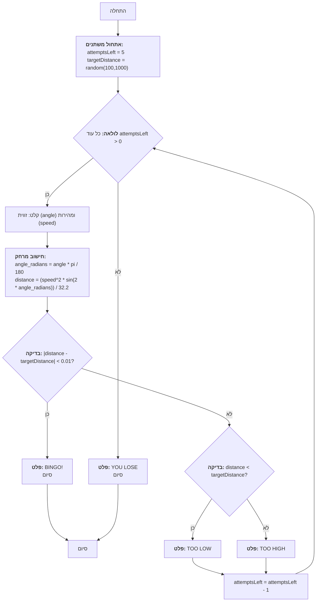
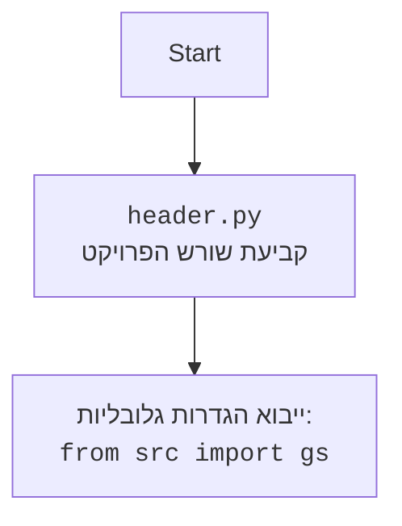

# ניתוח קוד: משחק "GUNNER"

## 1. <algorithm>

**תיאור אלגוריתם צעד-אחר-צעד:**

1.  **אתחול משתנים:**
    *   הגדרת מספר הניסיונות `attemptsLeft` ל-5.
    *   יצירת מרחק מטרה אקראי `targetDistance` בין 100 ל-1000.
    *   דוגמה: `attemptsLeft = 5`, `targetDistance = 357`.

2.  **לולאת משחק (כל עוד נשארו ניסיונות):**
    *   **קלט מהמשתמש:** בקשת קלט עבור זווית הירי `angle` ומהירות הירי `speed`.
        *   דוגמה: `angle = 45`, `speed = 200`.
    *   **חישוב מרחק:**
        *   המרת זווית לרדיאנים: `angle_radians = angle * pi / 180`.
        *   חישוב מרחק הירי: `distance = (speed^2 * sin(2 * angle_radians)) / 32.2`.
        *   דוגמה: `angle_radians = 0.785`, `distance = 1230`.
    *   **בדיקת פגיעה:**
        *   אם המרחק שווה למרחק המטרה (בתוך טווח סביר של דיוק):
            *   הדפסת "BINGO!", סיום המשחק.
        *   אם המרחק קטן ממרחק המטרה:
            *   הדפסת "TOO LOW".
        *   אם המרחק גדול ממרחק המטרה:
            *   הדפסת "TOO HIGH".
    *   הפחתת מספר הניסיונות `attemptsLeft` ב-1.
        *   דוגמה: `attemptsLeft = 4`.

3.  **בדיקת הפסד:**
    *   אם `attemptsLeft` שווה ל-0:
        *   הדפסת "YOU LOSE".
        *   סיום המשחק.

4.  **סיום המשחק.**

**זרימת נתונים:**
*   משתנים `attemptsLeft`, `targetDistance`, `angle`, `speed`, `distance` ו- `angle_radians` משמשים לחישוב מרחק הפגיעה ובדיקת פגיעה במטרה.
*   קלט המשתמש משמש ישירות לחישוב מרחק הפגיעה.
*   משתנה `attemptsLeft` משמש גם כדי לשלוט בלולאת המשחק.

## 2. <mermaid>

**תלויות מיובאות:**

*   **`random`:** משמש לייצור ערך אקראי עבור מרחק המטרה `targetDistance`.
*   **`math`:** משמש לביצוע פעולות מתמטיות כגון המרת זוויות מרדיאנים למעלות וחישוב הסינוס של זווית.

## 3. <explanation>

**ייבואים (Imports):**

*   `import random`: מודול זה משמש ליצירת מספרים אקראיים, ובמקרה זה, ליצירת מרחק המטרה באופן אקראי. מודול זה הוא חלק מהספרייה הסטנדרטית של פייתון.
*   `import math`: מודול זה מספק פונקציות מתמטיות, כגון סינוס והמרת זוויות מרדיאנים למעלות. מודול זה הוא גם חלק מהספרייה הסטנדרטית של פייתון.

**משתנים (Variables):**

*   `attemptsLeft`: משתנה מסוג `int` המייצג את מספר הניסיונות שנותרו למשתמש. הוא מאותחל ל-5 בתחילת המשחק ומופחת ב-1 בכל ניסיון.
*   `targetDistance`: משתנה מסוג `int` המייצג את מרחק המטרה. הוא נוצר באופן אקראי בין 100 ל-1000 בתחילת המשחק.
*   `angle`: משתנה מסוג `float` המייצג את זווית הירי שהמשתמש מזין.
*   `speed`: משתנה מסוג `float` המייצג את מהירות הירי שהמשתמש מזין.
*  `angle_radians` : משתנה מסוג `float` המייצג את הזווית במעלות שהומרה לרדיאנים.
*   `distance`: משתנה מסוג `float` המייצג את המרחק אליו הגיע הכדור בהתבסס על זווית הירי ומהירות הירי.

**פונקציות (Functions):**
אין פונקציות מוגדרות בקוד מלבד הפונקציות הסטנדרטיות שסופקו על ידי פייתון, כמו פונקציית ה-input, ה-print  ה-random.randint ופונקציות המודול math  כמו math.sin ו math.radians.

**הסבר מפורט:**

1.  **אתחול המשחק:** הקוד מתחיל באתחול מספר הניסיונות למשתנה `attemptsLeft` ל-5 ויצירת מרחק מטרה אקראי `targetDistance`.

2.  **לולאת המשחק:**
    *   הלולאה `while attemptsLeft > 0:` ממשיכה עד שלא נותרו ניסיונות למשתמש.
    *   **קלט נתונים:** הקוד מבקש מהמשתמש להזין זווית ומהירות ירי, תוך כדי טיפול בשגיאות קלט אפשריות. הקוד בודק גם אם זווית הירי חוקית (בין 0 ל-90 מעלות).
    *   **חישוב מרחק:** הקוד מחשב את המרחק אליו יגיע הכדור לפי הנוסחה הפיזיקלית, לאחר המרת הזווית לרדיאנים.
    *   **בדיקת פגיעה:** הקוד בודק אם המרחק המחושב קרוב למרחק המטרה, תוך שימוש בערך סובלנות קטן כדי להתחשב בשגיאות עיגול בחישובי נקודה צפה.
    *   **פלט:** הקוד מציג פלט המודיע אם המשתמש פגע במטרה, או אם הכדור קצר מידי או רחוק מידי.

3.  **סיום המשחק:** אם הלולאה מסתיימת והמשתמש לא פגע במטרה, הקוד מציג הודעת הפסד.

**בעיות אפשריות ותחומים לשיפור:**

*   **טיפול בקלט משתמש:** כדאי להוסיף בדיקות קלט נוספות, כמו לוודא שהקלט חיובי או שהמשתמש לא הכניס מספר גדול מידי.
*   **יכולת הרחבה:** הקוד הנוכחי הוא פשוט. ניתן להרחיב את המשחק על ידי הוספת אפשרויות נוספות, כמו רוח שמשפיעה על מסלול הכדור, או יעדים נעים.
*   **דיוק:**  ניתן להוסיף דיוק רב יותר בנוסחה לחישוב המרחק, שכן הנוסחה הנוכחית היא פשוטה ומניחה שהכדור נורה על משטח ישר.

**שרשרת קשרים:**
*   הקוד משתמש במודולים סטנדרטיים של פייתון (`random`, `math`) אך אינו מקושר לחלקים אחרים של הפרויקט באופן ספציפי. ניתן לחשוב על הוספת ממשק גרפי או לוגיקה מורכבת יותר, אך הקוד עצמו עומד בפני עצמו.

הקוד מספק דוגמה טובה לשימוש בפקדים לוגיים ובסיסיים, לולאות וקלט משתמש בפייתון, תוך שילוב של אלמנטים פיזיקליים בסיסיים.