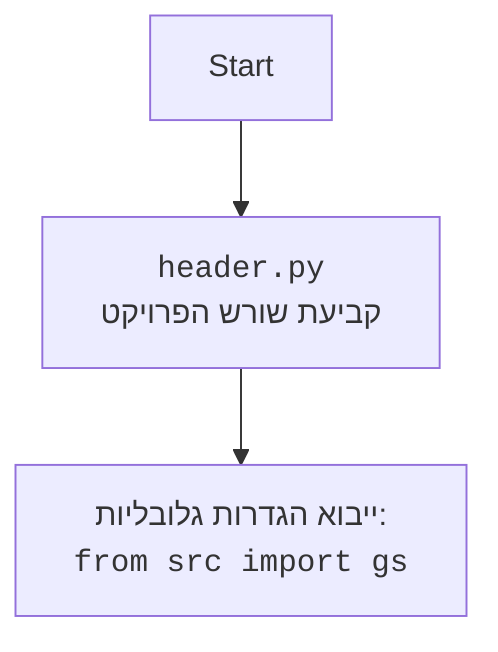

## <algorithm>

1. **Initialization:**
   - The program starts by importing the `random` module, which is used for selecting a random word.
   - A list of words (`WORDS`) is defined.
   - **Example:** `WORDS = ["python", "java", "kotlin", ...]`

2. **Game Start (`play_hangman` function):**
   - A random word is chosen from `WORDS`, converted to uppercase and assigned to `target_word`.
     - **Example:** `target_word` could be "PYTHON".
   - A string of underscores (`_`) named `guess_string`, with the same length as `target_word` is created.
      - **Example:** If `target_word` is "PYTHON", then `guess_string` will be "______".
   - The `number_of_errors` counter is set to 0.

3. **Game Loop:**
    - A loop starts (`while number_of_errors < 6 and "_" in guess_string`) which continues as long as the player has not made 6 errors, and has not yet guessed the word (still some underscores in `guess_string`).
        - The current state of `guess_string` is printed.
        - The player is asked to input a letter. The input is converted to uppercase.
            - **Example:** User inputs 'A', converted to 'A'.
        - If the input letter is found in `target_word`:
            -  A new `new_guess_string` string is initialized as an empty string.
            - The program goes through each letter in `target_word`:
                - If a letter matches the user's input, this letter is appended to `new_guess_string`.
                - If not, the character from `guess_string` at that index is appended.
                  - **Example:** if the target is "PYTHON" and the user entered 'O', `new_guess_string` will be "__O___".
            - `guess_string` is updated to `new_guess_string`.
            - If `guess_string` is equal to `target_word`, the player wins, a congratulatory message is printed, and the function returns, ending the game.
        - If the letter is not in the word, the `number_of_errors` is incremented by 1, and the hangman drawing function `draw_hangman` is called.
          - **Example:** if number of errors is 3, the third drawing of the hangman is displayed.

4. **Game Over Check:**
    - After the loop ends, if `number_of_errors` is 6, then it means the player has lost, and a message is printed along with the correct word.

5. **Starting the Game:**
    - The `if __name__ == "__main__":` condition ensures that the `play_hangman()` function is called only if the script is executed directly.
    
**Data flow:**
- `WORDS` list is used to pick the `target_word`.
- `target_word` is used to initialize `guess_string` and compared with `user_letter`
- `user_letter` input is compared with `target_word` and `guess_string` updated
- `number_of_errors` is incremented, if needed, and passed to the `draw_hangman` function to show the updated drawing.

## <mermaid>

```mermaid
flowchart TD
    Start --> ChooseWord[בחר מילה אקראית מתוך רשימה WORDS<br><code>target_word = random.choice(WORDS).upper()</code>]
    ChooseWord --> InitGuessString[אתחל מחרוזת ניחוש `guess_string` <br> עם קווים תחתונים באורך המילה `target_word` <br><code>guess_string = "_" * len(target_word)</code>]
    InitGuessString --> InitErrors[אתחל מספר שגיאות<br><code>number_of_errors = 0</code>]
    InitErrors --> GameLoopStart{האם מספר שגיאות < 6<br>וגם האם יש קווים תחתונים ב `guess_string`?}
    GameLoopStart -- כן --> PrintGuessString[הדפס את המחרוזת ניחוש הנוכחית<br><code>print("Слово:", guess_string)</code>]
    PrintGuessString --> GetUserInput[קבל קלט משתמש<br>המר לאות גדולה<br><code>user_letter = input("Введите букву: ").upper()</code>]
    GetUserInput --> CheckLetter[האם `user_letter` במילה `target_word`?]
    CheckLetter -- כן --> UpdateGuessString[עדכן את `guess_string` עם האות שניחשה <br><code>new_guess_string = ""</code><br><code>for...</code>]
    UpdateGuessString --> CheckWin{האם `guess_string` שווה ל `target_word`?}
    CheckWin -- כן --> PrintWin[הדפס הודעת ניצחון<br><code>print("ПОЗДРАВЛЯЮ! Вы угадали слово:", target_word)</code>]
     PrintWin --> End
    CheckWin -- לא --> GameLoopStart
    CheckLetter -- לא --> IncrementErrors[הגדל את מספר השגיאות<br><code>number_of_errors += 1</code>]
    IncrementErrors --> DrawHangman[הדפס את תליית האיש בהתאם למספר השגיאות<br><code>draw_hangman(number_of_errors)</code>]
    DrawHangman --> GameLoopStart
    GameLoopStart -- לא --> CheckLose{האם מספר השגיאות שווה 6?}
    CheckLose -- כן --> PrintLose[הדפס הודעת הפסד<br><code>print("СОЖАЛЕЮ, вы не отгадали слово. Загаданное слово:", target_word)</code>]
    PrintLose --> End
    CheckLose -- לא --> End
     End --> Stop[סיום]
```

**Imports:**
-   `import random`: מייבאת את המודול `random` שמאפשר לבחור מילה באקראי מתוך רשימת המילים.



## <explanation>

**Imports:**

*   `import random`: המודול `random` משמש לייצור מספרים אקראיים, ובקוד הזה משמש לבחירת מילה אקראית מתוך רשימת המילים `WORDS`. אין קשר ישיר לחבילות `src.` אחרות.

**Variables:**

*   `WORDS`: רשימה (list) של מחרוזות (strings), כל מחרוזת מייצגת מילה. רשימה זו משמשת כמקור המילים למשחק התלייה.
*   `target_word`: מחרוזת (string) שמכילה את המילה שנבחרה באקראי למשחק, באותיות גדולות.
*   `guess_string`: מחרוזת (string) שמכילה את הניחוש הנוכחי של המילה, בהתחלה היא מכילה קווים תחתונים ("_") באורך המילה `target_word`, לאחר מכן האותיות שנוחשו נכונה מחליפות את הקו התחתון במקום המתאים.
*   `number_of_errors`: מספר שלם (integer) שמכיל את מספר השגיאות שהשחקן עשה, מתחיל מאפס.
*  `user_letter`: מחרוזת שמכילה את האות שהמשתמש הכניס, כאשר היא מומרת לאות גדולה.
* `hangman_stages`: רשימה של מחרוזות, כאשר כל מחרוזת היא ייצוג טקסטואלי של מצב הציור של תליית האיש בהתאם למספר הטעויות.

**Functions:**

*   **`draw_hangman(errors)`:**
    *   **Parameters**: `errors` - מספר שלם המייצג את מספר השגיאות.
    *   **Returns**: None.
    *   **Purpose**: הפונקציה מדפיסה את ציור תליית האיש המתאים למספר השגיאות שנעשו, באמצעות גישה לאלמנטים ברשימה `hangman_stages`.
    *   **Example:** `draw_hangman(3)` תדפיס את הציור השלישי של תליית האיש.
*   **`play_hangman()`:**
    *   **Parameters**: None.
    *   **Returns**: None.
    *   **Purpose**: פונקציה זו מכילה את הלוגיקה המרכזית של המשחק. היא בוחרת מילה אקראית, מאפשרת לשחקן לנחש אותיות, ומדפיסה הודעת ניצחון או הפסד בסיום המשחק.
    *   **דוגמה לשימוש:** הפונקציה מופעלת כאשר הקובץ מורץ, דרך הקריאה `play_hangman()` בתוך הבלוק `if __name__ == "__main__":`.

**Problems and Improvements:**

*   **Hardcoded word list**: The `WORDS` list is hardcoded, which makes the game limited. This could be improved by reading the word list from a file or using a database.
*   **Limited input validation**:  The code does not handle invalid user input (e.g. multiple characters).
*   **No clear UI**: The game has a very basic text-based interface. It could be improved by using a GUI framework.
*   **No replay option**: The game ends after one round. It would be nice to have an option to play again without restarting the script.
*  **No difficulty levels:** The game does not have different difficulty levels. This could be improved by grouping the word list into different difficulties.

**Relations to other parts of the project:**
*   This file is part of `hypotez`'s project, under `src/endpoints/ai_games/101_basic_computer_games/ru/GAMES/HANG`.
*   It uses general logic of a hangman game.
*   This file contains `play_hangman` function that is executed from inside of the block `if __name__ == "__main__":`
*   It doesn't have any relations with `header.py` or other parts of `src`