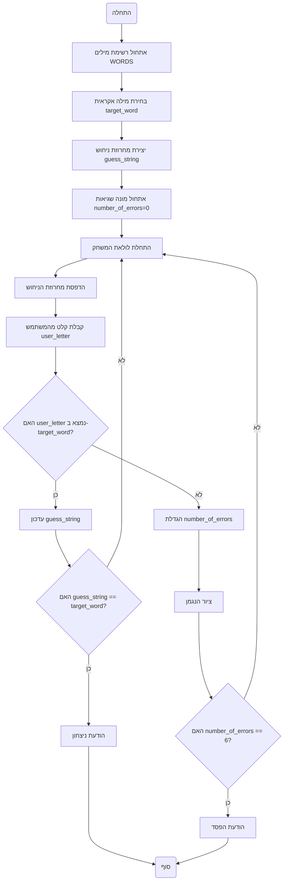

# ניתוח קוד: משחק התלייה

## <algorithm>

1.  **אתחול:**
    *   רשימת מילים `WORDS` מאותחלת: `WORDS = ["python", "java", "kotlin", "javascript", "swift", "ruby", "csharp"]`.
    *   דוגמה: המחשב יכול לבחור באופן אקראי מילה אחת מהרשימה, למשל, "python".

2.  **בחירת מילה אקראית:**
    *   המילה `target_word` נבחרת באופן אקראי מהרשימה `WORDS` והופכת לאותיות גדולות: `target_word = random.choice(WORDS).upper()`.
    *   דוגמה: `target_word` הופכת להיות "PYTHON".

3.  **יצירת מחרוזת ניחוש:**
    *   מחרוזת הניחוש `guess_string` נוצרת כמחרוזת של קווים תחתונים, שאורכה כאורך המילה הנבחרת: `guess_string = "_" * len(target_word)`.
    *   דוגמה: `guess_string` הופכת להיות "______".

4.  **אתחול מונה שגיאות:**
    *   המשתנה `number_of_errors` מאותחל ל-0: `number_of_errors = 0`.
    *   דוגמה: `number_of_errors` מתחיל ב-0.

5.  **לולאת משחק:**
    *   הלולאה `while number_of_errors < 6 and "_" in guess_string:` פועלת כל עוד מספר השגיאות קטן מ-6 ועדיין יש קווים תחתונים ב-`guess_string`.

    *   **תצוגת מצב נוכחי:**
        *   המחרוזת `guess_string` מוצגת למשתמש: `print("Слово:", guess_string)`.
        *   דוגמה: "Слово: ______".

    *   **קבלת קלט מהמשתמש:**
        *   קלט המשתמש נלקח והופך לאותיות גדולות: `user_letter = input("Введите букву: ").upper()`.
        *   דוגמה: אם המשתמש הזין "a", `user_letter` הופכת ל-"A".

    *   **בדיקה אם האות נמצאת במילה:**
        *   הקוד בודק אם `user_letter` נמצאת ב-`target_word`: `if user_letter in target_word:`.
            *   דוגמה: אם `user_letter` היא "P" ו-`target_word` היא "PYTHON", התנאי מתקיים.

        *   **עדכון מחרוזת ניחוש:**
            *   לולאה עוברת על כל אות ב-`target_word` ומשווה אותה ל-`user_letter`.
            *   אם האות תואמת, האות מתווספת ל-`new_guess_string`.
            *   אם לא, האות מתווספת מ-`guess_string`.
            *   `guess_string` מתעדכנת בערך החדש: `guess_string = new_guess_string`.
            *   דוגמה: אם `user_letter` היא "O" ו-`guess_string` היא "P_____", `new_guess_string` הופכת ל-"P_O___", ו-`guess_string` מתעדכנת ל-"P_O___".

        *   **בדיקה אם המילה פוענחה:**
            *   הקוד בודק אם `guess_string` שווה ל-`target_word`: `if guess_string == target_word:`.
            *   אם המילה פוענחה: הודעה "YOU GOT IT!" מוצגת, המילה המקורית מוצגת והפונקציה מסיימת את פעולתה.
            *   דוגמה: אם `guess_string` היא "PYTHON" ו-`target_word` היא "PYTHON", התנאי מתקיים והמשחק מסתיים.

        *   **אם האות לא נמצאת:**
            *   המונה `number_of_errors` גדל ב-1: `number_of_errors += 1`.
            *   הפונקציה `draw_hangman` נקראת להצגת שלב ההנגמן המתאים: `draw_hangman(number_of_errors)`.
            *   דוגמה: אם `user_letter` היא "Z", `number_of_errors` הופכת מ-0 ל-1 ומוצג שלב הנגמן הראשון.

6.  **בדיקת הפסד:**
    *   אם `number_of_errors` שווה ל-6: הודעה "SORRY, YOU DIDN\'T GET IT." מוצגת, המילה המקורית מוצגת.
    *   דוגמה: אם `number_of_errors` היא 6, המשחק מסתיים והודעה מופיעה.

7.  **סיום המשחק:**
    *   הפונקציה `play_hangman` מסתיימת.

8.  **הפעלה ראשית (Main):**
    *   אם הקובץ מורץ ישירות, הפונקציה `play_hangman` נקראת: `if __name__ == "__main__":  play_hangman()`.

## <mermaid>

## <explanation>

### ייבואים (Imports)

*   `import random`: מייבא את המודול `random` שמאפשר יצירת מספרים אקראיים. משמש לבחירת מילה אקראית מרשימת המילים.

### מחלקות (Classes)

*   אין מחלקות בשימוש בקוד זה.

### פונקציות (Functions)

1.  **`draw_hangman(errors)`:**
    *   **פרמטרים:**
        *   `errors` (מספר שלם): מספר השגיאות שביצע השחקן.
    *   **ערך מוחזר:** אין (הפונקציה מדפיסה פלט בלבד).
    *   **מטרה:** מדפיסה את שלב הנגמן המתאים לפי מספר השגיאות.
    *   **דוגמה:** `draw_hangman(3)` תדפיס את שלב הנגמן השלישי (עם ראש, גוף וזרוע אחת).

2.  **`play_hangman()`:**
    *   **פרמטרים:** אין.
    *   **ערך מוחזר:** אין.
    *   **מטרה:** מנהלת את משחק התלייה.
    *   **דוגמה:**
        *   בוחרת מילה אקראית מהרשימה `WORDS`.
        *   מציגה את מצב המילה עם קווים תחתונים במקום אותיות.
        *   מבקשת מהמשתמש להזין אות.
        *   בודקת האם האות קיימת במילה.
        *   מעדכנת את המילה או מוסיפה שגיאה בהתאם.
        *   ממשיכה את המשחק עד שהמילה נוחשה או שנעשו 6 שגיאות.

### משתנים (Variables)

*   `WORDS` (רשימה של מחרוזות): רשימה המכילה את המילים שמהן המחשב בוחר מילה למשחק.
*   `target_word` (מחרוזת): המילה האקראית שנבחרה למשחק, באותיות גדולות.
*   `guess_string` (מחרוזת): מחרוזת המכילה קווים תחתונים במקום אותיות, מתעדכנת כשהשחקן מנחש אותיות נכונות.
*   `number_of_errors` (מספר שלם): מונה שגיאות. גדל ב-1 בכל ניחוש שגוי.
*   `user_letter` (מחרוזת): האות שהזין המשתמש.

### בעיות אפשריות ותחומים לשיפור

*   **קלט לא תקין:** הקוד לא בודק האם הקלט של המשתמש הוא אות בודדת. אפשר להוסיף בדיקה.
*   **אפשרויות משחק מוגבלות:** רשימת המילים קצרה ולא ניתנת להרחבה קלה. אפשר להוסיף קריאת מילים מקובץ חיצוני.
*   **ממשק משתמש:** הממשק בסיסי מאוד וניתן לשיפור מבחינת תצוגה ואינטראקציה עם המשתמש.
*   **טיפול בשגיאות:** אין טיפול בשגיאות כלל. אפשר להוסיף טיפול במקרים של קלט שגוי, למשל.

### שרשרת קשרים עם חלקים אחרים בפרויקט

*   קוד זה הוא משחק עצמאי ואין לו קשרים ישירים עם חלקים אחרים בפרויקט.
*   אפשר להשתמש בו כחלק ממערכת גדולה יותר, למשל, מערכת משחקים. במקרה זה, אפשר להוסיף קישוריות להצגת נתונים (כמו ניקוד, שמירת שיאים), או כל קשר אחר הנדרש על ידי המערכת הגדולה יותר.