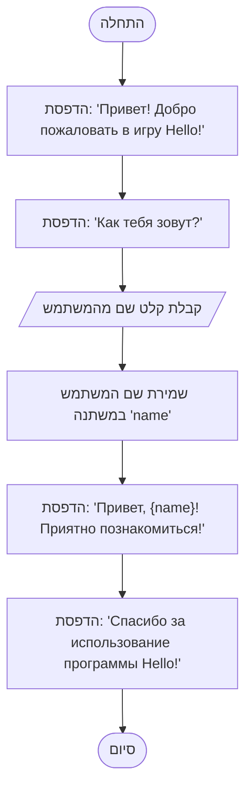

## ניתוח קוד: משחק Hello

### <algorithm>

1.  **התחלה:** תחילת ריצת התוכנית.
2.  **הדפסת הודעת פתיחה:** התוכנית מציגה את ההודעה "Привет! Добро пожаловать в игру Hello!" באמצעות הפונקציה `print()`.
    *   **דוגמה:** `print("Привет! Добро пожаловать в игру Hello!")`
3.  **קבלת שם משתמש:** התוכנית מבקשת מהמשתמש להזין את שמו באמצעות הפונקציה `input()`.
    *   **דוגמה:** `name = input("Как тебя зовут? ")`
4.  **אחסון שם משתמש:** השם שהזין המשתמש נשמר במשתנה בשם `name`.
5.  **הדפסת הודעת ברכה אישית:** התוכנית מציגה הודעת ברכה אישית, שכוללת את השם שהוזן, באמצעות f-string.
    *   **דוגמה:** `print(f"Привет, {name}! Приятно познакомиться!")`
6.  **הדפסת הודעת סיום:** התוכנית מציגה הודעה נוספת "Спасибо за использование программы Hello!" באמצעות הפונקציה `print()`.
    *   **דוגמה:** `print("Спасибо за использование программы Hello!")`
7.  **סיום:** התוכנית מסיימת את פעולתה.

זרימת הנתונים:
*   אין פונקציות או מחלקות מוגדרות, כך שאין העברת נתונים בין פונקציות או מחלקות.
*   הנתון היחיד הזורם הוא `name`, שמוזן על ידי המשתמש ונשמר בזיכרון.

### <mermaid>

**הסבר לתלותיות:**
*   הקוד אינו משתמש ביבוא. אין תלויות חיצוניות. כל הפונקציות בשימוש (`print` ו-`input`) הם מובנים בשפת Python.

### <explanation>

**ייבואים (Imports):**
*   אין ייבוא קוד חיצוני בתוכנית הזו. זהו קוד בסיסי שמשתמש רק בפונקציות המובנות של Python.

**מחלקות (Classes):**
*   אין מחלקות מוגדרות בקוד.

**פונקציות (Functions):**
*   `print()`: פונקציה מובנית להדפסת טקסט לקונסולה.
    *   **פרמטרים:** הטקסט להדפסה.
    *   **ערך מוחזר:** אין.
    *   **שימוש:** להצגת הודעות למשתמש.
    *   **דוגמה:** `print("Hello, World!")`, `print(f"Hello, {name}!")`
*   `input()`: פונקציה מובנית לקבלת קלט מהמשתמש.
    *   **פרמטרים:** טקסט להצגה לפני קבלת הקלט (אופציונלי).
    *   **ערך מוחזר:** מחרוזת שהוזנה על ידי המשתמש.
    *   **שימוש:** לקבלת מידע מהמשתמש.
    *   **דוגמה:** `name = input("Enter your name: ")`

**משתנים (Variables):**
*   `name`: משתנה מסוג מחרוזת שמאחסן את השם שהזין המשתמש. המשתנה נוצר כאשר הפונקציה `input()` מוחזרת ומקבלת את ערך הקלט של המשתמש.
    *   **שימוש:** משמש להצגת ברכה אישית.

**בעיות אפשריות או תחומים לשיפור:**

*   **אימות קלט:** הקוד לא מבצע אימות קלט. אם המשתמש לא יכניס שם (למשל, ילחץ על ENTER), התוכנית עדיין תפעל, אבל הודעת הברכה תראה לא תקינה.
*   **הטיפול בשגיאות:** הקוד לא מטפל בשגיאות. אם יהיו שגיאות בעת קליטת נתונים, התוכנית עלולה להתרסק.
*   **יכולת פעולה הדדית מוגבלת:** הקוד הוא מאוד פשוט, ומטרתו רק לברך את המשתמש בשמו. אין יכולת אינטראקציה נוספת.
*   **אין קשר לחלקים אחרים:** התוכנית עומדת בפני עצמה ואינה משתפת פעולה עם חלקים אחרים בפרויקט.

**שרשרת קשרים:**

*   הקוד הוא עצמאי ואין לו תלות בקוד אחר בפרויקט. זהו משחק פשוט שמדגים קלט ופלט בסיסיים, ולכן אין לו קשר ישיר לחלקים אחרים של הפרויקט.