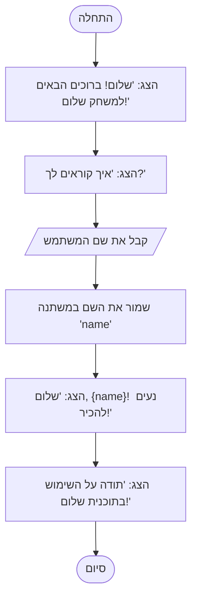

## ניתוח קוד: משחק "שלום"

### 1. <algorithm>
הקוד מיישם משחק פשוט בשם "שלום", שבו המחשב מברך את המשתמש, מבקש את שמו ומברך אותו באופן אישי.

**תרשים זרימה צעד אחר צעד:**

1.  **התחלה:** תחילת ביצוע התוכנית.
2.  **הצגת הודעת פתיחה:** התוכנית מדפיסה את ההודעה "שלום! ברוכים הבאים למשחק שלום!".
    *   **דוגמה:** `print("שלום! ברוכים הבאים למשחק שלום!")`
3.  **בקשת שם המשתמש:** התוכנית מבקשת מהמשתמש להזין את שמו.
    *   **דוגמה:** `name = input("איך קוראים לך? ")`
    *   הפונקציה `input()` מחזירה את קלט המשתמש כמחרוזת.
4.  **שמירת שם המשתמש:** השם שהוזן על ידי המשתמש נשמר במשתנה בשם `name`.
5.  **הצגת ברכה אישית:** התוכנית מדפיסה ברכה אישית למשתמש, תוך שימוש בשמו.
    *   **דוגמה:** `print(f"שלום, {name}! נעים להכיר!")`
    *   ה-f-string מאפשר להטמיע את ערך המשתנה `name` בתוך המחרוזת.
6.  **הודעת סיום:** התוכנית מדפיסה הודעה המודה למשתמש על השימוש בתוכנית.
    *   **דוגמה:** `print("תודה על השימוש בתוכנית שלום!")`
7.  **סיום:** התוכנית מסיימת את פעולתה.

### 2. <mermaid>

**ניתוח התלויות:**

הקוד משתמש רק בפונקציות מובנות של Python, ולכן אין בו תלויות מיובאות (imports).
* `print()` - פונקציה מובנית של פייתון, המשמשת להדפסת טקסט לקונסולה.
* `input()` - פונקציה מובנית של פייתון, המשמשת לקבלת קלט מהמשתמש.
* `f-string` - פיצ'ר מובנה של פייתון המאפשר להטמיע משתנים בתוך מחרוזות.

### 3. <explanation>

**ייבואים (Imports):**
אין ייבוא (imports) בקוד זה, מכיוון שהוא משתמש רק בפונקציות מובנות של פייתון.

**מחלקות (Classes):**
אין מחלקות בקוד זה, מכיוון שהוא מורכב מפונקציות ומשתנים בלבד.

**פונקציות (Functions):**
*   **`print()`:**
    *   **פרמטרים:** המחרוזת או הערך להדפסה.
    *   **ערך מוחזר:** אין.
    *   **מטרה:** להדפיס טקסט או ערכים לקונסולה.
    *   **דוגמאות:**
        *   `print("שלום!")` - מדפיס את המילה "שלום!".
        *   `print(f"שלום, {name}!")` - מדפיס "שלום, " ואת ערך המשתנה `name`, ואחריו "!".
*   **`input()`:**
    *   **פרמטרים:** מחרוזת המציגה בקשה למשתמש.
    *   **ערך מוחזר:** מחרוזת המייצגת את הקלט שהזין המשתמש.
    *   **מטרה:** לקבל קלט מהמשתמש.
    *   **דוגמאות:**
        *   `name = input("איך קוראים לך? ")` - מציג את ההודעה "איך קוראים לך?" ומחזיר את הקלט שהמשתמש מזין.

**משתנים (Variables):**
*   **`name`:**
    *   **סוג:** מחרוזת (string).
    *   **שימוש:** מאחסן את שם המשתמש, כפי שהוזן על ידי פונקציית `input()`.

**בעיות אפשריות או תחומים לשיפור:**
*   **בדיקת תקינות קלט:** הקוד אינו בודק את תקינות הקלט שהוזן על ידי המשתמש. לדוגמה, הוא לא בודק אם המשתמש הזין שם תקין. ניתן להוסיף בדיקות קלט כאלו.
*   **טיפול בשגיאות:** הקוד אינו מטפל בשגיאות אפשריות, כגון שגיאות בזמן הריצה. ניתן להוסיף טיפול בשגיאות כדי להפוך את הקוד ליותר יציב.
*   **פונקציונליות מורכבת יותר:** הקוד מאוד פשוט ומשמש רק כדוגמה בסיסית. ניתן להרחיב אותו כדי להוסיף פונקציונליות מורכבת יותר.

**שרשרת קשרים עם חלקים אחרים בפרויקט:**
הקוד הזה הוא עצמאי ואין לו תלות ישירה בקבצים אחרים בפרויקט. הוא מהווה דוגמה בסיסית לקוד פייתון.