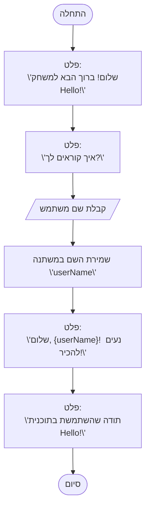

## <algorithm>
הקוד מתאר תוכנית פשוטה שמברכת את המשתמש ומציגה הודעות מסך. התהליך מתחיל בהצגת הודעת פתיחה, לאחר מכן התוכנית מבקשת את שם המשתמש, שומרת אותו, ומברכת את המשתמש בשמו. לבסוף, התוכנית מציגה הודעת סיום.
להלן פירוט צעד-אחר-צעד:

1. **התחלה:** התוכנית מתחילה את פעולתה.
    * דוגמה:  הקוד מתחיל לרוץ.
2.  **הצגת הודעת פתיחה:** התוכנית מציגה למשתמש הודעת פתיחה: "שלום! ברוך הבא למשחק Hello!".
    * דוגמה: המשתמש רואה על המסך: "שלום! ברוך הבא למשחק Hello!".
3.  **בקשת שם המשתמש:** התוכנית מציגה למשתמש שאלה: "איך קוראים לך?".
    * דוגמה: המשתמש רואה על המסך: "איך קוראים לך?".
4.  **קבלת שם המשתמש:** התוכנית קולטת את קלט המשתמש ושומרת אותו במשתנה שנקרא `name`.
    * דוגמה: המשתמש מקליד "אליס", וזה נשמר במשתנה `name`.
5.  **הצגת ברכה:** התוכנית מציגה הודעת ברכה אישית עם שם המשתמש: "שלום, {name}! נעים להכיר!".
    * דוגמה: אם המשתמש הזין "אליס", התוכנית תציג: "שלום, אליס! נעים להכיר!".
6.  **הצגת תודה:** התוכנית מציגה הודעת תודה: "תודה שהשתמשת בתוכנית Hello!".
    * דוגמה: המשתמש רואה על המסך: "תודה שהשתמשת בתוכנית Hello!".
7.  **סיום:** התוכנית מסיימת את פעולתה.
    * דוגמה: הקוד מפסיק לרוץ.

## <mermaid>

התרשים בפורמט `mermaid` מתאר את הזרימה של התוכנית בצורה ויזואלית.  
*   `Start`: מציין את תחילת התוכנית.
*   `DisplayWelcome`: הצגת הודעת הפתיחה למשתמש.
*   `AskName`: שאלת המשתמש לשמו.
*   `GetUserName`: קבלת קלט שם המשתמש.
*   `StoreName`: שמירת השם במשתנה בשם `userName`.
*   `DisplayGreeting`: הצגת ברכה אישית.
*   `DisplayThanks`: הצגת הודעת תודה.
*   `End`: מציין את סוף התוכנית.

אין תלויות מיובאות בתוך קוד ה-mermaid, כיוון שזהו תרשים זרימה ולא קוד פייתון.

## <explanation>
**ייבואים (Imports)**:
אין ייבוא בקוד הזה מכיוון שזה תרשים זרימה ולא קוד תכנות.

**מחלקות (Classes)**:
אין מחלקות בקוד הזה.

**פונקציות (Functions)**:
אין פונקציות בקוד הזה, אלא רק תיאור של זרימת פעולות.

**משתנים (Variables)**:
* `userName`: משתנה מסוג מחרוזת (string) שבו נשמר שם המשתמש שהוזן.

**הסברים מפורטים**:

הקוד הזה הוא תרשים זרימה של תוכנית פשוטה, שמטרתה היא לברך משתמש. הוא מדגים תהליך של קבלת קלט מהמשתמש (שמו), שמירתו במשתנה, ולאחר מכן הצגת הודעת ברכה אישית.
התרשים מתאר את הזרימה של הפעולות בתוכנית, אך אינו מייצג קוד תכנות ממשי.

**בעיות אפשריות או תחומים לשיפור**:

*   **אימות קלט**: הקוד הנוכחי לא מבצע אימות קלט. לדוגמה, אם המשתמש יכניס קלט לא חוקי, התוכנית לא תתייחס לזה.
*   **טיפול בשגיאות**: הקוד לא מטפל בשגיאות אפשריות כמו קלט ריק.
*   **התאמה אישית**: הקוד מאוד בסיסי וניתן להרחיב אותו עם תכונות נוספות כמו תפריט או אינטראקציה מורכבת יותר עם המשתמש.

**שרשרת קשרים עם חלקים אחרים בפרויקט**:
מכיוון שהקוד הזה הוא תרשים זרימה בלבד, אין לו קשר ישיר לחלקים אחרים בפרויקט. עם זאת, אם התרשים היה מתורגם לקוד בפועל, הוא היה יכול ליצור אינטראקציה עם חלקים אחרים בפרויקט כמו מודולים להצגת ממשק משתמש או מודולים לניהול משתמשים.