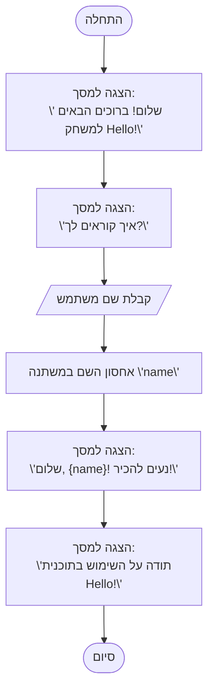

## <algorithm>

הקוד מתאר תוכנית פשוטה שמקבלת את שם המשתמש ומדפיסה ברכות. תהליך העבודה הוא כדלקמן:

1. **התחלה (Start):** התוכנית מתחילה את פעולתה.
    - אין נתונים נכנסים או יוצאים בשלב זה.
2. **הצגת הודעת פתיחה (DisplayWelcome):** התוכנית מציגה הודעת פתיחה למשתמש.
   - דוגמה: "שלום! ברוכים הבאים למשחק Hello!"
   - אין נתונים נכנסים, הודעה מוצגת למסך.
3. **שאילת שם משתמש (AskName):** התוכנית שואלת את שם המשתמש.
    - דוגמה: "איך קוראים לך?"
    - אין נתונים נכנסים, הודעה מוצגת למסך.
4. **קבלת שם משתמש (GetUserName):** התוכנית מקבלת קלט מהמשתמש (שם המשתמש).
    - לדוגמה, המשתמש מקליד "אליס".
    - קלט מהמשתמש נשמר במשתנה זמני.
5. **אחסון שם (StoreName):** התוכנית שומרת את שם המשתמש במשתנה בשם `name`.
    - לדוגמה, הערך "אליס" נשמר במשתנה `name`.
    - נתונים: שם המשתמש עובר מהקלט למשתנה.
6. **הצגת ברכה (DisplayGreeting):** התוכנית מציגה הודעת ברכה למשתמש, כולל שמו.
    - דוגמה: "שלום, אליס! נעים להכיר!"
    - נתונים: שם המשתמש מהמשתנה `name` מוכנס להודעה שמוצגת.
7. **הצגת תודה (DisplayThanks):** התוכנית מציגה הודעת תודה למשתמש.
    - דוגמה: "תודה על השימוש בתוכנית Hello!"
    - אין נתונים נכנסים, הודעה מוצגת למסך.
8. **סיום (End):** התוכנית מסיימת את פעולתה.
    - אין נתונים נכנסים או יוצאים בשלב זה.

## <mermaid>

הקוד `mermaid` יוצר תרשים זרימה פשוט. אין כאן תלויות מיובאות, מכיוון שהקוד הוא עצמאי ומתאר רק את זרימת הפעולה הבסיסית של התוכנית. שמות המשתנים בתרשים הם בעלי משמעות (לדוגמה, `DisplayWelcome`, `AskName`, `GetUserName`, `StoreName`, `DisplayGreeting`, `DisplayThanks`), ומתארים בצורה ברורה את הפעולות המתבצעות בכל שלב.

## <explanation>

**ייבואים (Imports):**
אין ייבואים בקוד זה. הקוד מתאר תרשים זרימה פשוט ואינו תלוי בספריות או מודולים חיצוניים.

**מחלקות (Classes):**
אין מחלקות בקוד זה. התרשים מתאר רק את זרימת הפעולה של התוכנית.

**פונקציות (Functions):**
אין פונקציות מוגדרות בקוד זה. הקוד מתאר רק את זרימת הפעולה הכללית של התוכנית באמצעות תרשים זרימה. הפעולות מתבצעות על ידי רצף של שלבים לוגיים פשוטים.

**משתנים (Variables):**
- `name`: משמש לאחסון שם המשתמש שהוזן. סוג המשתנה הוא מחרוזת (string). המשתנה משמש להצגת הברכה עם שם המשתמש.

**הסברים נוספים:**
- הקוד הוא דוגמה פשוטה מאוד לתוכנית שמתקשרת עם המשתמש, מקבלת קלט ומציגה פלט.
- התרשים מתאר זרימה לינארית, מההתחלה ועד הסוף, ללא תנאים או לולאות.
- ניתן לשפר את הקוד על ידי הוספת בדיקות תקינות לקלט (למשל, לוודא שהשם אינו ריק) או להרחיב את התוכנית עם פונקציונליות נוספת.

**שרשרת קשרים עם חלקים אחרים בפרויקט:**
אין קשר ישיר עם חלקים אחרים בפרויקט, מכיוון שקוד זה הוא דוגמה בסיסית של תרשים זרימה, ולא קוד ליישום פונקציונלי בפועל. אם הקוד היה מיושם כפונקציה, ניתן היה לקרוא לה מחלקים אחרים בפרויקט ולשלב אותה בתוך זרימת עבודה מורכבת יותר.