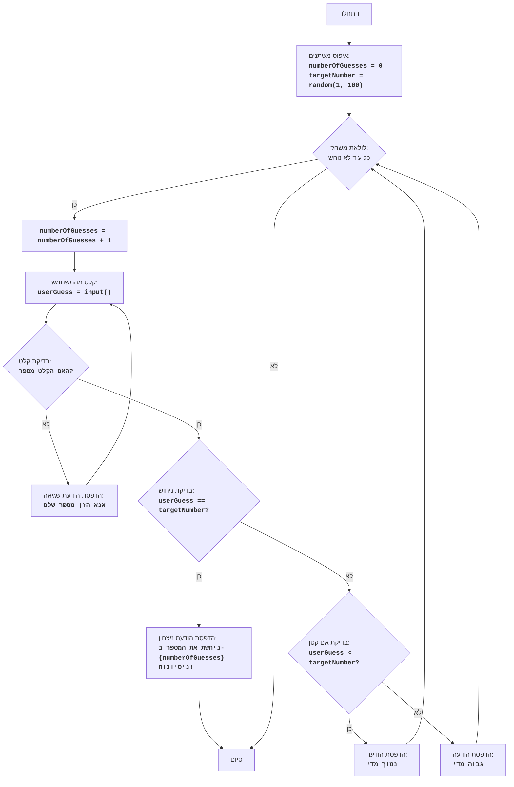
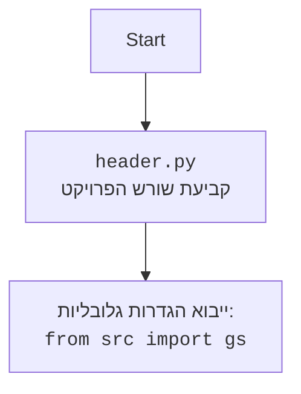

## <algorithm>

1. **התחלה:**
   - התחל את המשחק.
   - לדוגמה: המשחק מתחיל, והמשתמש מוכן לשחק.

2. **איפוס משתנים:**
   - הגדר את מספר הניחושים (`numberOfGuesses`) ל-0.
   - לדוגמה: `numberOfGuesses = 0`.
   - הגרל מספר אקראי בין 1 ל-100 והגדר אותו כ-`targetNumber`.
   - לדוגמה: `targetNumber = 42`.

3. **לולאת משחק (כל עוד המספר לא נוחש):**
   - התחל לולאה שתימשך עד שהמשתמש ינחש את המספר הנכון.
   - לדוגמה: הלולאה מתחילה לפעול.

4. **הגדלת מספר הניחושים:**
   - הגדל את מספר הניחושים ב-1.
   - לדוגמה: `numberOfGuesses` משתנה מ-0 ל-1.

5. **קבלת ניחוש מהמשתמש:**
   - בקש מהמשתמש להזין ניחוש.
   - לדוגמה: המשתמש מזין 50.
    - אם הקלט אינו מספר, הצג הודעת שגיאה וקבל קלט חדש.
    - לדוגמה: המשתמש מזין 'abc', מוצגת הודעה "אנא הזן מספר שלם".
     - אם הקלט הוא מספר, המשך.
      - לדוגמה: המשתמש מזין 25.
      
6. **בדיקת הניחוש:**
   - בדוק אם הניחוש של המשתמש (`userGuess`) שווה ל-`targetNumber`.
   - לדוגמה: בדוק אם 50 שווה ל-42.

7. **אם הניחוש נכון:**
    - הדפס הודעה "ניחשת את המספר ב- {מספר הניחושים} ניסיונות!".
    - לדוגמה: אם `userGuess` שווה ל-42, יודפס: "ניחשת את המספר ב-1 ניסיונות!".
    - צא מהלולאה.
    - לדוגמה: הלולאה מסתיימת, המשחק נגמר.
   

8. **אם הניחוש לא נכון:**
    - אם הניחוש של המשתמש קטן מ-`targetNumber`:
    - לדוגמה: אם 25 קטן מ-42,
      - הדפס "נמוך מדי".
      - לדוגמה: יודפס "נמוך מדי".
    - אחרת (הניחוש של המשתמש גדול מ-`targetNumber`):
    - לדוגמה: אם 50 גדול מ-42,
      - הדפס "גבוה מדי".
      - לדוגמה: יודפס "גבוה מדי".
   - חזור ללולאה.
   - לדוגמה: הלולאה ממשיכה וחוזרת לשלב 3.

9. **סיום:**
   - המשחק מסתיים כאשר המשתמש מנחש את המספר הנכון.
   - לדוגמה: המשחק הסתיים.

## <mermaid>

## <explanation>

**ייבואים (Imports):**

-   `import random`: מייבא את המודול `random`, שמשמש ליצירת מספרים אקראיים. הוא נחוץ כדי שהמשחק יגריל מספר חדש בכל פעם. אין תלות בחבילות אחרות של `src.` מכיוון שהוא חלק מהספרייה הסטנדרטית של פייתון.

**משתנים (Variables):**

-   `numberOfGuesses`: משתנה מסוג `int` שסופר את מספר הניחושים שהמשתמש ביצע. הוא מאותחל ב-0 בתחילת המשחק ומוגדל ב-1 בכל ניסיון.
-   `targetNumber`: משתנה מסוג `int` שמחזיק את המספר האקראי שהמחשב בחר. המספר נוצר על ידי `random.randint(1, 100)`.
-  `userGuess`: משתנה מסוג `int` שמחזיק את הניחוש שהמשתמש הכניס. ערך המשתנה מתעדכן בכל לולאה.

**פונקציות (Functions):**

-   אין פונקציות מוגדרות בקוד זה, הקוד משתמש במודול `random` ובפונקציות מובנות של פייתון כמו `input`, `int` ו-`print`.

**לולאות (Loops):**

-   `while True`: לולאה אינסופית שרצה עד שהמשתמש מנחש את המספר הנכון. הלולאה מכילה בתוכה את כל ההגיון של המשחק, כולל קבלת הקלט מהמשתמש, בדיקת הקלט והדפסת הודעות. הלולאה נעצרת על ידי פקודת `break` כאשר המשתמש מנחש נכון.

**בלוק `try...except`:**
-   בלוק ה-`try...except` נועד לטפל בשגיאות שעלולות להתרחש כאשר המשתמש מזין קלט שאינו מספר שלם. אם המשתמש מזין קלט שאינו מספר שלם, הקוד בתוך הבלוק `except ValueError:` ירוץ, יציג הודעה למשתמש, ויחזור לראש הלולאה כדי לבקש קלט חדש.

**הסבר מפורט:**

הקוד מממש משחק ניחוש פשוט. הוא מתחיל ביצירת מספר אקראי שעל המשתמש לנחש. לאחר מכן, הלולאה ממשיכה לקבל ניחושים מהמשתמש, בודקת אם הניחוש נכון, ומודיעה למשתמש אם הניחוש גבוה מדי או נמוך מדי. כאשר המשתמש מנחש נכון, המשחק מסתיים והתוכנית מדפיסה הודעה שמברכת את המשתמש ומציינת כמה ניחושים לקח לו.

**בעיות אפשריות או תחומים לשיפור:**

-   **אימות קלט נוסף:** הקוד מטפל כעת רק במקרה שבו המשתמש מזין קלט שאינו מספר שלם. ניתן להוסיף טיפול גם למקרים אחרים, כמו למשל אם המשתמש מזין מספר מחוץ לטווח המותר (1-100).
-   **הגבלת מספר ניסיונות:** ניתן להגביל את מספר הניסיונות שהמשתמש יכול לעשות ואז לסיים את המשחק גם אם הוא לא ניחש את המספר.
-   **ממשק משתמש משופר:** הקוד משתמש רק בהדפסה לקונסול, ניתן להוסיף ממשק משתמש גרפי.
-   **קושי משחק משתנה:** ניתן להוסיף אפשרות למשתמש לבחור רמת קושי שתשפיע על טווח המספרים או מספר הניסיונות המותרים.

**שרשרת קשרים עם חלקים אחרים בפרויקט:**

-   הקוד הזה הוא משחק עצמאי ואין לו קשרים ישירים עם חלקים אחרים בפרויקט, אך הוא חלק מהתיקייה `ai_games`. הוא יכול להיות משולב במערכת משחקים כוללת, שבה הוא יהיה אחד מהמשחקים.