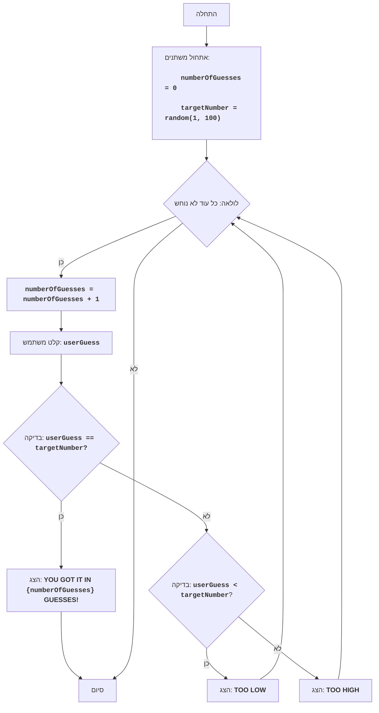

## <algorithm>

1. **התחלה:**
   - אתחול משתנה `numberOfGuesses` ל-0.
   - יצירת מספר אקראי `targetNumber` בין 1 ל-100.

2. **לולאה:**
   - **כל עוד** המספר לא נוחש, המשך:
     - הגדלת `numberOfGuesses` ב-1.
     - קבלת קלט מהמשתמש (`userGuess`).
        - דוגמה: משתמש מזין "50".
     - **אם** `userGuess` שווה ל-`targetNumber`:
       - הצגת הודעה "YOU GOT IT IN {numberOfGuesses} GUESSES!".
       - סיום הלולאה.
        - דוגמה: אם `targetNumber` הוא 50 והמשתמש הזין 50, המשחק מסתיים.
     - **אחרת אם** `userGuess` קטן מ-`targetNumber`:
       - הצגת הודעה "TOO LOW".
        - דוגמה: אם `targetNumber` הוא 60 והמשתמש הזין 50, תוצג ההודעה "TOO LOW".
     - **אחרת**:
       - הצגת הודעה "TOO HIGH".
        - דוגמה: אם `targetNumber` הוא 40 והמשתמש הזין 50, תוצג ההודעה "TOO HIGH".

3. **סיום:**
   - המשחק מסתיים.

## <mermaid>

## <explanation>

**ייבואים (Imports):**

- `import random`: ייבוא מודול `random` משמש ליצירת מספר אקראי עבור המשחק. מודול זה אינו חלק מחבילת `src.`, הוא מובנה בפייתון.

**משתנים (Variables):**

- `numberOfGuesses`: משתנה מסוג `int` שמשמש לספירת מספר הניסיונות של השחקן. הוא מאותחל ל-0 בתחילת המשחק.
- `targetNumber`: משתנה מסוג `int` שמכיל את המספר האקראי שנוצר בין 1 ל-100. השחקן מנסה לנחש את המספר הזה.
- `userGuess`: משתנה מסוג `int` שמכיל את הניחוש של השחקן בכל ניסיון.

**פונקציות (Functions):**

- אין פונקציות מוגדרות בקוד הזה מלבד פונקציות מובנות כמו `print` ו `input`.
- `random.randint(1, 100)`: פונקציה שיוצרת מספר שלם אקראי בטווח שבין 1 ל-100 (כולל).

**מבנה קוד:**
- לולאת `while True`: הלולאה הראשית של המשחק. היא רצה עד שהשחקן מנחש את המספר.
-  `try...except ValueError`: בלוק שמטפל בשגיאות שהמשתמש מכניס קלט שאינו מספר שלם. במקרה כזה, תודפס הודעת שגיאה והמשחק ימשיך.
- משפטי `if, elif, else`: הם תנאים שבודקים אם הניחוש של השחקן שווה, קטן או גדול מהמספר שנוצר.
- `break`: משמש ליציאה מהלולאה כאשר השחקן מנחש את המספר.

**בעיות אפשריות ותחומים לשיפור:**

1. **אימות קלט:**
    - הקוד מטפל במקרה של קלט לא מספרי, אבל ניתן להוסיף אימות נוסף כמו בדיקה שהקלט נמצא בטווח הנכון (בין 1 ל-100).
2. **הגבלת מספר הניסיונות:**
    - ניתן להוסיף מגבלה למספר הניסיונות של השחקן.
3. **משוב מפורט יותר:**
    - ניתן לספק משוב יותר מדויק על מידת הקרבה של הניחוש למספר הנכון. לדוגמה, "קרוב מאוד" אם הניחוש קרוב למספר האמיתי.
4. **רמת קושי משתנה:**
    - ניתן לאפשר למשתמש לבחור טווח מספרים אחר.
5. **שימוש בפונקציות:**
    - ניתן לחלק את הקוד לפונקציות שונות, כל פונקציה תבצע משימה מסוימת (לדוגמה פונקציה לניחוש, פונקציה ליצירת מספר אקראי).

**קשרים עם חלקים אחרים בפרויקט:**

- אין קשרים ישירים עם חלקים אחרים בפרויקט מכיוון שהקוד הוא עצמאי ומשמש למשחק בסיסי.
- עם זאת, ניתן להשתמש במודול הזה כחלק ממשחק גדול יותר, תוך שימוש בפונקציות או במחלקות מתוך הקוד הזה.