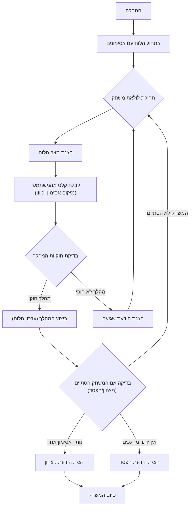

## <algorithm>

1. **אתחול הלוח (InitializeBoard)**:
   - יוצר לוח משחק (רשימה של רשימות) עם סידור התחלתי של אסימונים. לדוגמה:
     ```python
     board = [
         [0, 0, 1, 1, 1, 0, 0],
         [0, 0, 1, 1, 1, 0, 0],
         [1, 1, 1, 1, 1, 1, 1],
         [1, 1, 1, 0, 1, 1, 1],
         [1, 1, 1, 1, 1, 1, 1],
         [0, 0, 1, 1, 1, 0, 0],
         [0, 0, 1, 1, 1, 0, 0]
     ]
     ```
   - לוח זה מיוצג על ידי רשימה מקוננת שבה `1` מציין אסימון ו-`0` מציין משבצת ריקה.
   
2. **לולאת משחק (GameLoopStart)**:
   - מתחיל לולאה המאפשרת למשתמשים לבצע מהלכים עד שהמשחק מסתיים (ניצחון או הפסד).
   - לולאה זו תמשיך עד שאין יותר מהלכים אפשריים או שיש רק אסימון אחד על הלוח.

3. **הצגת הלוח (DisplayBoard)**:
   - מציג את המצב הנוכחי של הלוח למשתמש.
   - מדפיס כל שורה של הלוח על המסך. לדוגמה:
     ```
     0 0 1 1 1 0 0
     0 0 1 1 1 0 0
     1 1 1 1 1 1 1
     1 1 1 0 1 1 1
     1 1 1 1 1 1 1
     0 0 1 1 1 0 0
     0 0 1 1 1 0 0
     ```

4. **קבלת מהלך (GetMove)**:
   - מבקש מהמשתמש להזין את מיקום האסימון (שורה ועמודה) ואת כיוון המהלך (למעלה, למטה, שמאלה, ימינה).
   - מוודא שהקלט תקין (מיקום אסימון בתוך גבולות הלוח וכיוון חוקי).
   - לדוגמה, המשתמש עשוי להזין: שורה: 3, עמודה: 2, כיוון: 'u' (למעלה).

5. **אימות מהלך (ValidateMove)**:
   - בודק האם המהלך המבוקש חוקי לפי חוקי המשחק:
     - האם יש אסימון במיקום שנבחר.
     - האם יש אסימון שיכול לדלג מעליו בכיוון המבוקש.
     - האם יש משבצת פנויה לנחות עליה.
   - לדוגמה, אם המשתמש בחר להזיז אסימון למעלה, הקוד בודק האם יש אסימון במשבצת מעל, ומשבצת פנויה מעליו.

6. **ביצוע מהלך (MakeMove)**:
    - אם המהלך חוקי, מעדכן את הלוח:
      - מסיר את האסימון שדילגו מעליו.
      - מעביר את האסימון שנבחר למיקום החדש.
    - לדוגמה, אם האסימון בשורה 3, עמודה 2 זז למעלה, האסימון בשורה 2, עמודה 2 מוסר, והאסימון עובר לשורה 1, עמודה 2.
    
7. **בדיקת סיום משחק (CheckEndGame)**:
    - לאחר כל מהלך, בודק האם המשחק הסתיים:
      - האם נותר רק אסימון אחד.
      - האם אין יותר מהלכים אפשריים.
    - אם המשחק הסתיים, עובר לשלב 8 או 9, אחרת חוזר לתחילת לולאת המשחק.

8. **הצגת ניצחון (OutputWin)**:
    - אם נשאר רק אסימון אחד, מוצגת הודעת ניצחון והמשחק מסתיים.

9. **הצגת הפסד (OutputLose)**:
    - אם אין יותר מהלכים אפשריים, מוצגת הודעת הפסד והמשחק מסתיים.

10. **פלט מהלך לא חוקי (OutputInvalidMove)**:
    - אם המהלך אינו חוקי, מוצגת הודעת שגיאה והמשתמש מתבקש להזין מהלך חדש.
    
## <mermaid>

 
## <explanation>

**ייבואים (Imports):**

- אין ייבוא מודולים חיצוניים. הקוד משתמש רק בפונקציות מובנות של פייתון.

**מחלקות (Classes):**
   - אין מחלקות בקוד זה. הקוד מורכב מפונקציות בלבד.

**פונקציות (Functions):**

1.  **`init_board()`**:
    -   **מטרה:** יוצרת ומחזירה את הלוח ההתחלתי של המשחק.
    -   **פרמטרים:** אין.
    -   **ערך מוחזר:** רשימה של רשימות (מטריצה) המייצגת את הלוח עם סידור האסימונים ההתחלתי.
    -   **דוגמה לשימוש:** `board = init_board()`

2.  **`print_board(board)`**:
    -   **מטרה:** מדפיסה את הלוח למסך.
    -   **פרמטרים:** `board` - רשימה של רשימות המייצגת את מצב הלוח.
    -   **ערך מוחזר:** אין.
    -   **דוגמה לשימוש:** `print_board(board)`

3.  **`get_move()`**:
    -   **מטרה:** מקבלת קלט מהמשתמש (שורה, עמודה וכיוון המהלך).
    -   **פרמטרים:** אין.
    -   **ערך מוחזר:** טאפל של (שורה, עמודה, כיוון).
    -   **דוגמה לשימוש:** `row, col, direction = get_move()`

4.  **`is_valid_move(board, row, col, direction)`**:
    -   **מטרה:** בודקת האם המהלך המבוקש חוקי.
    -   **פרמטרים:**
        -   `board`: מצב הלוח הנוכחי.
        -   `row`: שורת האסימון הנבחר.
        -   `col`: עמודת האסימון הנבחר.
        -   `direction`: כיוון המהלך (u, d, l, r).
    -   **ערך מוחזר:** `True` אם המהלך חוקי, `False` אחרת.
    -   **דוגמה לשימוש:** `if is_valid_move(board, row, col, direction): ...`

5.  **`make_move(board, row, col, direction)`**:
    -   **מטרה:** מבצעת את המהלך ומעדכנת את מצב הלוח.
    -   **פרמטרים:** כמו ב-`is_valid_move()`.
    -   **ערך מוחזר:** הלוח המעודכן.
    -   **דוגמה לשימוש:** `board = make_move(board, row, col, direction)`

6.  **`has_moves(board)`**:
    -   **מטרה:** בודקת האם יש מהלכים אפשריים על הלוח.
    -   **פרמטרים:** `board` - מצב הלוח הנוכחי.
    -   **ערך מוחזר:** `True` אם יש מהלכים אפשריים, `False` אחרת.
    -   **דוגמה לשימוש:** `if not has_moves(board): ...`

7.  **`count_pegs(board)`**:
    -   **מטרה:** סופרת את כמות האסימונים על הלוח.
    -   **פרמטרים:** `board` - מצב הלוח הנוכחי.
    -   **ערך מוחזר:** מספר האסימונים.
    -   **דוגמה לשימוש:** `if count_pegs(board) == 1:`

8.  **`play_hi_q()`**:
    -   **מטרה:** הפונקציה הראשית של המשחק. מנהלת את כל מהלך המשחק, ומבצעת קריאות לפונקציות האחרות.
    -   **פרמטרים:** אין.
    -   **ערך מוחזר:** אין.
    -   **דוגמה לשימוש:** `play_hi_q()`
    
**משתנים (Variables):**

-   `board`: רשימה של רשימות (מטריצה) שמייצגת את הלוח.
-   `row`: שורה שנקלטה מהמשתמש.
-   `col`: עמודה שנקלטה מהמשתמש.
-   `direction`: כיוון שנקלט מהמשתמש.

**בעיות אפשריות או תחומים לשיפור:**

-   **בדיקת קלט משתמש:** הקוד בודק אם הקלט בטווח אבל לא בודק האם האסימון קיים במקום שבו המשתמש טען שהוא נמצא.
-   **תצוגת משחק:** אפשר לשפר את תצוגת הלוח, למשל על ידי הוספת מספור לשורות ועמודות.
-   **משוב משתמש:** ניתן להוסיף הודעות משוב מפורטות יותר על חוקיות המהלך (למשל, להסביר למה מהלך לא חוקי ולא רק להגיד "מהלך לא חוקי").
-   **עיצוב קוד:** ניתן להשתמש בקבועים כדי לייצג את גודל הלוח ואת ערכי האסימונים (1 ו-0).

**שרשרת קשרים עם חלקים אחרים בפרויקט:**

-   הקוד הזה הוא משחק עצמאי ואין לו תלות בחלקים אחרים בפרויקט.