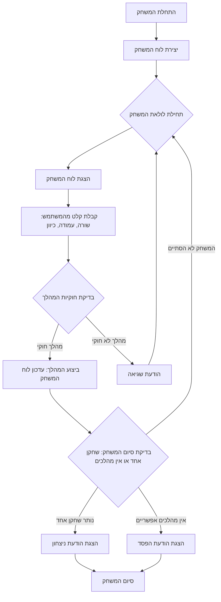

# ניתוח קוד: משחק HI Q

## <algorithm>

להלן תיאור תהליך העבודה של הקוד צעד-אחר-צעד, כולל דוגמאות:

1.  **אתחול הלוח:**
    *   פונקציה `init_board()` יוצרת לוח משחק התחלתי כמטריצה דו-ממדית (רשימה של רשימות), בה `1` מציין שחקן (כדור) ו-`0` מציין מקום ריק.

        ```python
        board = [
            [0, 0, 1, 1, 1, 0, 0],
            [0, 0, 1, 1, 1, 0, 0],
            [1, 1, 1, 1, 1, 1, 1],
            [1, 1, 1, 0, 1, 1, 1],
            [1, 1, 1, 1, 1, 1, 1],
            [0, 0, 1, 1, 1, 0, 0],
            [0, 0, 1, 1, 1, 0, 0]
        ]
        ```

2.  **תחילת לולאת המשחק:**
    *   הלולאה הראשית מתחילה בתוך הפונקציה `play_hi_q()`, והיא ממשיכה עד שהמשחק מסתיים.

3.  **הצגת הלוח:**
    *   פונקציה `print_board(board)` מקבלת את הלוח ומדפיסה אותו לקונסולה, כאשר 1 מסמל שחקן ו-0 מסמל מקום ריק.

        ```
        0 0 1 1 1 0 0
        0 0 1 1 1 0 0
        1 1 1 1 1 1 1
        1 1 1 0 1 1 1
        1 1 1 1 1 1 1
        0 0 1 1 1 0 0
        0 0 1 1 1 0 0
        ```

4.  **קבלת קלט מהמשתמש:**
    *   פונקציה `get_move()` מבקשת מהמשתמש להזין את קואורדינטות השחקן (שורה ועמודה) ואת הכיוון אליו הוא רוצה לקפוץ (למעלה, למטה, שמאלה או ימינה). היא מבצעת בדיקות תקינות של הקלט.
        *   דוגמה: המשתמש מכניס שורה: 3, עמודה: 1, כיוון: 'r'.
        *   דוגמה: המשתמש מכניס שורה: 7, עמודה: 2, כיוון: 'u'. (במקרה הזה הקלט לא תקין ותתבצע בקשה נוספת לקלט)

5.  **אימות המהלך:**
    *   הפונקציה `is_valid_move(board, row, col, direction)` מקבלת את הלוח, השורה, העמודה והכיוון ומבצעת בדיקה האם המהלך אפשרי לפי חוקי המשחק.
        *   דוגמה: אם המשתמש בחר שורה 3, עמודה 1, וכיוון ימינה ('r'), אז יבדק האם יש שחקן בעמדה 3,1, האם יש שחקן בעמדה 3,2, והאם יש עמדה ריקה בעמדה 3,3.
    *   אם המהלך לא חוקי, הפונקציה מחזירה `False`.
        *   דוגמה:  אם המשתמש בחר שורה 0, עמודה 0, וכיוון ימינה ('r') יוחזר `False` כי שורה 0, עמודה 0 היא 0 והיא לא מכילה שחקן.

6.  **ביצוע המהלך:**
    *   אם המהלך חוקי, הפונקציה `make_move(board, row, col, direction)` מעדכנת את הלוח ע"י הסרת השחקן הקופץ, הסרת השחקן שקפצו מעליו והצבת השחקן הקופץ במקומו החדש.
        *   דוגמה: עבור מהלך חוקי בשורה 3, עמודה 1, כיוון ימינה, השחקן בשורה 3 עמודה 1 מוסר, השחקן בשורה 3, עמודה 2 מוסר והשחקן החדש מוצב בשורה 3 עמודה 3.

7.  **בדיקת סיום המשחק:**
    *   הפונקציה `count_pegs(board)` סופרת כמה שחקנים נותרו על הלוח.
    *   אם נותר שחקן אחד, מוצג מסר ניצחון והמשחק מסתיים.
    *   הפונקציה `has_moves(board)` בודקת האם יש מהלכים אפשריים.
    *   אם אין מהלכים אפשריים, מוצג מסר הפסד והמשחק מסתיים.

8.  **חזרה ללולאה הראשית:**
    *   אם המשחק לא הסתיים, החזרה ללולאת המשחק ומוצג לוח מעודכן, המשתמש מתבקש להזין מהלך חדש.

## <mermaid>



**הסבר תלויות:**

אין תלויות חיצוניות. הקוד משתמש בספריית פייתון סטנדרטית בלבד.

## <explanation>

### ייבואים (Imports)

אין ייבואים בקוד זה.

### מחלקות (Classes)

אין מחלקות בקוד זה.

### פונקציות (Functions)

*   **`init_board()`**:
    *   **פרמטרים**: אין.
    *   **ערך מוחזר**: רשימה של רשימות (מטריצה) המייצגת את לוח המשחק עם מיקום התחלתי של השחקנים.
    *   **מטרה**: אתחול לוח המשחק בתחילת המשחק.
    *   **דוגמא לשימוש:**
        ```python
        board = init_board()
        ```

*   **`print_board(board)`**:
    *   **פרמטרים**: `board` (רשימה של רשימות).
    *   **ערך מוחזר**: אין.
    *   **מטרה**: הדפסת לוח המשחק לקונסולה.
    *   **דוגמא לשימוש:**
        ```python
        print_board(board)
        ```

*   **`get_move()`**:
    *   **פרמטרים**: אין.
    *   **ערך מוחזר**: טאפל (tuple) המכיל את שורת השחקן, עמודת השחקן וכיוון הקפיצה (`row`, `col`, `direction`).
    *   **מטרה**: קבלת קלט מהמשתמש למהלך.
    *   **דוגמא לשימוש:**
        ```python
        row, col, direction = get_move()
        ```

*   **`is_valid_move(board, row, col, direction)`**:
    *   **פרמטרים**: `board` (רשימה של רשימות), `row` (מספר שורה), `col` (מספר עמודה), `direction` (כיוון).
    *   **ערך מוחזר**: `True` אם המהלך חוקי, `False` אחרת.
    *   **מטרה**: בדיקה אם המהלך המוצע על ידי המשתמש חוקי לפי חוקי המשחק.
    *   **דוגמא לשימוש:**
        ```python
        is_valid = is_valid_move(board, row, col, direction)
        ```

*   **`make_move(board, row, col, direction)`**:
    *   **פרמטרים**: `board` (רשימה של רשימות), `row` (מספר שורה), `col` (מספר עמודה), `direction` (כיוון).
    *   **ערך מוחזר**: רשימה של רשימות המייצגת את הלוח המעודכן אחרי המהלך.
    *   **מטרה**: עדכון לוח המשחק לאחר ביצוע מהלך חוקי.
    *   **דוגמא לשימוש:**
        ```python
        board = make_move(board, row, col, direction)
        ```

*   **`has_moves(board)`**:
    *   **פרמטרים**: `board` (רשימה של רשימות).
    *   **ערך מוחזר**: `True` אם יש מהלכים אפשריים, `False` אחרת.
    *   **מטרה**: בדיקה אם המשחק יכול להמשיך.
    *   **דוגמא לשימוש:**
        ```python
        has_moves_bool = has_moves(board)
        ```

*   **`count_pegs(board)`**:
    *   **פרמטרים**: `board` (רשימה של רשימות).
    *   **ערך מוחזר**: מספר שלם המייצג את כמות השחקנים על הלוח.
    *   **מטרה**: ספירת כמות השחקנים שנשארו על הלוח.
    *   **דוגמא לשימוש:**
        ```python
        count = count_pegs(board)
        ```

*   **`play_hi_q()`**:
    *   **פרמטרים**: אין.
    *   **ערך מוחזר**: אין.
    *   **מטרה**: הפונקציה הראשית של המשחק, מנהלת את כל לוגיקת המשחק.
    *   **דוגמא לשימוש:**
        ```python
        play_hi_q()
        ```

### משתנים (Variables)

*   `board`: רשימה של רשימות המייצגת את לוח המשחק, בו `1` מציין שחקן ו- `0` מציין מקום ריק.
*   `row`: משתנה המכיל את מספר השורה שנבחרה על ידי המשתמש.
*   `col`: משתנה המכיל את מספר העמודה שנבחרה על ידי המשתמש.
*   `direction`: משתנה המכיל את הכיוון אליו בחר המשתמש לקפוץ (`u`, `d`, `l`, `r`).

### בעיות אפשריות או תחומים לשיפור

*   הקוד לא מטפל בקלט שגוי באופן מקיף (למשל, אם המשתמש מכניס אות במקום מספר).
*   הקוד לא כולל ממשק משתמש גרפי, מה שמקשה על חווית המשתמש.
*   אין תיעוד פנימי מפורט (docstring) לכל פונקציה.
*   ניתן לשפר את קריאות הקוד ע"י שימוש בקבועים (constants) עבור גדלי הלוח וכיוונים.
*   ניתן לשפר את ביצועי הקוד ע"י שימוש ב-Numpy arrays במקום רשימות (במקרה של לוחות גדולים).

### שרשרת קשרים עם חלקים אחרים בפרויקט

אין תלות בקודים אחרים בפרויקט. הקוד הוא עצמאי ומכיל את כל ההגיון הדרוש למשחק HI Q.