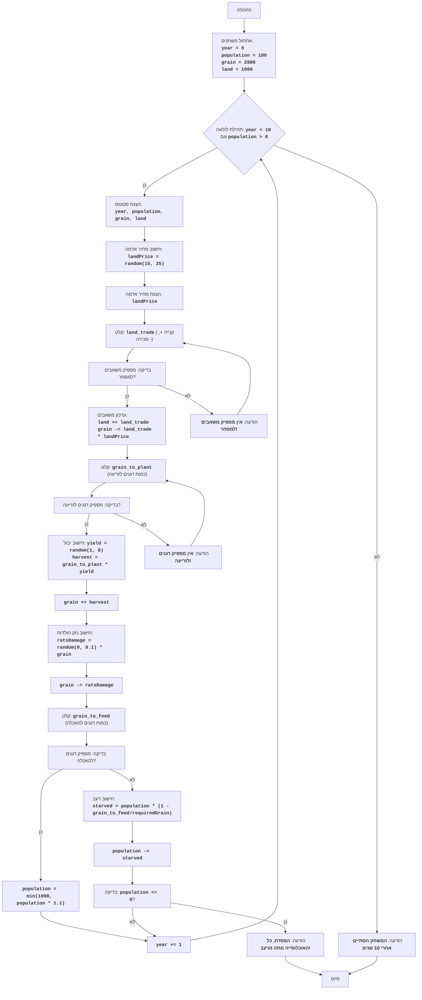

# ניתוח קוד המשחק "חמורבי"

## 1. <algorithm>

**תרשים זרימה של אלגוריתם המשחק:**

1.  **אתחול משתנים:**
    *   `year = 0` (שנה נוכחית)
    *   `population = 100` (מספר התושבים)
    *   `grain = 2800` (כמות הדגנים)
    *   `land = 1000` (שטח האדמה)

2.  **לולאת משחק:**
    *   הלולאה נמשכת כל עוד `year < 10` וגם `population > 0`.

3.  **הצגת סטטוס:**
    *   הצגת השנה, האוכלוסייה, כמות הדגנים ושטח האדמה.
    *   דוגמה: "שנה 1, אוכלוסייה: 100, דגנים: 2800, אדמה: 1000"

4.  **חישוב מחיר אדמה:**
    *   יצירת מספר אקראי בין 15 ל-25 (מחיר אדמה).
    *   דוגמה: `land_price = 20`

5.  **קלט מסחר אדמה:**
    *   קליטת קלט מהמשתמש לגבי כמות האדמה לקנייה (חיובי) או מכירה (שלילי).
    *   דוגמה: `land_trade = 100` (קניית 100 אדמות) או `land_trade = -50` (מכירת 50 אדמות).

6.  **בדיקת מסחר אדמה:**
    *   אם המשתמש רוצה לקנות, יש לבדוק האם יש מספיק דגנים.
    *   אם המשתמש רוצה למכור, יש לבדוק האם יש מספיק אדמה.
    *   אם אין מספיק משאבים, להציג הודעת שגיאה ולחזור לקלט מסחר אדמה.

7.  **עדכון אדמה ודגנים:**
    *   `land += land_trade` (עדכון שטח האדמה)
    *   `grain -= land_trade * land_price` (עדכון כמות הדגנים)

8.  **קלט זריעת דגנים:**
    *   קליטת קלט מהמשתמש לגבי כמות הדגנים לזריעה.
    *   דוגמה: `grain_to_plant = 500`

9.  **בדיקת זריעת דגנים:**
    *   אם אין מספיק דגנים לזריעה, להציג הודעת שגיאה ולחזור לקלט זריעת דגנים.

10. **חישוב יבול:**
     *   יצירת מספר אקראי בין 1 ל-8 (יבול לדונם).
     *   `harvest = grain_to_plant * yield_per_acre` (חישוב היבול הכולל).

11. **עדכון דגנים (יבול):**
    *   `grain += harvest` (הוספת היבול לכמות הדגנים).

12. **נזק חולדות:**
     *  יצירת מספר אקראי בין 0 ל-0.1 (אחוז נזק החולדות).
     *  `rats_damage = int(random.random() * 0.1 * grain)` (חישוב הנזק).
     *   `grain -= rats_damage` (הפחתת נזק החולדות מכמות הדגנים).

13. **קלט האכלת תושבים:**
     *   קליטת קלט מהמשתמש לגבי כמות הדגנים להאכלת התושבים.
     *  דוגמה: `grain_to_feed = 400`

14. **בדיקת האכלת תושבים:**
     *   אם כמות הדגנים להאכלה גדולה או שווה לכמות האוכלוסייה:
            * הגדלת האוכלוסייה ב-10% (עד מקסימום 1000).
            * הפחתת כמות הדגנים בהתאם.
     *   אם כמות הדגנים לא מספיקה:
            *   חישוב מספר המתים מרעב.
             *   הפחתת האוכלוסייה בהתאם.
             *  הפחתת כמות הדגנים בהתאם.
             *   אם כל האוכלוסייה מתה, להציג הודעת סוף משחק.

15. **עדכון שנה:**
    *   `year += 1` (הגדלת השנה הנוכחית).

16. **סוף משחק:**
    *   אם `year == 10`, להציג הודעת סיום המשחק.
    *   אם האוכלוסייה מתה, המשחק מסתיים עם הודעת הפסד.

## 2. <mermaid>

**הסבר תלויות (imports):**

*   `import random`: ספרייה זו משמשת לייצור מספרים אקראיים, ומשמשת בפונקציות הבאות:
    *   קביעת מחיר האדמה (`land_price = random.randint(15, 25)`)
    *   קביעת היבול (`yield_per_acre = random.randint(1, 8)`)
    *   קביעת נזק החולדות (`rats_damage = int(random.random() * 0.1 * grain)`)

## 3. <explanation>

**ייבוא (Imports):**

*   `import random`:  המודול `random` משמש ליצירת ערכים אקראיים לצורך דינמיות המשחק, כגון מחיר האדמה, היבול וגודל הנזק מהחולדות. אין תלות בחבילות `src.` אחרות.

**משתנים (Variables):**

*   `year`: מספר שלם המייצג את השנה הנוכחית במשחק. מאותחל ל-0.
*   `population`: מספר שלם המייצג את מספר התושבים בעיר. מאותחל ל-100.
*   `grain`: מספר שלם המייצג את כמות הדגנים הזמינה. מאותחל ל-2800.
*   `land`: מספר שלם המייצג את שטח האדמה הזמינה. מאותחל ל-1000.
*   `land_price`: מספר שלם המייצג את מחיר האדמה הנוכחי. משתנה בכל שנה באופן אקראי.
*   `land_trade`: מספר שלם המייצג את כמות האדמה שהמשתמש רוצה לקנות או למכור.
*   `grain_to_plant`: מספר שלם המייצג את כמות הדגנים שהמשתמש רוצה לזרוע.
*   `yield_per_acre`: מספר שלם המייצג את כמות היבול האקראית לדונם.
*  `harvest`: מספר שלם המייצג את היבול הכולל השנתי.
*   `rats_damage`: מספר שלם המייצג את הנזק שנגרם על ידי חולדות לדגנים.
*   `grain_to_feed`: מספר שלם המייצג את כמות הדגנים שהמשתמש רוצה להקצות להאכלת האוכלוסייה.
*   `starved`: מספר שלם המייצג את מספר התושבים שמתים מרעב.

**פונקציות (Functions):**

אין פונקציות מוגדרות מחוץ ללולאת המשחק הראשית.

**הסברים נוספים:**

*   הקוד מייצג משחק טקסט פשוט בו המשתמש מנהל עיר עתיקה, תוך כדי ניהול משאבים כמו אוכל, אדמה ודאגה לאוכלוסייה.
*   המשחק ממשיך כל עוד יש אוכלוסייה והוא לא עבר 10 שנים.
*   המשתמש צריך לקבל החלטות לגבי קנייה ומכירה של אדמות, זריעה, והאכלת האוכלוסייה.
*   הערכים האקראיים הופכים את המשחק למעט לא צפוי ודינמי, מכיוון שהמשתמש צריך להתמודד עם משתנים שונים כמו מחיר האדמה והיבול.
*   הקוד מציג לולאות while עם תנאי עצירה על מנת להבטיח קבלת קלט תקין מהמשתמש.
*   הקוד פשוט וקל להבנה, אך ניתן לשפר אותו על ידי פירוק לקטעי קוד קטנים יותר המורכבים מפונקציות כדי להגביר את הקריאות והגמישות.

**בעיות אפשריות ותחומים לשיפור:**

*   **קריאות קוד:** ניתן לשפר את הקריאות על ידי פיצול ללולאות משניות, פונקציות נפרדות ושימוש בשמות משתנים יותר ברורים.
*   **טיפול בשגיאות:** יש לבצע טיפול בשגיאות קלט נוספות על מנת לוודא שהמשחק ירוץ באופן תקין גם במקרה של קלט לא צפוי.
*   **עיצוב ממשק משתמש:** ניתן להוסיף ממשק משתמש יותר ידידותי במקום טקסט רגיל בלבד.
*   **איזון המשחק:** ניתן לבצע שינויים בערכים השונים על מנת לאזן את רמת הקושי של המשחק.

**שרשרת קשרים עם חלקים אחרים בפרויקט:**

הקוד הזה עומד בפני עצמו ואינו תלוי בקבצים או מחלקות אחרות בתוך הפרויקט, מלבד הספרייה הסטנדרטית `random`.